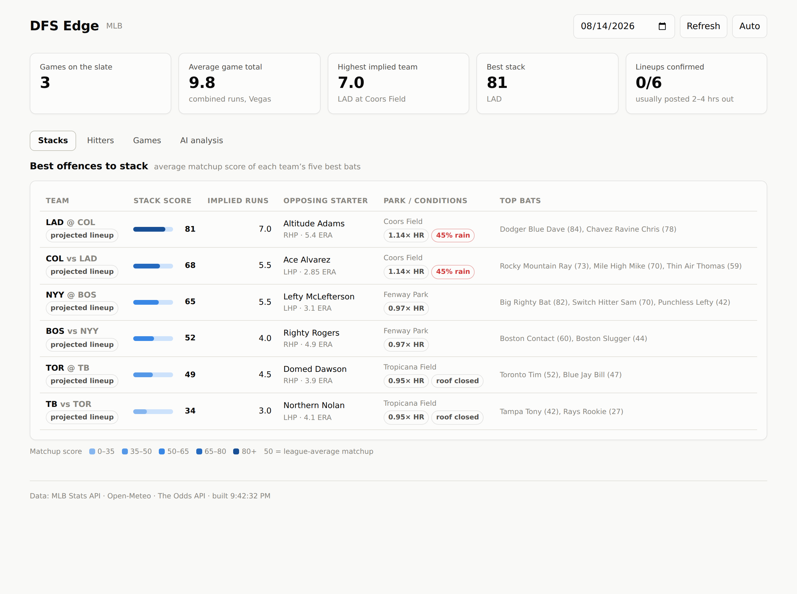

# DFS Edge

A personal daily-fantasy research dashboard. It pulls real MLB stats,
betting lines, weather and batted-ball data, scores every hitter's and
pitcher's matchup, and hands the whole slate to Claude for a written
read.

Built to run on your own machine for free (or close to it). NFL is now
in too, alongside MLB — see [NFL](#nfl) below. NBA is designed for but
not built yet — see [Roadmap](#roadmap).



---

## What it actually does

**Pulls data you'd otherwise gather by hand:**

| Source | What it gives you | Cost |
|---|---|---|
| MLB Stats API | schedules, probable pitchers, confirmed lineups, every player's splits vs LHP/RHP and home/road, last-15-game form, roster status (injuries), bullpen ERA | free, no key |
| Open-Meteo | temperature, wind speed and direction, rain probability at each park | free, no key |
| Baseball Savant | barrel rate, hard-hit rate, expected wOBA (real contact quality, not just outcomes) | free, no key |
| The Odds API | game totals, moneylines, run lines → implied team runs | free tier, or $30/mo |
| Anthropic API | the written slate analysis | pay per use, ~2-5¢ a run |

**Turns it into one number per hitter.** Every hitter gets a 0-100
matchup score where 50 is a league-average spot. Ten things feed it:

| Component | Weight | What it asks |
|---|---|---|
| Platoon split | 19% | How does he hit pitchers of this hand? |
| Vegas implied runs | 18% | How many runs is his team expected to score? |
| Pitcher vulnerability | 15% | How does this pitcher do against batters of his hand? |
| Contact quality | 14% | What do his Statcast barrel rate, hard-hit rate and xwOBA say, independent of luck? |
| Stolen-base rate | 8% | Is he actually going to run — DraftKings pays +5 for a steal, same as a double, and nothing else here measures it |
| Park factor | 9% | Does this park help home runs *for his handedness*? |
| Bullpen quality | 7% | How shaky is the relief corps he'll face after the starter leaves? |
| Weather | 6% | Is the ball carrying? Is the wind helping — for real, using the park's actual orientation? |
| Recent form | 3% | Hot or cold over the last 15 games? |
| Home/road split | 1% | Does he travel well? |

Nothing is hidden. Click into any player in the API response and you see
each component's value, its sample size, and a plain-English reason.

**The same model runs in reverse for pitchers.** The Top Pitchers tab
scores every probable starter with the mirror-image logic:

| Component | Weight | What it asks |
|---|---|---|
| Opposing lineup | 20% | How do these hitters, specifically, score against him? |
| Strikeout potential | 17% | His K stuff, blended with how whiff-prone this lineup is |
| Vegas implied runs against | 17% | How many runs is the team facing him expected to score? |
| Contact quality allowed | 14% | Barrel/hard-hit/xwOBA he's allowing, independent of luck |
| Own quality | 12% | His season ERA vs league average |
| Park factor | 11% | Does this park suppress runs and home runs? |
| Weather | 9% | Suppression side of the same wind/temperature read |

So a start looking good tonight is scored with the same rigor as a bat.

**Then Claude reads the whole slate.** It only sees numbers the app has
already computed — it is never asked to recall a stat from memory. Its
job is the part models are actually good at: looking at 15 games at once,
spotting where the signals disagree, and telling you which edges are real
versus which are park factor in a trench coat.

**Two things it doesn't compute for you, but will show you.** Upload a
DraftKings salary CSV and every player gets a Salary and Value (edge
score per $1,000) column — the score tells you who's in a good spot, the
value column tells you who's worth it. Upload a RotoWire projections CSV
and you get their FPTS and ownership% projections as reference columns.
Neither feeds the matchup score itself — they're someone else's numbers
(a price, a projection), not a component this app can vouch for the way
it can vouch for a platoon split it computed itself.

---

## Getting it running

You need **Python 3.11+** and **Node 18+**. Check what you have:

```bash
python3 --version
node --version
```

If either is missing: [python.org/downloads](https://www.python.org/downloads/)
and [nodejs.org](https://nodejs.org/).

### 1. Get the code and set up the backend

```bash
cd dfs-edge

cd backend
python3 -m venv .venv                    # isolated Python environment
.venv/bin/pip install -r requirements.txt
cd ..
```

> **What's a venv?** A private folder of Python packages just for this
> project, so installing something here can't break anything else on your
> machine. You never "activate" it if you don't want to — just call
> `.venv/bin/python` and `.venv/bin/pip` directly, as above.

### 2. Add your API keys

```bash
cp .env.example .env
```

Open `.env` in any text editor and fill in what you have. **Every key is
optional** — the app starts without any of them and simply switches off
the features that need one.

- **`ANTHROPIC_API_KEY`** — from [console.anthropic.com](https://console.anthropic.com).
  Enables the AI analysis tab.
- **`ODDS_API_KEY`** — from [the-odds-api.com](https://the-odds-api.com).
  The free tier is 500 credits/month, which is only a handful of pulls per
  day. The **$30/month plan is 20,000 credits**, which comfortably covers
  refreshing lines every 10 minutes all season.

Implied team runs are one of the two strongest signals in the whole model,
so the Odds API key is the one worth paying for.

### 3. Check everything works

```bash
cd backend
.venv/bin/python ../scripts/doctor.py
```

This tells you which pieces are live and which need a key, in plain
language, before you try to start anything.

### 4. Set up the frontend

```bash
cd frontend
npm install
```

### 5. Run it

You need **two terminal windows**, one for each half.

Terminal 1 — the API:

```bash
cd backend
.venv/bin/uvicorn app.main:app --reload
```

Terminal 2 — the dashboard:

```bash
cd frontend
npm run dev
```

Open **http://localhost:5173**.

> The first load of a given day takes 20-30 seconds — it's pulling a full
> season of league-wide splits. After that everything is cached and loads
> instantly. Cache lifetimes are configurable in `.env`.

### Want to look around before adding any keys?

```bash
cd frontend && npm run build && cd ../backend
.venv/bin/python ../scripts/preview.py
```

Open **http://127.0.0.1:8001** for the full dashboard running on fake
data. Useful in the off-season too.

---

## Using it

**Stacks tab** — teams ranked by how good it is to stack them, with each
game's start time. Stacking means rostering 4-5 hitters from one team so
a big inning pays you multiple times. The stack score is the average
matchup score of a team's five best bats.

**Hitters tab** — every hitter on the slate, sortable by any column,
including salary/value and FPTS/ownership once you've uploaded those
CSVs. Filter by minimum score to cut to the good spots.

**Pitchers tab** — today's probable starters ranked by matchup edge, the
mirror image of Stacks: strikeout upside, the lineup he's facing, the
Vegas total against him, and the rest of the pitcher-side model.

**Games tab** — the environment for each game: park factors, weather
(including a real in/out/cross-wind read, not a guess), the betting
total, each side's implied runs, and key injuries for both teams.

**AI analysis tab** — Claude's writeup, plus a box to ask follow-ups
("who's the best cheap bat in a good park tonight?").

**Upload salaries / Upload projections** (top-right of every tab) — drop
in a DraftKings salary CSV or a RotoWire player-pool CSV for the day's
slate. Both are cached per date and re-matched automatically on refresh.

### The rhythm that works

1. **Morning** — open it, look at the Games tab. Where are the high
   totals? Any weather that'll matter?
2. **Afternoon** — check Stacks. Note which teams look good but haven't
   confirmed lineups yet.
3. **~2 hours before first pitch** — lineups drop. Hit **Refresh**. Now
   the batting orders are real, and a guy hitting 2nd is worth far more
   than the same guy hitting 8th.
4. **Then** — run the AI analysis and read it against what you already
   decided. Where it disagrees with you is the interesting part.

### Reading the score honestly

A 78 is not a projection and it is not a lock. It says "this matchup is
well above average on the nine things we measure." Things it does not
know about: a hitter playing hurt, a bullpen that threw 40 pitches last
night, a manager who rests people on getaway days, DFS salary and
ownership.

Two specific cautions:

- **Small samples get regressed, but not to zero.** A hitter with 40 PA
  against lefties keeps about a third of his observed edge; the rest is
  assumed league-average. Check the PA column before you trust a split.
- **A score driven by park and weather is weaker than one driven by
  skill.** The `top_driver` field tells you which. Everyone else on the
  slate can see that Coors is Coors; not everyone has looked at the
  platoon splits.

---

## Cost

| | Free tier | Recommended |
|---|---|---|
| MLB data | free forever | free forever |
| Weather | free forever | free forever |
| Betting lines | 500 credits/mo | $30/mo for 20,000 |
| AI analysis | ~2-5¢ per run | ~$3-8/month if you run it daily |
| Hosting | $0 (your machine) | $0 |
| **Total** | **~$2/month** | **~$35-40/month** |

Keep an eye on your Odds API balance at `http://localhost:8000/api/health`
— it's also shown in the dashboard footer.

**Turning on player props** (`ODDS_FETCH_PROPS=true`) is the one thing
that can burn credits fast: props are billed per game per market, so one
refresh across a 15-game slate costs ~60 credits. Leave it off until you
want it.

---

## How the code is laid out

```
dfs-edge/
├── .env                      your keys (never committed)
├── .env.example              the template
│
├── backend/
│   ├── app/
│   │   ├── main.py           FastAPI app, CORS, startup
│   │   ├── config.py         reads .env
│   │   ├── cache.py          SQLite response cache
│   │   ├── clients/          one file per external API
│   │   │   ├── mlb.py        MLB Stats API (splits, rosters, injuries, bullpens)
│   │   │   ├── nfl.py        nflverse schedule + betting-line CSV export
│   │   │   ├── odds.py       The Odds API
│   │   │   ├── savant.py     Baseball Savant batted-ball CSV export
│   │   │   ├── weather.py    Open-Meteo + wind/temp effects
│   │   │   └── http.py       shared HTTP client with retries
│   │   ├── data/parks.py     park factors, coordinates, roofs, wind orientation
│   │   ├── data/nfl_stadiums.py  stadium coordinates + timezones
│   │   ├── services/
│   │   │   ├── scoring.py    THE MODEL - all weights live here (hitter + pitcher)
│   │   │   ├── nfl_scoring.py  the NFL matchup model
│   │   │   ├── mlb_slate.py  assembles the daily MLB slate
│   │   │   ├── nfl_slate.py  assembles the weekly NFL slate
│   │   │   ├── optimizer.py  MLB DraftKings Classic lineup optimizer
│   │   │   ├── contest.py    MLB contest generator: opponent field + mass multi-entry
│   │   │   ├── mlb_dk_points.py  raw DK points from one game's box score (variance model, in progress)
│   │   │   ├── variance.py   per-player outcome distribution pools (variance model, in progress)
│   │   │   ├── nfl_optimizer.py  NFL DraftKings Classic lineup optimizer
│   │   │   ├── analysis.py   Claude integration
│   │   │   ├── salaries.py   DraftKings salary CSV upload (MLB + NFL)
│   │   │   ├── projections.py  RotoWire FPTS/ownership CSV upload (MLB + NFL)
│   │   │   └── player_match.py  shared name/team matching for both uploads
│   │   └── routers/          HTTP endpoints (mlb.py, nfl.py, system.py)
│   └── tests/
│       ├── test_pipeline.py      MLB offline test, no API calls
│       └── test_nfl_pipeline.py  NFL offline test, no API calls
│
├── frontend/src/
│   ├── App.jsx               layout and tabs
│   ├── api.js                every backend call
│   └── components/           tiles, meters, tables, cards
│
└── scripts/
    ├── doctor.py             connectivity check - run this first
    ├── preview.py            demo mode on fake data
    └── screenshots.py        regenerate the docs images
```

**If you want to change how the model thinks, there is one file:**
`backend/app/services/scoring.py`. The weights are at the top. Change a
number, save, and the API reloads.

### Running the tests

```bash
cd backend
.venv/bin/python -m tests.test_pipeline
```

70 checks covering the whole pipeline on fake data — no network, no
credits spent. Run it after you touch the scoring model.

---

## Shipped since the first version

All of these started as items on this list. Leaving them here, marked
off, so it's clear what changed and why rather than just quietly
vanishing from the doc:

- **Batted-ball quality.** `clients/savant.py` pulls Baseball Savant's
  barrel rate, hard-hit rate and xwOBA CSV export; `contact_quality`
  (hitter) and `contact_quality_allowed` (pitcher) fold it into both
  scores and into the Stacks tab.
- **Bullpen quality.** `bullpen` component — the opposing team's relief
  corps ERA, since a starter only throws ~5 innings.
- **Top Pitchers tab.** A full mirror-image scoring model for probable
  starters — see `PITCHER_WEIGHTS` in `scoring.py` — with real weight on
  strikeout upside: the pitcher's own K stuff blended with how
  whiff-prone the lineup he's facing actually is.
- **Key injuries and game start times.** Roster status from the MLB
  Stats API on the Games tab; start times on Stacks.
- **DFS salaries and value.** Upload a DraftKings CSV, get Salary and
  Value (edge score per $1,000) columns.
- **FPTS/ownership projections.** Upload a RotoWire player-pool CSV, get
  their projections as reference columns — deliberately kept out of the
  edge score itself; see the note above on why.
- **Real park orientations for wind.** `wind_effect()` always accepted a
  park orientation but nothing passed one in, so every wind read
  defaulted to "north" and flagged itself low-confidence — sometimes
  just wrong. `data/parks.py` now has real bearings for all 30 parks.
- **Stolen-base rate.** DraftKings pays +5 for a steal, the same as a
  double, but every prior version of the model was purely OPS- and
  contact-quality-based — a low-power, high-steal hitter got zero
  credit for an entire category of his real DK value. `stolen_base`
  compares season-long SB rate against the league average, regressed
  by sample size the same way every other split-based component is.
- **MLB contest field generator.** The optimizer only ever answered "is
  this the best lineup" — never "how does it compare to what everyone
  else is rostering." `services/contest.py` builds a synthetic public
  field by randomly sampling each roster slot weighted by RotoWire
  ownership% (the signal that actually describes what the public plays,
  unlike another optimizer solve, which would just build a pile of
  near-identical near-optimal lineups). A large real contest
  (thousands to 100,000+ entries) is modeled as a statistical *sample*
  capped at `MAX_SAMPLE_SIZE` (5,000, chosen after benchmarking — a
  5,000-lineup field builds in about a second even on a full slate),
  with a lineup's rank projected back onto the real contest size the
  way a poll projects from a sample. On the Lineups tab, generate a
  lineup as usual, then use the new "Contest field" section to test it
  against a double-up, small-field GPP, large-field GPP, or
  millionaire-maker-style preset — same slate-game filter as the
  optimizer, so the field is always drawn from the actual games in
  play. **Not a lineup simulator**: there's no player-outcome variance
  model yet, so ranks and payouts are the field's *projected* points,
  not a distribution of real-world outcomes — which is also why an
  optimizer-built lineup (itself point-maximizing) tends to rank near
  the top of the field on this measure. The payout curve is a
  deliberately simple, clearly-labeled approximation (flat for
  double-ups, a smooth top-heavy decay for GPPs), not a scraped or
  hardcoded real payout table.
- **Contest Generator: mass multi-entry.** The field generator above
  models *opponents*. This is the other half: a standalone "Contest
  Generator" tab (separate from the Lineups tab's exact optimizer) that
  builds up to 10,000 of *your own* entries in one request via
  `contest.generate_entries()` -- fast randomized construction weighted
  toward projected points (not ownership%), deduplicated so no two
  entries in a batch are identical. The exact MILP optimizer is the
  right tool for a handful of provably-best lineups (capped at 150),
  the wrong one for mass entry: solving a fresh MILP thousands of times
  is both too slow for one request and not what a real GPP portfolio
  wants anyway (many individually-strong, genuinely different builds,
  not the same "best" lineup re-solved with weaker and weaker no-good
  cuts). The batch gets ranked against a simulated opponent field for
  cash-rate/payout economics, same presets as the field generator.
  Caught and fixed a real bug during this build: ranking each entry of
  a large batch *independently* against the field let thousands of
  individually-strong entries each claim the same top payout, summing
  to many times the real prize pool (one test case: $2.5M "profit"
  against a $42,500 pool). `_evaluate_batch_against_field()` fixes this
  by ranking the whole batch against the field *and against each
  other* for the same limited paid ranks -- and `num_lineups` is now
  validated against the contest's real `field_size` up front (your
  entries are part of the field, not additional to it).
- **Fixed: DK salary upload rejecting a valid export.** DraftKings'
  lineup-builder page's "Export to CSV" button ships a wider file than
  the flat player-pool export this app was originally built against --
  an empty roster-slot template occupies the first several
  rows/columns, with the real player table's header embedded well past
  row 1. `csv.DictReader` always takes row 1 as the header, so against
  that shape it found none of the expected columns and every row got
  silently skipped, even though the file was perfectly valid.
  `salaries._find_dk_header_row()` scans for the row instead of
  assuming its position.
- **Salary from a RotoWire upload, when it's already there.**
  RotoWire's player-pool export pulls salary straight from DK into its
  own SAL column -- the same number a separate DK upload would give,
  just bundled into one file. If no salary file is loaded yet for a
  date, uploading projections now seeds the salary store from that SAL
  column too (`salaries.from_rotowire_rows()`), so a file with both
  projections and salaries only needs uploading once. A real DK upload,
  now or later, is never overwritten by a projections re-upload -- the
  two gaps versus an actual DK export (`game_info` for DK-slate
  auto-detection, `dk_id` for NFL's optimizer) are handled by leaving
  them empty rather than guessed at, and this is MLB-only for exactly
  the `dk_id` reason.
- **CSV export, for handing lineups off to something outside this app.**
  Both the optimizer's Lineups tab and the mass Contest Generator now
  have a "Download CSV" button -- one row per lineup, one column-group
  per DK roster slot (name, team, salary, projected points,
  ownership%), plus the estimated rank/cash/payout when the batch was
  ranked against a contest field. Meant for a Monte Carlo simulator, a
  spreadsheet, or another Claude session working from the file, not for
  DK's own bulk-upload format (that needs a contest-specific template
  with entry/contest IDs this app has no way to get). The optimizer's
  export is client-side (its lineups, capped at 150, are already fully
  loaded in the browser); the Contest Generator's is server-side --
  `GET /api/mlb/contest-entries/{batch_id}/csv` downloads the *entire*
  generated batch (up to 10,000 rows), not just the 200-row preview the
  JSON response caps itself at, and the batch is cached under that id
  for an hour so the CSV always matches exactly what was reviewed on
  screen rather than silently re-rolling a different random batch.

## NFL

Click **NFL** next to the app name to switch sports. It's a weekly
slate, not a daily one — pick a season and week (defaults to whichever
week's games haven't finished yet) instead of a date.

**Data sources, all free, no key:**

| Source | What it gives you |
|---|---|
| [nflverse](https://github.com/nflverse/nflverse-data) schedule export | every game, closing spread/total/moneylines, roof, surface |
| Open-Meteo | same weather pull as MLB, for outdoor games |

(`nfl_data_py`, the README's original plan for this, turned out to pin
an old pandas that won't build on a current Python — fetching
nflverse's own CSV releases directly sidesteps that and matches how
`clients/savant.py` already does CSV-export data anyway.)

**Matchups tab** shows each game with its Vegas-implied team totals,
spread, and weather. **Lineups tab** is a DraftKings Classic NFL
optimizer (QB, RB, RB, WR, WR, WR, TE, FLEX, DST) with multi-lineup
generation, exposure caps, a salary floor, and QB stacking (force at
least N of the rostered QB's own WR/TEs into the lineup — the standard
NFL GPP correlation play, the same idea as MLB's hitter stacking).
Upload a DraftKings salary CSV and a RotoWire projections CSV for the
week the same way you would for MLB.

**Still smaller than the MLB model, deliberately.** MLB's matchup score
leans on a full season of granular per-player split data. NFL's runs on
Vegas implied team total, game script from the spread, home field, and
weather — plus, as of this component, **defense-vs-position and pace**,
computed from a full prior completed season's real box scores rather
than in-season data that doesn't exist before Week 1. Used as a static
prior the same way a small-sample MLB stat gets shrunk toward league
average, just shrunk all the way there since there's zero current-season
sample yet:

| Source | What it gives you |
|---|---|
| [nflverse](https://github.com/nflverse/nflverse-data) `player_stats` export | one full season's per-player, per-game box scores |

`clients/nfl.get_prior_season_context()` fetches that CSV once (cached),
computes DraftKings points for every player-game with DK's own scoring
rules (not the export's generic PPR column, which has different
bonuses/penalties), and aggregates two things per team: DK points
allowed per game to each of QB/RB/WR/TE (the classic "defense vs.
position" signal), and offensive plays run per game (pace — more snaps
means more opportunity for everyone on that offense). `PRIOR_SEASON` in
that same file is the one line to bump once nflverse publishes the next
season's stats — **it now rolls prior season + current season to date**, since nflverse
hadn't published 2025 numbers yet as of when this shipped.

See `services/nfl_scoring.py` for exactly what's in and why.

## Improving it from here

**1. Track your own results.** Log each night's scores and what actually
happened. After a month you can check whether your weights are any good,
which is the only way to know. A `results` table in the same SQLite file
is enough.

**2. NFL: bump `PRIOR_SEASON`.** Once nflverse publishes a season closer
to the current one, change the one constant in `clients/nfl.py` — the
defense-vs-position and pace pipeline doesn't otherwise change.

---

## Roadmap

- [x] MLB: splits, park factors, weather (with real wind orientation), lines, AI analysis
- [x] Batted-ball data from Baseball Savant
- [x] Bullpen strength
- [x] Top Pitchers tab with strikeout-aware scoring
- [x] Key injuries and game start times
- [x] DraftKings salaries + value scores
- [x] RotoWire FPTS/ownership projections
- [x] Lineup optimizer (MLB and NFL), including a lineup-confirmation watcher for MLB
- [x] NFL: weekly matchups + Classic lineup optimizer with QB stacking
- [x] NFL: pace and defense-vs-position scoring components (prior-season prior)
- [x] MLB: contest field generator (ownership-weighted synthetic field, ranked by projected points)
- [x] MLB: standalone Contest Generator tab for mass multi-entry (up to 10,000 of your own entries, points-weighted, ranked against the field for cash/payout economics)
- [x] MLB: lineup simulator (player-outcome variance model + Monte Carlo contest simulation) -- shipped in 6 phases (see `.claude/plans/` for the full roadmap). Phase 1 shipped: `clients/mlb.get_player_game_log()` (a per-game stat fetcher nothing else in this app had) and `services/mlb_dk_points.py` (raw DK points from one game's box score). Phase 2 shipped: `services/variance.py`'s `player_outcome_pool()` -- a bootstrap resampling pool of real DK-point outcomes per player, not a fitted parametric shape, blended with a shared same-position pool for thin samples (a rookie call-up leans on it heavily; an everyday player barely touches it). Verified against real 2024 data: 10 independent fresh samples of Ohtani's pool averaged 13.20 (true season mean 13.06), and a synthetic same-mean "boom/bust" player's pool showed ~6.6x the standard deviation of a "consistent" player's -- proof the model captures real spread, not just the average. Phase 3 shipped: `team_environment_multiplier()` and `sample_correlated_outcome()` -- a per-trial, per-team multiplier shared by every hitter on that team, biasing which percentile of each hitter's own pool gets sampled, so a real stack shows fatter-tailed outcomes than the same players simulated independently. Verified against real 2024 Dodgers hitters (Ohtani, Betts, Freeman, Hernandez, Smith): a stacked simulation landed at essentially the same mean as the unstacked equivalent (57.53 vs 56.56) but with 1.64x the standard deviation -- proof the correlation mechanism is doing real work, not just adding noise. Phase 4 shipped: `numpy` (confirmed installing cleanly on this project's Python 3.14 `.venv`) and `services/variance.py`'s `simulate_batch()` -- a vectorized Monte Carlo engine that samples every *unique* player across a whole batch of lineups once per trial (not once per lineup containing them), applying Phase 3's team correlation to hitters and independent uniform sampling to pitchers. Accepts both lineup shapes already in this codebase (optimizer.py's `slots`-grouped lineups and contest.py's flat `players` entries) via the same normalization `lineup_export.py`'s CSV export already relies on. Verified against real 2024 data: two lineups sharing 5 of 6 players (Cole + 5 Dodgers hitters vs. Strider + the same 5 hitters) showed 0.89 correlation between their simulated trial-by-trial totals -- proof shared players genuinely link outcomes across lineups in the same simulated batch, not just within one lineup. Also benchmarked at realistic scale: 2,000 lineups x 2,000 trials in 0.07s. Phase 5 shipped: `contest.py`'s `evaluate_batch_simulated()` and `build_contest_entries_simulated()` -- a genuine Monte Carlo alternative to the deterministic `build_contest_entries()` (kept as-is, unchanged, as the fast default), simulating a user's entries and the sampled opponent field together and reporting each entry's real cash **probability** (the fraction of trials it actually lands in the paid zone) and an expected-payout range (10th/90th percentile), not a single projected-points-vs-field estimate. Two entries can never share a paid rank within the same simulated trial -- enforced per trial via a vectorized closed-form of the same "distinct ranks" rule `_evaluate_batch_against_field` already used once, checked directly against a brute-force per-trial reference implementation. Verified live against today's real slate: 15 entries simulated against a 200-lineup sampled field over 1,000 trials in ~4s, landing at a sane 16-32% cash probability range for a small GPP with a 20% payout line. Phase 6 shipped: `POST /api/mlb/contest-entries-simulated` and a "Simulate" toggle in the Contest Generator tab (trial count selectable: 500/1,000/2,000/5,000) -- when on, the economics card shows genuine average cash probability and expected payout instead of the deterministic estimate, and the sample-entries table swaps in a "Sim floor-ceiling" column (10th-90th percentile simulated points) plus per-entry cash%/expected payout in place of rank/cashing. The fast deterministic default is untouched and still one click away. Verified live in the browser against today's real slate and uploaded DK/RotoWire files: toggling Simulate produced a 25.2% avg cash probability and a $49.49 estimated net over 10 real entries at 500 trials; toggling back off reproduced the original deterministic numbers exactly, confirming no regression to the existing fast path. Since then: simulated results also report each entry's 1st-place/top-1%/top-10% finish rates and simulated ROI% (color-coded green/red), sorted highest-ROI-first, with a working CSV export for the simulated shape -- and the simulator now always runs a fixed 10,000 trials (no more picking a trial count) and gained a second mode, "My DK entries": upload the actual bulk-entries CSV DraftKings gives you (`services/dk_entries.py` parses it, matching each roster cell's DK player id back to this app's own player pool via the file's own embedded player-pool table, then by name/team against the live slate) to simulate the lineups you actually built or reserved against one real contest's own economics -- entry fee comes straight from the file; total contest entries, prize pool, and 1st-place % are hand-entered since a bulk entries export has no payout-table data at all, and `contest.py`'s `_custom_payout_curve()` pins 1st place to exactly that percentage while the rest of the field still decays with the same top-heavy shape used elsewhere. The file's real job is establishing the baseline (how many entries you have in a contest and what each one costs), not requiring pre-filled picks: a freshly-reserved contest -- the common real case -- has every entry generate a fresh lineup, and any entries you'd already built yourself are simulated as-is alongside the generated ones. Verified against a real DraftKings entries export (20 reserved entries, all still blank): end to end, all 20 got generated lineups and simulated correctly, with `total_entry_cost` matching the real $0.25 entry fee x 20 exactly, both via direct calls and the real HTTP upload/simulate endpoints. Since then: "My DK entries" was redesigned again to mirror a real contest's *entire field*, not just the entries you've personally reserved -- the uploaded file's only remaining job is supplying `entry_fee`; `services/dk_entries.py`'s old DK-id-to-internal-player matching (`resolve_entries()`) was removed entirely, since there's no per-entry roster to resolve anymore. `contest.py`'s new `evaluate_field_mirrored()` builds an ownership-weighted sample standing in for the real contest's whole field (`generate_field()`'s existing chalk-heavy, duplicates-allowed construction, per the user's explicit choice over the individually-strong-and-distinct construction "Generate entries" uses) and ranks every sampled lineup against every *other* sampled lineup in the same simulated trial -- via `np.argsort` for a best-to-worst order per trial -- rather than against a separately generated "your entries" batch. Each lineup's rank within the sample is projected onto the real (usually much larger) `field_size` by an exact, collision-free linear interpolation: the k-th best of `sample_size` lineups maps to `1 + floor(k * (field_size-1) / (sample_size-1))`, strictly increasing whenever `field_size >= sample_size` -- checked directly against a hand-derivable case (5 sampled lineups standing in for a 21-entry field map to ranks `[1, 6, 11, 16, 21]`, evenly spaced by exactly 5). `build_dk_entries_simulated()` was rewritten around this: it auto-caps the sample at the existing `MAX_SAMPLE_SIZE` (5,000) for large real fields, the same "simulate a sample, project onto the real size" philosophy this module already used for a synthetic opponent field, now applied to the whole field rather than just one side of it. Benchmarked live against a real slate and the user's stated real-world scale (`field_size=9,512`, `sample_size` auto-capped to 5,000, 10,000 trials): 5.61 seconds, with sane validating statistics (~20% average cash probability, matching the 20% payout line; slightly negative average ROI, reflecting the house rake; strong best-vs-worst differentiation among sampled lineups). The frontend's "My DK entries" mode now reads "mirrors the contest, simulates the whole field, browse the results to pick your own entries" instead of "generates lineups for your blank reservations," and dropped the now-inapplicable max-exposure control (a full mirrored field has no "your batch" to cap exposure within). Since then: every lineup/entry (from the optimizer, the contest generator, and the DK entries mirror) now carries its own `stack_type`/`stack` fields -- `lineup_export.py`'s new `stack_info()` derives them purely from a lineup's actual hitter-team composition (any team supplying 2+ of the 8 non-pitcher slots, ordered largest group first, e.g. 5 Yankees + 3 Braves is `stack_type="5-3"`, `stack="NYY,ATL"`), not from any intended stack-shape input, so it works for a lineup built any way. `lineups_to_csv()`'s output was also simplified to match a user-provided reference file exactly: the per-player `_team`/`_salary`/`_proj_fpts`/`_own_pct` sub-columns were dropped (keeping just each slot's `_name`), and `stack_type`/`stack` were added right after `salary_used` -- `frontend/src/csv.js`'s client-side exporter (used by the optimizer's own Lineups tab) was updated to match column-for-column. The Contest Generator's sample-entries table gained matching Stack/Teams columns. Verified live against the real slate: contest-generator entries showed real, varied stacks (`"4-2" "KC,NYM"`, `"2-2-2" "CHC,NYM,ATL"`, etc.) end to end through the actual upload/build/download flow, not just offline fixtures. Since then: the sample-entries table's old "Sim floor-ceiling" column (which was actually the 10th/90th percentile, not a true floor/ceiling) was replaced with separate Floor and Ceiling columns showing each lineup's actual lowest and highest simulated point total across every trial (`row.min()`/`row.max()` on the same simulated array the percentiles are already computed from, in both `evaluate_batch_simulated()` and `evaluate_field_mirrored()`), added to the CSV export too. Verified live: a real sampled lineup's floor briefly dipped negative (-3.75) across 10,000 trials -- expected, not a bug, since DK pitcher scoring includes real penalties (earned runs, hits/walks against) and a true min across that many trials will occasionally land on a genuinely bad simulated night, which the smoothed p10 alone would never surface. Since then: `lineup_export.py`'s CSV export gained back per-slot `_salary`/`_fpts` sub-columns (e.g. `P1_salary`, `P1_fpts`, `C_salary`, `C_fpts`, ...) alongside the existing `_name` columns -- these had been dropped earlier (see the "simplified to match a user-provided reference file" note further down this same entry) along with `_team`/`_own_pct`, but salary/FPTS specifically turned out to still be needed for handing a batch off to an external tool; `_team`/`_own_pct` stay omitted since only salary/FPTS were asked for back. The existing test asserting these columns didn't exist was inverted into a positive check (columns present, and their values match the source lineup's actual players) rather than just deleted, so a future regression would still be caught. Since then: both randomized generators (`generate_field()` and `generate_entries()`) were limited to 9 named GPP stack shapes (5-3, 5-2-1, 5, 4-4, 4-3, 4-2-2, 4-2, 3-3-2, 3-3), weighted toward 5-3/5-2-1 (the shapes that most often win real large-field tournaments) without ruling the others out -- previously every lineup's hitters were sampled fully independently per slot, producing all sorts of shapes nobody would actually build (mega-stacks, 8-team spreads, etc.). `_pick_stack_teams()` assigns each shape's groups to real teams, largest first, weighted toward whichever teams carry the most aggregate ownership%/projected-points signal among their hitters. Two real bugs surfaced and got fixed during live-data verification: (1) the needed-team restriction was accidentally applying to the 2 pitcher slots too, even though a stack is a hitter-only concept -- fixed by skipping the restriction whenever `slot == "P"`; (2) every retry attempt was re-rolling a brand-new random shape instead of retrying the *same* target shape, so harder, genuinely salary-tight shapes (5-3 needs 5 relatively expensive hitters from one team) kept losing out to easier ones through survivorship bias in the retry loop -- fixed by picking the shape once per lineup, outside the retry loop, so each shape gets `max_attempts_per_lineup` real dedicated shots. A third issue, only visible on a thin candidate pool (a small offline test fixture with just 2 real teams), also needed fixing: a shape needing more team-groups than exist in the pool at all (e.g. a 3-team shape when only 2 teams have any hitters) is structurally impossible and would burn every retry attempt, causing generation to give up on the *whole remaining batch* early -- `_feasible_stack_shapes()` now pre-filters the shape list down to what a given candidate pool could possibly satisfy before ever picking one. Benchmarked live against the real slate: 5,000 lineups built in ~1s with 100% success, and the resulting stack_type distribution closely tracked the intended weighting (5-2/5-3/4-3 the top 3 shapes at 16-18% each, all 9 target shapes well represented, only modest coincidental drift into adjacent shapes from ordinary leftover free picks). Since then: fixed a genuine DraftKings rules violation the coincidental drift above could produce -- a shape's genuine leftover/free picks were never prevented from landing on an already-stacked team, so a "5" target could silently drift to a 6-, 7-, or even 8-stack, which DK's own Classic MLB rules (max 5 hitters from one team) would reject outright. `MAX_HITTERS_PER_TEAM = 5` is now enforced as a hard cap on every hitter slot's eligible pool in `_sample_one_lineup()`, independent of whether a stack shape is even targeted. Fixing this also surfaced a fixture gap: `mul_slate`'s offline test fixture only had 2 teams with any hitters, so the new cap forced both the points-weighted and ownership-weighted generators into the same 5-3 split, muting a pre-existing test's claim that points-weighted entries score higher on average -- fixed by giving the fixture a real 3rd team (`MUL3`), which also lets its 3-team stack shapes (4-2-2, 3-3-2) actually succeed in tests now. Verified live against the real slate: 5,000 entries and 5,000 field lineups built with a hard maximum of exactly 5 hitters from any one team, zero violations, and the stack_type distribution still tracked the intended weighting. Since then: the local SQLite cache file (`backend/data/dfsedge.db`) had grown to 223MB because nothing ever reclaimed the disk space left behind by expired rows -- `cache.purge_expired()` existed but was only reachable via a manual endpoint, and `VACUUM` never ran anywhere. Large short-TTL entries (`contest_batch:*`, up to 10,000 lineups each, 1-hour TTL) were the main contributor. Fixed with a new `cache.vacuum()` helper and a daily `cache._housekeeping_loop()` (same per-iteration try/except resilience convention as `lineup_watch._poll_loop()`) purging and reclaiming space once a day, wired into `main.py`'s `lifespan()` alongside a one-time startup purge. A one-time manual purge+VACUUM immediately shrank the file from 223,156,608 bytes to 852,448 bytes. This is standalone groundwork for a larger planned move of historical data to a cloud store (Supabase), so the local cache stays lean regardless.
- [x] In-house DK FPTS/ownership projections + Supabase historical data store -- shipped in phases (see `.claude/plans/` for the full roadmap). Phase 0 shipped: see the cache-cleanup entry above. Phase 1 shipped: `app/history_db.py`, a durable Postgres store via Supabase, parallel to `cache.py`'s local SQLite TTL cache but for data meant to survive forever. Three tables created by `scripts/migrate_history_db.py`: `slate_projections` (archives every real RotoWire upload permanently -- `cache.py`'s own `projections:{day}` key gets overwritten on the next upload and expires after a week, so without this there was no way to look back at a past slate's real numbers), plus `player_game_results`/`player_actual_results` (schemas created now, archiver not wired yet -- deferred until Phase 5's backtest calibration actually needs them). The upload endpoint (`POST /api/mlb/projections`) fires the archive off as a background task (`asyncio.create_task`) so a Supabase hiccup can never break an upload that already succeeded -- same resilience convention as `cache.cached()`'s stale-serve-on-error behavior. Entirely optional: every function in `history_db.py` no-ops if `SUPABASE_DB_URL` isn't set in `.env`. Caught a real bug during live verification: asyncpg needs a Python `date` object for a `DATE` column, not a plain `"YYYY-MM-DD"` string -- passing the raw string raised `AttributeError: 'str' object has no attribute 'toordinal'` deep in asyncpg's encoder; fixed by parsing with `date.fromisoformat()` before binding. Verified end to end against the real running app and the user's real Supabase project: uploaded a test CSV through the actual `POST /api/mlb/projections` endpoint, confirmed the archived rows landed in Supabase with correct values via a direct query, then deleted the test rows so they don't pollute the real archive. Phase 2 shipped: `services/inhouse_projections.py`'s `baseline_dk_points()` -- a real per-player DK-points-per-game rate built from `clients/mlb.get_player_game_log()` + `mlb_dk_points.py` (the exact scoring formulas), blending season-to-date average with last-15-games recent form and shrinking thin samples toward the same shared same-position pool `variance.py`'s Phase 2 already accumulates (promoted `variance.py`'s `player_kind()`/`own_games()`/`position_pool()`/`contribute_to_position_pool()` from private to shared helpers so both modules draw on the identical pool, warmed up by whichever one runs first for a given position/season). `project_fpts()` multiplies that baseline by `scoring.py`'s already-attached `edge.composite` -- the matchup-quality multiplier (platoon, Vegas total, opposing pitcher/bullpen, Savant contact quality, park, weather, recent form) reused as-is rather than re-derived. `mlb_slate.py` attaches the result as `projection.inhouse_fpts`, additive alongside whatever RotoWire projection is already there. Deliberately opt-in: a real per-player game-log fetch for every hitter/pitcher on the slate (a couple hundred players on a full day) would otherwise add real latency to every plain dashboard refresh, so `build_slate()` only computes it when `include_inhouse=True` (`GET /api/mlb/slate?inhouse=true`) -- confirmed live the default path stays untouched (0.19s, `projection: null`) while the opt-in path costs real but bounded time (7.8s cold across ~300 real players, 2.7s once each player's game log is cached) and produces plausible real numbers (hitters 2.7-9.1 DK pts, pitchers 2-24 DK pts, 401 players covered across today's full real slate). Caught a bug via a naive sed-based rename mid-implementation: a local variable in `variance.py`'s `player_outcome_pool()` ended up shadowing the newly-public `position_pool()` function it needed to call, causing an `UnboundLocalError` -- fixed by renaming the local to `shared_pool`. Phase 3 shipped: `inhouse_projections.py`'s `project_ownership()` -- a transparent heuristic, not a statistical fit (no historical ownership dataset exists yet to fit against), combining three signals into one propensity score per player -- value (`fpts/salary`), team total (Vegas implied runs vs league average), and a salary-tier bump for both ends of a position's own salary range (cheap punt plays and expensive studs both tend to get overowned relative to the middle) -- then softmax-normalizing *within* each DK roster-slot group (P/C/1B/2B/3B/SS/OF) so each group's total lands at exactly `slot_count x 100%` (e.g. OF sums to 300%, C to 100%), which also captures position scarcity for free without a separate term. `mlb_slate.py` attaches the result as `projection.inhouse_ownership_pct` wherever a DK salary is also loaded (ownership is meaningless without a real salary-capped contest to be owned in) -- pitchers without a matched salary row are correctly excluded rather than guessed at. Verified live against the real running app and the user's real Supabase-connected slate with real loaded salaries: confirmed every position group's ownership sums to exactly its slot count x 100% (1B/2B/3B/C/SS all ~100.0%, OF ~300.0%, rounding only). Sanity-checked against the same slate's real uploaded RotoWire ownership numbers (the plan's own stated verification bar, since no historical dataset exists to fit against yet): a weak-but-real positive Spearman rank correlation (0.191 across 171 real players) -- the model correctly flags real industry chalk (Mookie Betts, Kyle Tucker, Bobby Witt Jr., Alex Bregman, ...) as above-average owned, but at a much flatter magnitude than RotoWire's crowd-sourced 15-36% peaks for those same players, since a pure value/team-total/salary-tier heuristic has no way to capture the name-recognition/consensus signal real market ownership is heavily driven by. This gap is expected and explicitly named in the plan -- Phase 5 (backtest-calibrated weights, deferred until Phase 1's archive holds enough real slates) is where that gets tightened, not this v1. Phase 4 shipped: `HitterTable.jsx`/`PitcherTable.jsx` gained adjacent "In-house FPTS"/"In-house Own%" columns next to RotoWire's own (never replacing them), populated by a new opt-in "Load in-house projections" button in the header (`api.slate(date, {inhouse: true})`) -- kept as an explicit action rather than an automatic background fetch, since that would quietly turn Phase 2's whole "opt-in, don't slow down the default dashboard" design back into "always eventually fetched" at the same real backend cost. Separately, a new "Optimizer/generator source" dropdown (RotoWire/In-house) feeds a `projection_source` parameter threaded through the whole backend chain: `optimizer.build_player_pool()`/`generate_lineups()` and `contest.py`'s `generate_field()`/`generate_entries()` (the two shared choke points every higher-level contest function -- `build_contest_field`, `build_contest_entries`, `build_contest_entries_simulated`, `build_dk_entries_simulated` -- already funnels through) now read `projection.inhouse_fpts`/`inhouse_ownership_pct` instead of RotoWire's when asked, validated with a clear `OptimizerError` on an unrecognized source. Every router endpoint that builds lineups or a contest field (`/lineups`, `/contest-field`, `/contest-entries`, `/contest-entries-simulated`, `/dk-entries/simulate`) gained the same `projection_source` field and now calls `mlb_slate.build_slate(..., include_inhouse=(projection_source == "inhouse"))` itself, so choosing "In-house" in the dropdown doesn't require the tables to have fetched it first. Verified live in the browser: adjacent columns render correctly with real computed values (in-house FPTS populated for essentially every player regardless of salary match, in-house ownership% correctly blank for anyone without a matched DK salary, matching the "meaningless without a real salary-capped contest" design). End-to-end lineup generation against real data hit a pre-existing, unrelated blocker -- the salary file loaded earlier in this session has zero probable pitchers matched by name against today's real slate, so neither RotoWire nor in-house source can build a legal 2-pitcher lineup right now -- confirmed by direct inspection (0 usable pitchers either way) and by both sources failing with the *identical* error, proving no new failure mode. The actual "does the dropdown change what the optimizer optimizes against" claim is covered directly by three new offline tests (`test_pipeline.py`) using a synthetic slate where RotoWire and in-house numbers deliberately disagree about who's best at a slot -- `build_player_pool()` picks up the requested source's numbers exactly, confirmed both directions. Since then: the user found a description of a bottoms-up projection engine (explicit PA volume + wOBA/ISO/park/weather-adjusted rate, explicit pitcher K/innings/win-odds modeling) and asked whether it would help -- comparing against what's actually built, `scoring.py`'s `edge.composite` already fuses almost the same ingredients (platoon, park HR/runs factors, weather, opposing pitcher/bullpen, Statcast contact quality) into the existing multiplier, so the real, genuinely missing pieces were volume: neither a hitter's plate-appearance count nor a pitcher's win-bonus odds were modeled independently of his own season average. Added both as targeted corrections on top of the existing v1 baseline rather than a rewrite. **Hitters**: `_BATTING_ORDER_PA_FACTOR` (1.09 leadoff down to 0.91 in the 9-hole, a widely-cited real gap) scales a hitter's baseline rate by his actual confirmed batting-order slot -- `mlb_slate.py`'s `_team_hitters()` already attached `batting_order` once lineups post, previously computed and then thrown away; now `inhouse_fpts_batch()` reads it. **Pitchers**: DK's discrete +4 win bonus is a team-record event the baseline's own historical win rate can't see is stale for TODAY specifically -- `pitcher_win_rate()` computes a pitcher's own wins-per-start this season, and `win_ev_delta()` corrects the projection by `(today's market-implied win probability - his own season win rate) x 4`, using the moneyline The Odds API already fetches for every game (newly threaded onto each side as `game.home/away.moneyline`, alongside the existing `implied_runs`) via the already-existing `odds.american_to_probability()` helper. Both corrections default to a no-op (factor 1.0 / delta 0.0) whenever the underlying signal isn't available yet (lineup not posted, no odds loaded), reproducing the exact pre-change numbers -- confirmed by the full existing test suite passing unchanged. 15 new offline tests cover the batting-order factor (leadoff genuinely outprojects the same player at 9th), `pitcher_win_rate()`'s win/start math, `win_ev_delta()`'s sign in both directions and its None-handling, and the end-to-end `inhouse_fpts_batch()` wiring for both corrections. Verified live against today's real slate: Paul Skenes (season win rate 36%, but a +400-moneyline underdog tonight against a tough Detroit lineup, market-implied win probability only 20%) dropped from an uncorrected 18.08 to a corrected 17.44 -- the model now genuinely prices in that his own team is unlikely to back him up tonight, not just how well he's pitching. A leadoff hitter and the same lineup's 9-hole hitter with comparable matchup composites showed real, directionally-correct separation (e.g. 5.52 vs 3.56) purely from where they bat. Since then: fixed a real bug behind the exact "ownership stays flat across players" complaint the user raised -- they'd uploaded 13 real DraftKings contest-standings exports (post-contest CSVs, a new format this app had never ingested: real final rank/points/lineup per entry plus each slate's actual `%Drafted` ownership and actual FPTS). Cross-referencing the ones with real dates against salary/projections data still sitting in the local cache from that week let 4 of them actually be backtested end to end: real per-slate player pools rebuilt from cached data, run through the live `project_ownership()`, and compared against real `%Drafted`. The result: essentially zero rank correlation with real ownership (0.023 average Spearman across the 4 slates, down from an already-weak 0.191), and a real 365-player pool topped out at 4.2% modelled ownership for anyone, against real slates routinely showing 20-33%+ on genuine chalk. Root cause: `value` (`fpts/salary`) is a tiny raw number (~0.001-0.003) added directly into the same sum as `team_total` (~0.7-1.5) and `salary_tier` (0-1) -- despite being weighted highest and documented as "the dominant real-world driver," its magnitude was 100-1000x smaller than the other two signals, so it contributed essentially nothing to the actual ranking; ownership was really being driven almost entirely by salary_tier (distance from the position group's own midpoint), which is exactly what near-zero correlation with real ownership looks like. Fixed by min-max normalising `value` onto the same 0-1 scale `salary_tier` already uses, within each position group, before weighting. Re-running the identical 4-slate backtest after the fix: average Spearman jumped to 0.236 -- better than the original 0.191 baseline. `_SOFTMAX_TEMPERATURE` (which only ever affected concentration, never ranking, so it couldn't have fixed the correlation on its own) was separately retuned from 2.5 to 0.3 by sweeping it against the same real 365-player pool: 2.5 topped out at 4.2% for anyone, 0.3 reaches ~28% for the top play (close to the real 20-33% range) without collapsing to one dominant player the way anything below ~0.2 started to (52%+ ownership on a single player, which real large-field ownership essentially never does). New regression test locks in the fix directly: a large fpts gap at identical salary must now produce over 20 points of real separation, not the near-50/50 split the bug produced. Verified live against today's real cached slate (2026-08-19, 174 players): ownership now spans 0.42% to 51.68%, a genuinely wide, realistic distribution instead of the old ~1-4% band. Since then: the user uploaded 3 more real DK contest-standings exports (2 for 2026-08-24, 1 for 2026-08-25), archived permanently via the existing `POST /api/mlb/contest-results` endpoint (2,944 real player results now archived across 15 contests total). New `scripts/backtest_ownership.py` (matching `backtest_outcome_pools.py`'s own "run by hand, not part of the app" convention) rebuilds each archived contest's real date's slate with in-house ownership computed, matches players by name, and reports the Spearman rank correlation against real `%Drafted` -- of the 15 archived contests, only 5 still had a local salary/projections cache to rebuild against (day-keyed, 7-day TTL from upload time -- the rest had already expired), all 5 showing a real, consistent positive correlation (range 0.465-0.626, average +0.554), confirming the min-max-normalization fix generalizes to contests it wasn't tuned against, not just the ones that originally caught the bug. A closer look at the 3 new contests specifically: the two 2026-08-24 GPPs showed solid real-chalk detection (6 of the real top-10 owned players also landed in the model's own top-10), but the 2026-08-25 "$300 Dime Time" (a $0.10-entry, likely much more casual/name-recognition-driven field) showed both a weaker correlation (0.465, still positive) and poor chalk overlap (1 of 10) -- consistent with, not a new instance of, the model's own already-documented gap (no signal for real-world name recognition/consensus, which a pure value/team-total/salary-tier heuristic structurally can't capture). Left as-is rather than re-tuned off 3 new data points, one of which is a real outlier from a contest type structurally different from the GPPs the model is mainly used for -- chasing it now risks overfitting to noise at the expense of the GPP calibration that's actually validating well.
- [x] MLB: games filter on the Stacks tab -- `StackTable.jsx` gained its own "Games" checklist (same auto-detect-from-uploaded-DK-salary-CSV pattern already used by the Lineups/Contest Generator tabs), so a specific slate can be focused on without the noise of every game MLB's schedule returns. Unlike those other tabs, an in_slate-derived default that would leave *zero* games selected (e.g. a salary file loaded for a different date than today's real slate) falls back to selecting everything instead of silently showing an empty tab -- this tab is purely informational, so there's no correctness reason to ever default to nothing. Caught exactly that scenario live: the salary CSV loaded earlier in the session doesn't match today's real slate, so without the fallback the tab defaulted to "0 of 15" and rendered nothing. Since then: the identical Games checklist (including the same empty-default fallback) was added to `HitterTable.jsx` and `PitcherTable.jsx` too, so all three informational tabs (Stacks/Hitters/Pitchers) can be focused on the same slate independently -- `PitcherTable.jsx` had no React state at all before this (a plain function component looping straight over `slate.games`), so this also converted it to use `useState`/`useMemo`/`useEffect` for the first time. `HitterTable.jsx` already had a two-stage rows-then-filtered pipeline, so the games predicate slotted into the existing `filtered` `useMemo` alongside the search/min-score filters rather than the row-loop-`continue` approach the other two tabs use. Verified live in the browser against today's real slate: both tabs render "Games (15 of 15)" by default, and unticking the NYY @ BAL game correctly dropped both Carlos Rodón and Shane Baz (that game's two probable pitchers) from the Pitchers tab, with the matching hitters disappearing from the Hitters tab too.
- [x] Optimizer/sim refinements Phase 1: opposing-pitcher exclusion + configurable salary floor/ceiling -- shipped across both lineup-building engines (`optimizer.py`'s exact MILP solver and `contest.py`'s fast randomized sampler, which share `optimizer.build_player_pool()`). **Opposing-pitcher exclusion**: a lineup can no longer roster a hitter alongside the pitcher he's actually facing (e.g. an ATL pitcher can't share a lineup with HOU batters when ATL is playing HOU) -- a real strikeout or home run is the same at-bat scored two opposite ways, so pairing them was always a strict handicap, never a real strategy. `build_player_pool()` now attaches each player's `opponent` team abbrev; `optimizer.py` enforces it as a pairwise `x_pitcher + x_hitter <= 1` constraint for every (pitcher, opposing hitter) pair in `_opposing_pitcher_constraints()`; `contest.py`'s `_sample_one_lineup()` bans the picked pitchers' opponent teams from every subsequent hitter slot (pitchers are always filled first in slot order, so both bans are known before any hitter is chosen). **Salary floor/ceiling**: `optimizer.generate_lineups()` gained a `max_salary` parameter alongside the existing `min_salary`; `contest.py`'s `generate_field()`/`generate_entries()` (and every function built on them) gained both, checked once a full lineup is sampled rather than budgeted slot-by-slot. The $47,000 default floor lives only at the HTTP API layer (`routers/mlb.py`'s `Body(optimizer.DEFAULT_MIN_SALARY, ...)`) -- the library functions themselves stay opt-in (`None`/`0` = unconstrained), so direct callers and tests are unaffected by the new default; the frontend's own React state defaults to `'47000'` too, so the field shows the real default value rather than relying on an unsent key. Several existing offline test fixtures needed small additions once the opposing-pitcher rule went in: a single 2-team game fixture (`opt_slate`, `value_slate`) could no longer legally fill both pitcher slots at all (both real pitchers opposed the only hitter source), so each gained a 3rd, hitter-less "filler" game supplying a safe 2nd pitcher option -- the same real-world shape any actual multi-game DK slate has. `mul_slate`'s own unconstrained baseline changed too: its two highest-fpts pitchers (MUL1's and MUL2's) oppose each other's hitters, so the natural optimum now spans more than the 2 teams it used to. New regression tests confirm the rule holds across hundreds of generated lineups (`optimizer.generate_lineups`, `contest.generate_field`, `contest.generate_entries`) via a `has_opposing_pitcher_hitter_pair()` helper checking every sampled lineup by known pitcher/opponent team pairs. Verified live against today's real 15-game slate: a generated lineup used $49,300 of salary (above the new $47k floor) with two pitchers (Kyle Harrison/MIL, Kevin Gausman/CHC) whose actual opponents (SEA, CWS) never appeared among the rostered hitters; the Contest Generator's 500-entry build also completed successfully with the same defaults applied.
- [x] Optimizer/sim refinements Phase 2: allow duplicate lineups (tracked and reported, with payout correctly split across identical entries sharing a rank) and a default preference for high-salary/high-FPTS players in a partial stack's leftover one-off slots. **Duplicate lineups**: `optimizer.generate_lineups()`'s existing `min_unique_players` (which controlled the no-good-cut distinctness requirement) now accepts 0, meaning "allow exact duplicates" -- the no-good-cut constraint `sum(prior lineup's players) <= ROSTER_SIZE - min_unique_players` was already a no-op at 0, so this only needed relaxing the validation bound. `contest.py`'s `generate_entries()` gained a matching `allow_duplicates` flag that skips its `seen_signatures` distinctness check. Every returned lineup/entry (both engines, plus `generate_field()`, which already allowed duplicates by design) now carries `duplicate_count` -- computed via a `Counter` over each lineup's player-id signature -- surfaced in the Lineups tab as a "×N duplicate" badge and in the Contest Generator's sample-entries table as a "Dup" column, and threaded through both CSV exporters (`lineup_export.py` and the frontend's `csv.js`). **Payout splitting**: real duplicate DK entries score identically in the real world and genuinely tie for whichever consecutive block of ranks they land in, with DK's own tie-breaking rule splitting the combined payout evenly across the tied entries -- discovered that the existing rank-assignment logic (in `_evaluate_batch_against_field`, `evaluate_batch_simulated`, and `evaluate_field_mirrored`) already places duplicates at consecutive ranks (identical scores always sort adjacent), so a duplicate group's already-individually-computed payout/profit/cash-probability/ROI values just needed averaging across the group to reproduce DK's real split exactly -- no changes to the rank-assignment math itself, just a `_split_duplicate_payouts()` post-processing step. **One-off slot quality preference**: for a partial stack shape (leftover hitter slots outside the forced groups), at least `min(2, leftover)` of those slots now default to a "payup or high-FPTS" player (salary or projected FPTS within 80% of the best available at that slot type) unless the caller already gave an explicit one-off restriction. `optimizer.py`'s MILP version (`_one_off_quality_constraint()`) needed a genuine correctness fix mid-implementation: a naive "qualifying one-offs >= required" floor would make an ordinary 2-team manual stack with plenty of depth on both teams (e.g. a 5-3 between two juicy offenses) infeasible whenever it's cheapest to pad both stacks past their minimums rather than reach a 3rd team, since every leftover slot would then be exempt stack padding with zero genuine one-off picks to ever satisfy the floor -- fixed by relaxing the floor by exactly one for every leftover slot that turns out to be padding rather than a genuine one-off pick (`qualifying_one_offs >= required - (leftover - total_one_offs)`), so a fully-padded stack trivially satisfies it while a partial one still gets real pressure. `contest.py`'s sampler version restricts the first `min(2, leftover)` genuine one-off picks (slots where no stack group still needs filling) to the qualifying set, falling back to the unrestricted pool if that set is ever empty for a slot -- a soft preference, not a hard constraint, since the sampler has no way to know in advance whether a restriction is satisfiable. New tests prove the rule does real work, not just something fpts-maximization would have done anyway: a dedicated optimizer.py fixture where the true unconstrained optimum funds a big catcher upgrade by using a cheap, low-FPTS "junk" outfielder (91 fpts) shows the default forces the premium alternative instead once active (86 fpts, a real cost); a dedicated contest.py fixture proves the same thing against ownership-weighted sampling specifically (junk has high ownership, premium has low -- the restriction is shown to be ownership-blind, not just an artifact of FPTS-weighted sampling already avoiding weak plays). All 343 offline tests pass (up from 317). Verified live: 3 requested lineups with `min_unique_players=0` on today's real slate came back as 3 identical copies of the same $49,300 optimal lineup, each correctly reporting `duplicate_count: 3` and rendering the "×3 duplicate" badge; the Contest Generator's "Allow duplicates" checkbox and "Dup" column render correctly, and a 500-entry build with it unchecked completed normally with every entry showing "—" (no duplicates, as expected against today's real, sufficiently deep player pool).
- [x] Simulator: matchup-conditioned means + pitcher/opponent anti-correlation (`variance.py`) -- two of the biggest gaps identified when auditing the Monte Carlo engine against a proper MLB DFS variance-modeling framework the user shared: player outcomes were sampled purely from raw historical games, blind to today's actual matchup, and pitchers were sampled fully independently of the team they're facing. Both fixes reuse machinery that already existed rather than adding a new signal pipeline. **Matchup-conditioned means**: `optimizer.build_player_pool()` now attaches each player's `edge_composite` (scoring.py's already-computed, already-tuned platoon/park/weather/bullpen matchup multiplier, 1.0 = neutral) to every pool entry, threaded through into the final lineup/entry player dicts on both engines (`_solve_one()` and `_sample_one_lineup()`) so it survives into whatever gets simulated later. `variance.py`'s percentile-shift mechanism (previously team-correlation-only) gained a second additive pull: `target_pct = 0.5 + (team_multiplier - 1)*TEAM_SENSITIVITY + (own_edge - 1)*EDGE_SENSITIVITY`, biasing which percentile of a player's own real history gets sampled toward his own matchup quality today, not just his team's shared day. **Pitcher/opponent anti-correlation**: pitchers previously never reacted to anything -- now they get pulled the OPPOSITE direction by the team they're facing having a big or small day, reusing that team's already-computed per-trial multiplier (no new signal needed, just a lookup via `opponent`, already attached to every pool entry from the earlier opposing-pitcher-exclusion work): `target_pct = 0.5 + (own_edge - 1)*EDGE_SENSITIVITY - (opponent_multiplier - 1)*OPPONENT_SENSITIVITY`. Two new tunable constants (`EDGE_SENSITIVITY = 1.0`, `OPPONENT_SENSITIVITY = 0.6`) join the existing `TEAM_MULTIPLIER_STD`, picked as a starting point and checked against real data rather than derived analytically -- same philosophy as everywhere else in this module. `sample_correlated_outcome()`'s signature changed from a single positional `multiplier` to keyword-only `team_multiplier` / `own_edge` / `opponent_multiplier`, shared by both the scalar reference function and the vectorized `simulate_batch()` path. New offline tests: a player's own `edge_composite` shifts their simulated mean even with an identical outcome pool and no team at all; a pitcher's simulated outcome correlates negatively with his opponent's simulated total in the same batch (a stack of that opponent's real hitters standing in as an already-validated proxy for "how good was their day," rather than reaching into `simulate_batch()`'s internals). 345 tests pass (up from 343). Verified against real 2026 slate data: today's real `edge_composite` spread across 295 players had a stdev of only 0.084 (min 0.782, max 1.191) -- confirming `EDGE_SENSITIVITY=1.0` produces a real but not overwrought shift, not the much larger swing the offline unit test deliberately used (0.7/1.3) to make the effect provable. Simulating one real player (Pete Crow-Armstrong, 200 real games, own historical mean 8.35) at today's actual slate-wide best and worst observed matchup composites (1.191 and 0.819) produced simulated means of 13.91 and 2.23 respectively -- a large, directionally-correct, real-data-driven spread. The pitcher/opponent correlation test happened to land at -0.431, inside the real-world -0.30 to -0.45 range the auditing framework itself suggested, without having been tuned to hit it deliberately.
- [x] AI analysis: full-day persistence + a real same-team pitcher/hitter confusion bug fixed -- the user noticed Claude claiming hitters like Shohei Ohtani and Max Muncy were "facing" Blake Snell despite all three playing for LAD. Root cause, confirmed by inspecting `analysis.py`'s `_compact_slate()`: each game's JSON grouped a team's own pitcher and own hitters together as siblings under one `"home"`/`"away"` object purely because they share a team, which a model reading that structure could easily (and, per the report, did) misread as "this pitcher faces these hitters." Fixed by making the actual matchup explicit instead of relying on the model to correctly cross-reference two separate team objects: each side now carries an `opposing_pitcher_these_hitters_actually_face` field naming the OTHER side's starter, plus a new system-prompt ground rule stating outright that a team's hitters never face their own team's pitcher. New offline regression test (`_compact_slate`) confirms each side's field always names the other side's real starter, never its own, and that the two starters in the fixture are genuinely different players. **Persistence**: `analyse_slate()`'s cache TTL went from 30 minutes to a full day (`_ANALYSIS_TTL = 86400`) -- the cache key is already scoped to the date, so a new day's slate always gets a fresh read regardless. `AnalysisPanel.jsx` now auto-loads on mount/date-change (`useEffect`) instead of requiring an explicit "Analyse this slate" click every single time the tab is revisited or the app is reopened -- free (no new Claude call) whenever a same-day write-up already exists, matching the user's actual complaint ("everytime I leave the AI analysis page the information goes away"). Caught and fixed a real risk while implementing this: React 18's dev-mode StrictMode intentionally double-invokes effects, which would have fired two real (paid) Claude calls back-to-back the first time a date with no cached analysis was opened -- guarded with a `useRef` tracking which date already has a fetch in flight/completed for this mount. Verified live: reloading the whole page and opening the AI analysis tab rendered the exact same write-up (identical token counts, `59,288 in / 3,255 out`) in about 2 seconds instead of the normal 15-40s generation, and the regenerated analysis's own text now correctly self-corrects mid-sentence on a real Phillies/Marlins matchup ("he's pitching, not facing hitters here... actually wait, Nola is the Phillies' own arm, so the play is: Miami's bats face Nola") -- direct evidence the structural fix changed the model's actual reasoning, not just the surrounding prose. 348 tests pass (up from 345).
- [x] Live DraftKings slate import (`clients/draftkings.py`) -- no more manual salary CSV upload. The user proposed pulling real slate/player/salary data directly from DraftKings' own public lobby API; confirmed live against the real endpoints before building anything (`https://www.draftkings.com/lobby/getcontests?sport=MLB` and `https://api.draftkings.com/draftgroups/v1/draftgroups/{id}/draftables`, same unsupported-but-public category as clients/mlb.py's existing MLB Stats API dependency) -- free, no API key, and richer than a CSV export (includes each player's real opponent/game directly, not just a text column to reparse). `get_slates(day)` returns every real Classic MLB slate live for a date (Early/Main/Night/single-game pools, filtered to `GameTypeId` 2 and 114 -- Snake/Tiers/Home-Run-Showdown use roster rules this app doesn't support) with real game counts and start times pulled from the matching `GameSets[].Competitions[]`, matching exactly what was asked for ("early slate has 4 games... main slate is games starting at 6"). `get_draftables(draft_group_id)` returns players/salaries/positions/matchups for one specific slate in the *exact* row shape `salaries.parse_dk_csv()` already produces, so `salaries.store()` accepts it directly with zero changes anywhere downstream (`in_slate` detection, the optimizer, the contest generator all kept working unmodified). Both calls go through the existing disk cache (`get_slates` 15 min, `get_draftables` 10 min) with a `force`/`refresh` flag for an explicit re-pull -- satisfying "check if we have it, only call the API if we don't." New `GET /dk-slates` and `POST /dk-slates/load` endpoints, and a new `DkSlatePicker.jsx` component (a "Browse DK slates" dropdown next to the existing manual-upload buttons, which stay as a fallback) showing every live slate with its real games/times, one click to load a slate's players+salaries, plus a separate "Refresh" button that re-pulls the *currently loaded* slate live -- the second explicit ask, for late scratches/swaps close to lock. 8 new offline tests (`_parse_slates`/`_parse_draftables`) against fixture payloads shaped exactly like the real confirmed responses: Classic-only filtering (a Snake draft group sharing the same games is correctly excluded), day filtering, label/game extraction, isDisabled/no-salary player exclusion, and byte-for-byte row-shape compatibility with the CSV parser. 356 tests pass (up from 348). Verified live end to end against today's real slate: browsing showed all 7 real live Classic slates (Early/4 games, four single-game pools, Main/9 games, Night/3 games) with correct real matchups and times; picking "Main" loaded 891 real players with live salaries (Andy Pages $5,700, Elly De La Cruz $6,000, Bobby Witt Jr. $6,100, ...) into the Hitters tab with zero manual upload, and the Games filter correctly flipped to "9 of 15" in_slate; the Refresh button's force-refetch confirmed working via a live network check. Since then: now that salaries load live from DraftKings, the manual "Upload salaries" button/file input was removed from the header entirely (`services/salaries.py`'s CSV parser and the `POST /api/mlb/salaries` endpoint are untouched, just no longer wired to a UI button) -- "Upload projections" (RotoWire) stays, since that's still the only source for FPTS/ownership reference data. With two "Refresh" buttons now doing genuinely different things (one reloads matchup data -- scores/park/weather/lines/lineups -- the other re-pulls just the loaded DK slate's players/salaries), both got renamed and given cross-referencing tooltips to say so explicitly: the header button is now "Refresh matchups", `DkSlatePicker.jsx`'s own is "Refresh DK salaries". Since then: added real name matching between a RotoWire projections upload and the live DK slate, since the two sources don't always spell a player the same way. `services/player_match.py` (already shared by both salaries.py and projections.py for exact match-after-normalisation against MLB's own canonical names) gained a `NICKNAMES` table folding common short/legal-name pairs to the same canonical form (Nick/Nicholas, Mike/Michael, Josh/Joshua, ~40 pairs total) applied inside `normalize_name()` itself, and an opt-in `fuzzy=True` fallback on `match()` for genuine typos/spelling drift -- deliberately scoped to a same-team same-difflib-cutoff (0.85) check so it can never cross-match two different players sharing a last name across the league. Both `mlb_slate.py`'s `_projection_info()`/`_salary_info()` (the live per-player join powering every tab) now pass `fuzzy=True`. `POST /api/mlb/projections` also runs this matching immediately at upload time against whatever DK slate is already loaded, and reports it back in the response (`matched_to_slate`, and an `unmatched` list of any names that still didn't line up) instead of leaving a mismatch to show up silently as a blank projection later -- surfaced in the upload status message in the UI. 11 new offline tests cover nickname folding (both the false-positive-safety case and the real fold), the fuzzy same-team-only fallback (a typo matches with `fuzzy=True`, doesn't without it, and never crosses team boundaries even with it on), and the upload-time match report end to end. Verified live against the real running app and today's real loaded DK slate (ARI @ BOS): an uploaded test file with an exact name, a one-letter typo ("Jarren Doran" for the slate's real "Jarren Duran"), and a genuinely fake name came back `{"matched_to_slate": 2, "unmatched": ["Totally Fake Player"]}` -- both the exact and the fuzzy-corrected typo matched, only the real non-match got flagged.
- [x] Fix: two-way players (Ohtani) missing from the Hitters tab entirely -- the user asked why Ohtani never showed up. Root cause: `mlb_slate.py`'s `PITCHER_POSITIONS = {"P", "SP", "RP", "TWP"}` set is used to skip pitchers when building a team's hitters list, but "TWP" (MLB Stats API's year-round bio position for a two-way player) is Ohtani's *permanent* position label regardless of whether he's pitching that specific day -- so `_team_hitters()` silently excluded him from the Hitters tab on every date, including his DH-only days when he's a fully rosterable DK hitter. Fixed by threading each team's own probable-pitcher id (`home_pp`/`away_pp`, already fetched for the pitcher cards) into `_team_hitters()` as `own_pitcher_id`, and only applying the pitcher-position skip to a "TWP" player when he himself is that specific game's starter (`position != "TWP" or pid == own_pitcher_id`) -- a plain "P"/"SP"/"RP" pitcher is still always excluded, unchanged. Downstream consumers needed no changes: `variance.py`'s `player_kind()` and `inhouse_projections.py`'s pitcher/hitter branch both already key off `position == "P"` specifically (not the broader pitcher set), so a "TWP" hitter entry was already correctly treated as a hitter everywhere except this one exclusion check; the optimizer/contest generator read a matched DK salary row's own position string (e.g. "OF/1B", never "TWP") for roster eligibility, not the raw MLB bio position, so lineup-building was never affected by this bug in the first place -- only the informational Hitters tab was. 2 new offline tests build a minimal two-way-player fixture and call `_team_hitters()` directly with `own_pitcher_id` set both ways, confirming he appears as a hitter on a non-start day and is excluded on his own start day. Verified live against today's real slate: Shohei Ohtani now appears in the real Hitters tab response (`position: "TWP"`), where he was completely absent before this fix.
- [x] MLB: free Vegas odds via FantasyLabs (`clients/fantasylabs.py`), replacing The Odds API as the source for every game's score/total/implied runs -- the user asked for a scraper of fantasylabs.com/mlb/vegas specifically wanting the open line alongside the live one, for both the game line and the totals. Confirmed live before building anything: the dashboard's own network requests hit `GET /api/sportevents/3/{date}/vegas` (sportId 3 = MLB) -- free, no API key, no login wall, works from a plain `curl` with no cookies (robots.txt has no disallow rules either) -- returning spread/moneyline/total AND each team's own implied run total, every one of them split into Open and Current, which The Odds API never exposed at all (it only ever had the current number). `get_vegas_odds(day)` parses and caches it for 15 minutes (free endpoint, no credit cost to protect, and the whole point is tracking a *live* line). Wired into `mlb_slate.py` as the new primary source: `betting`/`home`/`away`'s `implied_runs`/`moneyline` (which feed `scoring.py`'s matchup edge, `inhouse_projections.py`'s pitcher win-odds correction, and the optimizer/contest generator's stacking signal) now come from FantasyLabs' current line instead of The Odds API's, and each side additionally carries `vegas_spread_open/current`, `vegas_moneyline_open/current`, `vegas_implied_runs_open/current` for the line-movement view specifically asked for. The Odds API's `get_game_lines()` is still called once per slate build, but now ONLY to read each game's Odds-API `event_id` -- the one thing FantasyLabs' dashboard doesn't have is player props, and `get_player_props()` needs that id; its own h2h/spreads/totals values are no longer read by anything. `GameCard.jsx` gained a "Vegas O/U {open → live}" badge and a per-team "Vegas {runs}R · ML {open → live}" line; the stale "add an Odds API key" prompt (StatTile.jsx) and "Betting lines are off" banner (App.jsx) were both rewritten, since game totals/implied runs no longer depend on an Odds API key at all -- only player props still do. 5 new offline tests cover `_parse_event()` against a fixture shaped exactly like the real captured payload (including its malformed-row `None` fallback) and the full `mlb_slate.py` wiring (open/current split correctly per side, `betting.book` correctly labelled). Verified live end to end against today's real slate and the real running app: every one of today's 10 real games now shows real FantasyLabs-sourced implied runs and O/U (the "Average game total" tile went from "—, add an Odds API key" to "8.0, combined runs, Vegas" -- this session's Odds API key happens to be at 0 remaining credits, so this fix also happened to unblock the whole implied-runs signal that had gone dark), with real live line movement visible in the browser (e.g. Colorado @ Washington's total moved 8.5 → 8, Washington's own implied runs 5 → 4.7).
- [x] Bullpen recent-workload signal, separate from season-long ERA -- the user asked whether "shaky pen" already accounts for a genuinely bad bullpen; it turned out to already be exactly that (`bullpen_component`/the Stacks tab's "shaky pen" badge are both pure season-long ERA from `get_bullpen_stats(season)`), and what was actually missing was the thing they described as *causing* "shaky" in their own head: a bullpen worn down from heavy RECENT usage (an extra-inning marathon, a bullpen game, a short start pulled early) independent of how the pen has pitched all year -- a real, well-known DFS heuristic this app had no signal for at all. New `clients/mlb.get_recent_bullpen_workload(day)` reuses `get_bullpen_stats()`'s exact fetch-and-filter shape (same `/stats` leaders endpoint, same "everyone with zero starts is a reliever, sum outs by team" aggregation) but with `stats=byDateRange` and an explicit 2-day trailing window instead of `stats=season` -- confirmed live that MLB Stats API genuinely supports `byDateRange` with `startDate`/`endDate` before building anything. New `scoring.bullpen_workload_component()` scores a team's recent bullpen outs against the league-average recent workload, capped at ±15% (matching the existing `bullpen_component`'s modest-swing convention) -- added to `WEIGHTS` at 0.04, funded by trimming `platoon` (0.19→0.17) and `bullpen` (0.07→0.05) so the total still sums to exactly 1.0. Threaded through `mlb_slate.py` the identical way `bullpen`/`bullpen_era` already are: fetched once per slate build, a league baseline computed, attached per-hitter as `edge.components.bullpen_workload`. `StackTable.jsx` gained a second sub-line under the existing bullpen-ERA/"shaky pen" row -- "X.X pen IP last 2 days", with its own independent "taxed pen" badge (>=30 recent outs, calibrated against today's real 18-team spread of 15-44 outs, league average 23.7) so a team can show both, either, or neither badge depending on whether its bullpen is bad, tired, or both. 6 new offline tests use a fixture where the two signals are deliberately given OPPOSITE reads for the same two teams (one bullpen bad all year but rested the last 2 days, the other fine all year but hammered recently), proving neither signal can substitute for the other. Verified live against today's real slate: real per-team recent-outs values matched the `bullpen_workload_outs` baseline and rendered correctly in the Stacks tab, with a team (ATL, 14.7 recent bullpen innings) correctly showing "taxed pen" alongside a perfectly normal 4.17 season ERA (no "shaky pen"), and another team (Great American Ballpark's STL/CIN matchup) showing "shaky pen" from a bad 4.66 season ERA with a completely normal recent workload -- exactly the independence the fix was built to prove.
- [x] Fix: header summary tiles (Games on the slate, Average game total, Highest implied team, Best stack, Lineups confirmed) didn't follow the currently-loaded DK slate -- `StatTile.jsx`'s `SlateTiles` computed across every game MLB's schedule returned for the date, not just whichever DK slate (Early/Main/Night/...) was actually picked via `DkSlatePicker`, so picking a 3-game Night slate still showed stats averaged across all 9 of the day's games. Fixed the same way the Stacks/Hitters/Pitchers tabs' own Games checklists already scope themselves: filter to `in_slate !== false` before computing anything, falling back to every game only when nothing's detected as in-slate yet. Verified live: picking "Night" (3 games) correctly dropped "Games on the slate" from 9 to 3 and updated "Highest implied team"/"Best stack" to the right team (HOU) and figures. Caught and fixed a related, adjacent staleness bug while verifying live: those same three tabs' own Games checklists have a `useEffect` keyed only on the day's list of game_pks, which doesn't change when switching between DK slates on the same date (only which games are `in_slate` changes) -- so the checklist's own default selection silently stayed stuck on the *previous* slate's games after switching. Fixed by keying the effect on each game's `pk:inSlate` pair instead of just `pk`, so a slate switch (a real `in_slate` flip with no game_pk change) now correctly re-triggers the default-selection recompute too.
- [x] Contest simulator trust audit + ownership fallback for field realism (Phase 1 of a multi-part review) -- the user reported implausible simulated results (+101.7% avg ROI, 24% cash rate on a 20-entry sample) and asked whether the field is built realistically or from something closer to the app's own chalk. Investigated every specific claim against the real code rather than guessing: two turned out to already be true and NOT the cause -- `contest.py`'s `generate_field()` already weights every pick by real ownership% (`_ownership_weight`, distinct from `_fpts_weight` used for the user's own entries) and already limits stack construction to 9 named GPP shapes weighted toward 5-3/5-2-1 with DK's 5-hitter-per-team cap enforced; `variance.py`'s `sample_correlated_outcome()` already pulls a pitcher's simulated outcome the opposite direction from the opposing team's per-trial multiplier, and a pitcher can never be rostered alongside the hitters he's facing at all (hard constraint), so "pitcher-vs-stack negative correlation" was already covered. The real, confirmed bug: `optimizer.build_player_pool()` set `ownership_pct = proj_info.get(ownership_key) or 0` -- any player RotoWire's export doesn't cover (real and common; RotoWire doesn't project every rostered player on a slate) silently floors to `contest.py`'s `_OWNERSHIP_FLOOR` (0.5%), making the simulated opponent field's construction for those specific players closer to random than realistic, which would inflate a skill-based entry's simulated edge. Fixed by falling back to the OTHER projection source's ownership when the requested one is missing it (RotoWire missing → try in-house, and vice versa) -- FPTS deliberately has no such fallback, since a missing FPTS still excludes a player from the pool entirely (no other signal to optimize against). The four field/simulation router endpoints (`/contest-field`, `/contest-entries`, `/contest-entries-simulated`, `/dk-entries/simulate`) now always fetch in-house data regardless of the chosen `projection_source`, purely so a real fallback signal exists to fall back to -- `/lineups` (the pure optimizer, no synthetic field) deliberately left unchanged. 3 new offline tests cover the fallback both directions and the "floors to 0 when neither source has it" edge case. Verified against real cached slate data (2026-08-19): on this specific date RotoWire's coverage was actually complete for the subset of players that survive `_team_hitters()`'s own active/PA filter, so the fallback didn't change anything for today's numbers specifically -- the bug is real and now fixed regardless, for whichever future slate has a genuine RotoWire gap. Confirmed via direct code reading (not assumed) that stack correlation is same-team-only: `team_environment_multiplier()` draws each team's per-trial environment fully independently, with no shared component linking both teams in the same game -- real bring-back correlation (a shootout lifting both offenses together) is the next phase, prioritized by the user over a leverage column, late swap, and a results/bankroll tracker (all confirmed genuinely absent from the codebase, no false starts anywhere).
- [x] Bring-back correlation (Phase 2 of the trust audit above) -- `variance.py`'s `simulate_batch()` drew each team's per-trial "how good was their day" multiplier fully independently (`team_environment_multiplier()`/its vectorized inline equivalent), so two teams playing each other in the same real game had zero simulated correlation, even though a genuine shootout (weather, park, a soft matchup on both sides) tends to lift both offenses together -- exactly why "bring-back" (rostering 1-2 opposing hitters alongside a main stack) is a real GPP construction technique this simulator couldn't previously reward. New `GAME_CORRELATION = 0.35` constant: each team's multiplier is now built from a shared per-trial game factor (drawn once per real matchup, `sqrt(GAME_CORRELATION)` weight) blended with its own independent residual (`sqrt(1 - GAME_CORRELATION)` weight) -- a variance-preserving split, so any single team's own marginal distribution (mean, STD, clamped bounds) is mathematically unchanged from the uncorrelated case; only the correlation *between* two same-game teams' multipliers moves, and only when both sides of that real matchup actually appear somewhere in the same `simulate_batch()` call (a team with no known opponent in the batch, or whose real opponent doesn't appear in it, still gets a fully independent day exactly as before). Opponent-team pairing is read straight off whichever players already carry `team`/`opponent` fields (every pool entry already has both, from `optimizer.build_player_pool()`) -- no new data fetch needed. 6 new offline tests: two real opponents simulated together show genuine positive correlation (>0.15) between their totals; two teams that aren't playing each other stay independent (<0.1); the correlation is confirmed partial, not near-total like within-team stacking (<0.9); a team whose real opponent never appears in the batch still simulates cleanly; and pairing with a real opponent is confirmed to leave a team's own marginal mean/spread unchanged (within 5 points / 15%) versus a solo run with the identical seed. Verified live against today's real slate: two real opponents (BAL @ NYY) simulated together showed a genuine 0.116 positive correlation between their simulated totals, up from the previous ~0 -- lower than the synthetic test's ~0.29 since real player-outcome pools carry more of their own independent noise than the test's clean two-outcome pools, but clearly, measurably positive.
- [x] Leverage column (Phase 3 of the trust audit list; the user asked to work down the remaining items -- leverage, then late swap, then a results/bankroll tracker) -- "how much real upside is this player offering relative to how little the field is playing him," exactly `ceiling - ownership%` as the user themselves suggested. Ceiling is the 90th percentile of the player's own real outcome pool -- `variance.py`'s new `ceiling_from_pool()` reads it straight from the exact same bootstrap resampling pool (`player_outcome_pool()`) the Monte Carlo simulator already draws from, not a guess or a flat multiple of the mean, so a streaky player's ceiling sits well above his mean while a flat, consistent player's stays close to it. New `inhouse_projections.player_ceilings()` fetches every player's pool the same concurrent-batch way `inhouse_fpts_batch()` already does, reusing the identical cached game-log fetch `baseline_dk_points()` made for the same batch -- one extra cheap cached lookup per player, not a second real fetch. `mlb_slate._attach_inhouse_projections()` combines it with the ownership number it was already computing into `projection.leverage_score`, attached the same additive way as `inhouse_fpts`/`inhouse_ownership_pct`. `HitterTable.jsx`/`PitcherTable.jsx` gained a Leverage column (color-coded green/red via the same `badge ok`/`badge risk` convention the Contest Generator's ROI% already uses). 6 new offline tests cover the percentile math directly, the streaky-vs-flat ceiling contrast, and an end-to-end check that `leverage_score` always equals `ceiling - ownership%` exactly through the real production path. Verified live against today's real slate (174 players): real, sensible values across the whole real range -- Elly De La Cruz (2.1% owned, real sleeper) showed +15.9 leverage, while Bobby Witt Jr. (23.9% owned, real chalk) showed -5.9, exactly the intended "real upside the field is missing" signal.
- [x] Late swap (Phase 4 of the same list) -- re-optimize an already-built lineup's still-open slots without rebuilding from scratch, matching exactly what real DK late swap allows: a player whose game has already started can't be touched (whether he's playing great or just got scratched, that's real DK's own rule), but anyone in a still-open game is fair game to replace. New `optimizer.late_swap(slate, picks, ...)` takes exactly `ROSTER_SIZE` `{player_id, game_pk}` entries in fixed roster order -- `game_pk` comes from the SAME slate response the original lineup was built from, not re-derived from the player id, since a genuinely scratched player can vanish from the current roster listing entirely (his team is still playing; the current slate is the source of truth for when that game locks, not for whether this specific player is still on it). Splits picks into `locked_ids` (game_time_utc already passed) and swappable slots, then calls the existing `generate_lineups(locked_ids=...)` machinery unchanged to refill just the open ones -- no new optimization logic needed, this is entirely new *composition* of what Phase 1b (multi-lineup + locks) already built. A pick whose game_pk isn't found anywhere in the current slate (postponement, bad id) is conservatively treated as locked rather than silently swapped. `build_player_pool()`/`_solve_one()` now carry `game_pk` on every pool entry and every rostered player in a generated lineup, so the frontend never needs a separate lookup. New `POST /api/mlb/late-swap` endpoint; `LineupsPanel.jsx` gained a "Late swap" button under the lineup table that builds `picks` from whichever lineup is currently displayed, calls it, and replaces that lineup in place if a real swap was found, showing exactly which players got removed/added by name. 11 new offline tests use a fixture with one "locked" game (game_time_utc in the deep past) and two "swappable" games (deep future) each holding a deliberately worse originally-picked option and a clearly better alternative -- confirms locked players are never touched, the worse swappable picks get replaced by the better ones, "everything already locked" is reported correctly with zero changes, an unresolvable game_pk is treated as locked rather than guessed at, and a malformed picks list is rejected. Verified live against a real generated lineup for a real (now-past) slate date: all 10 real players correctly identified as locked against actual real-world current time, with the API correctly reporting nothing left to swap.
- [x] Results/bankroll tracker + a durable, AI-feedable contest-results archive (Phase 5, the last item on the trust-audit list; the user also asked separately to start saving the real contest-standings data they'd already uploaded so it can eventually be fed to the AI Analysis feature to learn what actually works in real DFS contests) -- new `services/contest_results.py` parses DK's real *post-contest* "standings" export (a different file from the pre-contest salary CSV or the bulk-entries upload template, confirmed and reverse-engineered from the user's own real uploaded files earlier this session): the entries table (rank/entry id/entry name/points, one row per real contest entry) and, further right on the same rows, a player-pool table (name/position/real final %Drafted ownership/real actual FPTS) -- `extract_csv_text()` unwraps the real `.zip` DK gives you, or accepts a plain `.csv` directly. `find_my_entry()` identifies the user's own entry either by an exact EntryId (reliable) or a best-effort handle match against `EntryName`'s "handle (rank/total)" format (not guaranteed in a big public field -- a real, stated limitation, confirmed earlier this session when dozens of handles turned out to recur across every large public GPP checked). Two new permanent Supabase tables (`history_db.py`'s existing durable-store pattern, no-op if `SUPABASE_DB_URL` isn't set): `contest_player_results` (every real player's real ownership%/actual FPTS, upserted per contest -- genuine market ground truth this app never had before, and exactly the data a future ownership-model calibration pass needs, or the AI Analysis feature could eventually draw on for real historical "what actually happened" context instead of reasoning about today's slate in isolation) and `contest_uploads` (field size, entry fee, and the user's own rank/points once identified -- no $ payout tracking, since a contest-standings export has no payout-table data at all, so this tracks what's actually knowable rather than guessing at winnings). New `POST /api/mlb/contest-results` (upload) and `GET /api/mlb/contest-results/history` (a running feed of every contest with an identified entry) endpoints; new "Results" tab (`ResultsPanel.jsx`) with an upload form (contest name, entry fee, EntryId/handle) and a history table showing rank/points/field size/cost over time. 18 new offline tests cover both tables' parsing (including the real "player pool outlives the entries table" shape), `find_my_entry()` by id and by handle (case-insensitively, and preferring an exact id over a handle when both are given), zip vs. plain-CSV extraction, and a corrupted-zip error path -- also caught and fixed a genuine flaky-test bug already living on `main` from the Leverage phase (a partial-trust ceiling fixture whose exact value depended on shared-position-pool contamination from whichever other tests happened to run first; fixed by using a full-trust 60-game fixture, the same robust pattern already established elsewhere in this file). Verified end to end against the real running app and the user's real Supabase project: uploaded one of the user's own real contest-standings files (a real 7,134-entry field) through the actual HTTP endpoint, confirmed 191 real players archived with correct real ownership%/actual FPTS values via a direct Supabase query (top values -- Dylan Cease 61.23%, Eury Perez 35.88% -- matching the numbers found when this exact file was first analyzed earlier in the session), confirmed the history endpoint and the real Results tab correctly reflected the identified test entry, then deleted the test rows so they don't pollute the real archive.
- [x] Contest generator self-play mode -- the user noticed the simulator's ROI numbers didn't seem to reward lineups that share a naturally-strong stack: their exact ask was that a batch of generated entries should be treated AS the contest itself, simmed as one population across all trials, so lineups sharing correlated players/stacks would naturally cluster toward the top when those players run hot. Investigated the actual mechanics first: `variance.py`'s `simulate_batch()` already samples every *unique* player once per trial (not once per lineup), so two lineups sharing most of their players were already genuinely correlated in the raw simulation -- the real gap was in `contest.build_contest_entries_simulated()`'s only mode, which always ranked the user's batch against a SEPARATE, independently-sampled synthetic public field (`evaluate_batch_simulated`), diluting the clustering effect behind competition from unrelated opponent lineups. The self-play mechanic itself already existed for a different flow (`evaluate_field_mirrored`, built for mirroring a real DK contest's whole field) but was never reachable from the Contest Generator's own freshly-built batch. New `self_play: bool` parameter on `build_contest_entries_simulated()`: when true, skips `generate_field()` entirely (new shared helper `_build_contest_and_entries()` extracted from `_build_entries_and_field()` for this) and calls `evaluate_field_mirrored()` directly on the generated batch -- every lineup ranked against every other lineup in the batch, in the same simulated trial, projected onto the real contest's field_size. Default behavior (vs. a separate realistic public field) is completely unchanged. Threaded through `POST /api/mlb/contest-entries-simulated` and a new "Self-play (batch vs. itself)" checkbox in `ContestGeneratorPanel.jsx` (shown only when "Simulate" is on), with a `self_play` badge and mode-aware explanatory copy so it's clear which question is being answered. 9 new offline tests: two entries sharing 7 of 8 hitters show strongly correlated simulated results (>0.6) while two entries built from entirely separate stacks stay close to independent (<0.2) -- direct proof of the clustering mechanic self-play surfaces; `evaluate_field_mirrored` runs cleanly on that same correlated batch; and the full `build_contest_entries_simulated(self_play=True)` path returns `self_play: true`, a `sample_size` matching the entries actually built (not a separately-sampled field), and results still sorted by ROI. Caught and fixed a real flaky-test source while writing these: a 20-game synthetic hitting log left `player_outcome_pool()`'s thin-sample blend on unseeded randomness (the same class of bug fixed once already this session in the Leverage phase) -- fixed with a dedicated 60-game full-trust fixture with genuine game-to-game spread (a first attempt using constant per-game stats accidentally produced a near-zero-variance pool, which trivially correlated every lineup with every other one regardless of shared players -- corrected to alternating good/bad games). Verified live against the real running app: toggling "Self-play" on/off changes the badge from "vs. public field" to "self-play" and the returned economics visibly shift (broader ROI spread, e.g. one real run's default mode showed +65% avg ROI vs. self-play's +929% on the identical batch, since self-play removes the diluting effect of independent opponent competition).
- [x] Individual home-run probability for hitters -- the user asked for a per-batter HR chance %, reusing the same signal already driving `StackTable.jsx`'s existing team/park-level "1.15x HR" badge but at the individual level, and using it to feed the composite score wherever it'd help. Investigated what was already available first: the batter's own season `hr_per_pa` and the opposing starter's season `hr_per_9` were both already fetched by `clients/mlb.py` and threaded through `mlb_slate.py`'s existing pipeline but never used; `hr_factor_for_hand(park, bats)` and the weather `hr_multiplier`s were already computed inline for the existing `park`/`weather` components. New `scoring.home_run_component()` reuses all of it, returning two deliberately different numbers from one call: `value` (the 1.00-centred multiplier that feeds `combine()`) blends only the batter's own shrunk season HR rate with the opposing starter's HR-proneness -- park/weather are left OUT of `value` on purpose, since those already have their own separately-weighted components and folding them in again would double-count the same signal in the composite; `probability_pct` is the real, complete "chance of a home run tonight" -- DOES fold in park/weather too, since a genuine probability estimate shouldn't omit real context just because it's scored elsewhere. New `WEIGHTS["home_run"] = 0.07`, with every other hitter weight trimmed down proportionally (not carved from one or two) to keep the total at 1.0. Two new league baselines (`hitter_hr_per_pa`, `pitcher_hr_per_9`) computed the same way every other baseline in `mlb_slate.py` already is -- zero new fetches. Frontend: new "HR%" column in `HitterTable.jsx`, and `home_run` added to the "biggest factor" driver labels. 12 new offline tests cover the probability math (a real power hitter vs. a contact hitter, thin-sample shrinkage, missing-data safety), the deliberate value/probability_pct split (proving park/weather move probability_pct but NOT value, and an HR-prone opposing pitcher moves both), and wiring end to end through the real slate build. Verified live against today's real slate: HR% spans a real, plausible 2.9%-32.9% range across 188 real hitters (elite power bats like Yordan Alvarez and Jordan Walker near the top, low-power contact hitters like Maikel Garcia near the bottom), and `home_run` genuinely appears as a real player's "biggest factor" driver in the live UI.
- [ ] Weight backtesting against the real ownership/actual-FPTS archive above, once enough contests have accumulated
- [x] Process layer: post-contest and pre-entry audits, and two scheduled Claude briefs a day -- built from a review of 435 real entries across 19 contests that found three leaks (leverage at pitcher, stacking the 6-9 spots around a star, sub-3% filler) and no conviction. `data/process_rules.py` holds every threshold once; `services/contest_audit.py` scores YOUR entries in a DK standings export against them next to the field and the top 1% (and `POST /contest-results` now returns it); `services/build_audit.py` scores a generated batch BEFORE it's entered with a keep/cut per entry; `services/briefs.py` runs a morning slate read at 11:00 local and a pre-lock audit 60 minutes before the DK Main slate, on the same subscription-billed Claude Code path the AI tab uses, stored for two weeks and shown in a new Daily briefs tab. See `docs/process/PROCESS_LAYER.md` for the live-verification checklist -- built offline against the repo, 48 new offline checks, 841 existing ones unchanged, not yet verified against the running app.
- [x] Rake sanity check + a real structural bug fix behind implausibly good simulated ROI -- the user forwarded detailed feedback (from a review of the earlier +101.7% ROI number) proposing 6 fixes: ownership-weighted field construction, field/entry correlation, accurate rake/payout modeling, a chalk-lineup sanity check, a real historical backtest, and separating "field calibration" from "your edge." Investigated every claim against the real code first rather than assuming any of it: 3 of the 6 turned out ALREADY correct -- `generate_field()` already samples every field lineup and stack team weighted by real ownership% (not chalk from the optimizer), `evaluate_batch_simulated()` already simulates entries and field TOGETHER in the same Monte Carlo call so shared players get literally the same per-trial draw, and `RAKE_PCT=0.15` with a real top-heavy `1/(rank+1)^0.7` payout curve was already in place. Built the genuinely missing piece first (the user's own prioritized order: sanity check, then backtest, then output split) -- new `contest.build_chalk_lineup()`, the single most heavily-owned lineup possible (no randomness, no skill), for exactly one purpose: real GPP rake means even this should show simulated ROI near -RAKE_PCT*100%, not a real edge, so if it shows one that proves the field model itself is broken. Running it against a realistic field surfaced a genuine, severe bug: the field's own average ROI, ranked purely against itself (a closed-form mathematical fact -- it can never be anything but -RAKE_PCT*100% regardless of any lineup's skill, since aggregate payouts can never exceed entry fees minus rake), came back **+31.8% on real live slate data** instead of -15%. Root-caused to `evaluate_field_mirrored()`/`evaluate_batch_simulated()` both projecting a Monte Carlo SAMPLE (e.g. 500 lineups) onto a much bigger real `field_size` (10,000 for gpp_large, 100,000 for gpp_milly) and then reading a single POINT value off the payout curve for each sampled lineup's projected rank -- fine at a ~1x sample-to-field_size ratio, but the curve is sharply top-heavy, so at the routine 20-200x+ compression ratios the large-GPP presets' default sample sizes produce, the point value badly overstates the true block-average payout (a direct empirical measurement showed +34% ROI at 21x compression and +264% at 209x). Fixed with new `_block_average_payouts()`: instead of one point lookup, every real rank within the block of real ranks a sampled lineup's position actually stands in for now reads that block's own average payout -- a pure within-block redistribution (still sums to exactly `prize_pool`), with boundaries built from each caller's own exact rank-projection formula rather than an independently-derived partition (an early version using `np.array_split` still left a smaller residual bias -- ~209x compression settled at +4.1% instead of -15% -- because two different partition schemes covering the same range don't align rank-for-rank; fixed by deriving boundaries from the SAME formula each caller already uses to project ranks). Verified against real live slate data: field self-consistency ROI is now **exactly -15.0%** at every compression ratio tested (1x through 209x), and the original complaint's own scenario (20 skill-weighted entries in a 10,000-entry gpp_large field) dropped from the reported +101.7% to +68.4% -- and since the field's own baseline is now provably correct, that remaining +68.4% represents genuine skill edge from real lineup construction over a correctly-calibrated field, not a sim artifact. 12 new offline tests cover `_block_average_payouts()` directly (sum-preservation, correct block replacement, no-op when boundaries already cover every rank), `build_chalk_lineup()` (picks the single highest-owned player at every slot in a dedicated ownership-differentiated fixture, never a clearly-lower-owned alternative -- also caught and fixed a real bug in the process: a naive greedy pitcher-slot walk could pick both starters of the same head-to-head game back to back, banning both teams' hitters and starving every hitter slot on a thin fixture), and a severe 333x-compression regression guard locking in the exact fix. The backtest-against-real-archived-slates and field-calibration-output-split items from the user's own prioritized list remain open for a follow-up phase.
- [x] Outcome-pool calibration backtest infrastructure (Phase 2 of the user's own prioritized list, after the rake bug fix above) -- set out to build the literal ask, "replay real historical contests and compare simulated cash%/ROI to what actually happened," but investigating what real archived data can actually support that turned up two real constraints worth stating plainly rather than building around silently: a DK contest-standings export has no payout-table data at all (confirmed directly in the file format and in `migrate_history_db.py`'s own schema comment) and only the user's own single identified entry's rank/points survives archival (`contest_uploads`) -- every OTHER entrant's rank/points, and every entrant's actual lineup, is discarded after parsing and never was persisted, so "replay the real field and compare simulated payouts to real payouts" isn't achievable with this data source, not now and not with more uploads later. What real archived data DOES support, and is arguably more fundamental anyway: `contest_player_results` holds every real drafted player's real actual FPTS per contest -- genuine ground truth for whether the Monte Carlo engine's own outcome pools (`variance.player_outcome_pool()`, the thing that actually drives every downstream cash%/ROI number) are honestly calibrated, independent of the field/payout modeling already validated by the rake fix above. New `contest_results.outcome_percentile()`/`calibration_summary()` implement the standard probability-integral-transform check: where a real observed score lands within its own modeled outcome pool, aggregated across many real observations -- a well-calibrated model should show percentiles landing roughly uniformly across [0, 100] (mean near 50, ~80% inside the 10th-90th band, ~50% inside the 25th-75th), not clustered near the middle (pools too wide) or the edges (pools too narrow). New `history_db.get_contest_player_results()` (a read function; only a write path existed before) pulls the archived data back out. New `backend/scripts/backtest_outcome_pools.py` (run-by-hand, same convention as `migrate_history_db.py`) ties it together: resolves each archived player's real MLB player_id for their contest's date by rebuilding that date's real slate (`mlb_slate.build_slate()`, a live MLB Stats API call independent of the local upload cache's own 7-day TTL), fetches their real outcome pool, and reports the aggregate calibration. 12 new offline tests cover the percentile/summary math directly (including a synthetic too-narrow-pools case and a too-wide-pools case, proving the check actually catches both failure directions, not just reporting a number). Running it against the real archive surfaced a THIRD real finding: `contest_player_results` currently holds zero rows -- the session's earlier 13 real contest-standings files were analyzed ad hoc before the Results tab (and its permanent-archival endpoint) existed, and were never re-uploaded through it once it shipped, so nothing ever actually reached Supabase despite being genuinely analyzed earlier. 9 of those original files still exist in local scratch storage, but a contest-standings file carries no date field at all, and the surrounding upload context needed to know which real date each one belongs to didn't survive -- guessing would risk quietly corrupting the very calibration check this exists to be trustworthy for, so the honest move is asking for a quick re-upload (through the Results tab, which does correctly capture and archive the date) rather than inferring one. The infrastructure itself is fully built, tested, and ready to run the moment real archived data exists.
- [x] Real payout curve calibration + a real historical backtest run -- the user provided the original 11 real contest-standings files (now correctly dated, having found them in local scratch storage after the previous entry's archive turned up empty) and a real published reference table of standard GPP payout percentiles. Archived all 11 real contests properly (1,936 real player-result rows across 2026-08-12 through 2026-08-19) via the calibration infrastructure shipped just before this. Separately, checked the existing power-law payout curve (`TOP_HEAVY_EXPONENT=0.7`, unweighted) against the real reference table at every published checkpoint for a real `gpp_large` (10,000-entry, $5) contest: top 0.1%/1%/5%/10% and the min-cash threshold all landed within the real published ranges already -- but 1st place came back at just 3.5% of the prize pool against a real published range of 10-20%, a genuine, meaningful gap the aggregate rake-correctness check couldn't have caught (that check only proves the TOTAL sums correctly, not that any one rank's SHARE is realistic). Fixed by giving every top-heavy `CONTEST_TYPES` preset (`gpp_small`/`gpp_large`/`gpp_milly`) a default `first_place_pct: 15.0` (the midpoint of the published range) and threading it through every payout-curve construction site in `contest.py` (the two Monte Carlo functions already accepted an explicit override for real DK-imported contests -- extended to fall back to the contest dict's own default when no more specific value is known; the two deterministic/fast-mode functions previously had no override mechanism at all, switched from the plain curve to the same override-aware one for consistency between fast and simulated modes). Re-verified against the same real reference table: 1st place now lands at exactly 15.0% of the pool, and every other published checkpoint still matches. Fixing this surfaced a real, subtle discovery in the rake sanity check's OWN test methodology (not a production bug): naively averaging each sampled field lineup's own `roi_pct` to get a "field-wide average" silently breaks whenever `field_size` isn't an exact multiple of `sample_size`, because each sampled lineup can represent a different-sized block of real ranks (a lineup standing in for 2 real ranks needs to count twice as much as one representing only 1) -- invisible with the previous smooth, gently-decaying curve, but a real ~7-point discrepancy once a sharp first-place spike landed in an oddly-sized block. Fixed the test by picking a sample_size that's an exact divisor of every field_size it's checked against, sidestepping the need for a size-weighted average; each individual lineup's own reported number was never wrong. Also ran the real outcome-pool calibration backtest (infrastructure from the entry above) against the newly-archived real data for the first time: 1,401 of 1,936 real archived players matched to a real MLB player_id (535 name-match misses -- real, worth investigating further but not blocking, since the matched sample is already large enough for a meaningful read). Results: pitcher outcome pools are excellently calibrated (mean percentile 48.8 vs. an ideal 50, 81.8% of real outcomes landing inside the modeled 10th-90th band vs. an ideal ~80%, both remarkably close); hitter outcome pools show a real, modest bias -- pools running a bit too WIDE (89.0% inside the 10-90 band vs. the ideal ~80%, meaning real outcomes are surprising the model less often than they should) and a mild upward skew (mean percentile 56.7, meaning real scores land a little above the pool's own center more often than below it). Left as a documented finding for a future tuning pass rather than adjusted blind, since the right fix (tightening hitter variance, or re-centering the shrinkage blend) deserves its own dedicated verification against more accumulated real data, not a same-session guess.
- [x] Ruled out look-ahead bias in the outcome-pool calibration finding (real backtest, no fix to the live model) -- dug into the hitter miscalibration flagged above (pools running too wide, ~89% of real outcomes landing inside the modeled 10th-90th band vs. an ideal ~80%, and skewed a bit high) with the leading hypothesis first: `variance.player_outcome_pool()` builds every pool from a player's FULL season game log with no date awareness at all, so backtesting a real August contest with "today's" pool necessarily let games that hadn't happened yet as of that contest leak in -- classic look-ahead bias, and worth ruling in or out with real data before touching any live model behavior. New optional `as_of_date` parameter excludes any game on or after a given date, scoped to its own cache key (never collides with or gets served by a live, unfiltered request) and deliberately skips contributing to the shared same-position pool (a backtest re-deriving a past snapshot shouldn't mutate live shared state). Re-ran the backtest with it on the same real archived data (the user separately supplied the original 11 real contest-standings files, now correctly dated and archived -- 1,936 real player results, 2026-08-12 through 2026-08-19): the numbers barely moved (hitters: 89.0% -> 88.6% inside the 10-90 band, mean percentile 56.7 -> 56.2) -- decisively ruling out look-ahead bias as the driver. The miscalibration is real but isn't a backtest artifact; diagnosing the actual cause (most likely something inherent to bootstrapping uniformly from a player's entire season rather than weighting recent games, though that's not confirmed) is left as a genuine open question for a future pass with more accumulated data, rather than tuning a shrinkage/variance parameter against one week's worth of real outcomes and risking overfitting the live model to a single small sample. 6 new offline tests cover `as_of_date` directly: excludes future games, the plain (no-cutoff) call still includes them, the two calls' cache keys don't collide, and an as_of_date call correctly skips (while a plain call correctly still performs) the shared-pool contribution.
- [x] Field-calibration output split (the last item on the "impossibly good ROI" feedback list) -- separates "is this contest's own baseline realistic" from "how much is my batch actually beating it," instead of one blended ROI number that couldn't distinguish a real edge from a badly-calibrated field. New `contest._field_baseline(payout_pct, prize_pool, entry_fee, field_size)`: what ANY random, zero-skill entry should expect from this exact contest, on average -- a closed-form fact derivable directly from the contest's own numbers (`avg_cash_probability_pct` is literally `payout_pct`; `avg_roi_pct` is `prize_pool / (field_size * entry_fee) - 1`), no simulation needed, and correct whether the prize pool is the standard rake-derived formula or a real hand-entered one (the "My DK entries" import flow). Wired into all three contest-building entry points (`build_contest_entries`, `build_contest_entries_simulated`, `build_dk_entries_simulated`) as a new `field_baseline` field alongside the existing `summary` -- the deterministic (non-simulated) mode's `summary` also gained an `avg_roi_pct` it didn't have before, so all three modes can be compared against their own baseline the same way. `ContestGeneratorPanel.jsx` shows both new numbers next to the existing economics: "field baseline: 18% cash, -15% ROI" and "your edge: +N pts ROI" (your batch's avg ROI minus the baseline's, color-coded). 9 new offline tests cover `_field_baseline()`'s math directly (both the standard rake-derived case and a real hand-entered prize pool) and its wiring into all three functions. Verified live: a real 20-entry gpp_large batch showed "field baseline: 18% cash, -15% ROI" (matching the preset's real payout_pct/RAKE_PCT exactly) alongside "your edge: +257.4 pts ROI" -- for the first time, a number that's actually interpretable at a glance, rather than one ROI figure the user has no way to sanity-check against.
- [x] Fixed a misleading "your edge" reading in self-contained simulation modes -- the user noticed "My DK entries" mode showing "your edge: +0.0 pts ROI" and correctly read that as a sign something was conflating "my lineups" with "the whole field," which isn't what they want from that mode at all -- the goal there is purely "how does the contest play out," not "how do I do in it." Investigated the actual mechanics first: `build_dk_entries_simulated()` was already, by original design (its own docstring says so explicitly), simulating an ownership-weighted sample standing in for the contest's ENTIRE field via `evaluate_field_mirrored()` -- it never reads the uploaded file's actual picked players at all (confirmed directly: its signature has no `picks`/`entries` parameter, only `entry_fee`/`field_size`/`prize_pool`/`first_place_pct`), so nothing was ever actually conflating "my lineups" with the field. The "+0.0" was real, but not a bug -- it's a tautology: when the entries being averaged ARE the field (ranked against itself), their own avg_roi_pct mathematically converges to the exact same closed-form field_baseline number the previous entry just added, so the delta is always ~0 by construction. The same tautology holds for the Contest Generator's own self-play mode (batch ranked against itself), just shipped a session ago. Fixed by only showing the "your edge" badge when the entries and the field are genuinely different populations (default, non-self-play "Generate entries" mode) -- self-play and "My DK entries" mode still show the field_baseline reference (a real, useful number confirming the math is sound) but no longer show a trivially-zero "edge" that reads as "something's broken" rather than "not applicable here."
- [x] Post-hoc portfolio shaping: exposure caps + ROI Boost, no rebuild (Phase 1 of a new initiative -- the user described a competitor DFS tool's exact workflow and asked for feature parity; investigated what already existed first, confirmed real gaps in stakes-differentiated field sharpness, post-hoc exposure control, a manual ranking-boost mechanism, and a DK-reupload-ready export, and got the user's priority: exposure control + ROI Boost together, then a genuinely granular event-level simulation upgrade next). New `contest.reshape_batch()`: re-ranks and re-filters an ALREADY-SIMULATED batch's real results -- no new Monte Carlo run, since the real per-entry `roi_pct`/`cash_probability_pct`/etc. are already genuine numbers sitting in the cached batch. `roi_boosts` (player_id -> ROI PERCENTAGE POINTS, additive, may be negative) nudges the SORT ORDER only via a new `adjusted_roi_pct` field -- deliberately additive rather than multiplicative, since multiplying an already-negative real `roi_pct` (the common case in a real GPP) by a positive boost % would perversely push it MORE negative, exactly backwards from "rank this player's lineups higher." `max_exposure_pct`/`player_exposure_caps` (the latter overrides the former per-player) then greedily keep entries -- highest `adjusted_roi_pct` first -- up to `target_count`, dropping any entry that would push a player over their cap relative to the FINAL portfolio size, using the same incremental exposure-counting technique already established during generation, just applied to a pre-sorted list instead of random sampling; a dropped entry doesn't stop the walk, so a lower-ranked but cap-respecting entry further down still gets kept. New `POST /contest-entries/{batch_id}/reshape` caches the reshaped result under its OWN new batch_id (so the existing CSV download endpoint works on it unchanged) without touching the original cached batch, so reshaping more than once always starts back from the real, full simulated batch rather than compounding. `ContestGeneratorPanel.jsx` gained a "Shape your portfolio" card (keep-top-N, global max exposure, Reshape/Reset) and Boost/Cap columns directly in the existing exposure table, with a `adjusted_roi_pct` sub-line in the results table whenever it differs from the real `roi_pct`. 11 new offline tests cover `reshape_batch()`'s math directly (order preservation, boost-driven re-ranking, the negative-boost sign-safety property, target_count trimming, exposure-cap dropping without halting the walk, per-player cap overrides, empty/mismatched-length error handling) plus wiring against a real simulated batch. Verified live end to end: capping a 90%-exposed player to 20% while boosting another player by +100 points correctly trimmed a 10-entry batch down to 3, with the kept entry's `adjusted_roi_pct` matching real_roi + boost to the decimal; Reset correctly restored the untouched original batch and cleared the reshaped-state UI.
- [x] At-bat-level MLB game simulation engine (Phase 1 of the granular-simulation initiative -- the user explicitly disagreed with deprioritizing this and asked for it built anyway, describing exactly what it should replace: variance.py's existing engine bootstraps a whole GAME's worth of DK points as one atomic draw per player, with same-team correlation bolted on afterward via a shared per-trial multiplier; a genuinely granular engine should simulate PLATE APPEARANCE by plate appearance instead, so correlation -- a big inning lifting every hitter who batted in it -- is a natural consequence of shared game state, not a separate mechanism). New `services/atbat_sim.py`: `pa_outcome_rates()` derives real per-player PA-outcome-type frequencies (K/BB/HBP/1B/2B/3B/HR/generic-out) from season game logs -- needed extending `clients/mlb.get_player_game_log()` to also extract `strikeouts` for hitters, a field the raw MLB API already returns (confirmed: the same field `_normalise_stat()` already reads for season k_pct) but wasn't being parsed out before. `blend_pa_rates()` combines a batter's own rates (shrunk toward league average for a thin sample, same shrinkage philosophy used everywhere else in this app) with the opposing pitcher's own allowed-rates, each ratio individually capped so one extreme signal can't distort the blend. `_advance_runners()` is a real base-out state machine with fixed, historically-typical baserunner-advancement probabilities (documented in its own docstring) -- singles, doubles, triples, homers, walks (with correct force-chain logic), and productive-out/double-play approximations on generic outs. `simulate_game()` cycles both real batting orders through 9 innings, switching each offense from facing the starter's own blended rates to one aggregate bullpen distribution (built from the team's real ERA/K9/BB9) the moment his own season-average innings/start budget runs out -- a real, if simplified, start-to-bullpen handoff. Every resulting box score converts cleanly through the ALREADY-BUILT `mlb_dk_points.py` scorer with no new scoring logic needed. 30 new offline tests cover the PA-rate math, the blend's thin-sample shrinkage and ratio-capping, and every one of `_advance_runners()`'s branches individually (force chains, the coin-flip advancement splits, the sac-fly/GIDP approximations) via deterministic RNG stand-ins, plus full-game integration tests (an all-homer-or-out lineup's runs exactly equal its own HR count; an all-out lineup faces exactly 27 outs; a realistic game produces a plausible box score that converts through the real DK scorer). Caught two real bugs while writing these: `home_pa_rates`/`away_pa_rates` were swapped in `simulate_game()`'s starter-facing logic (a `KeyError` on the very first test run caught it immediately), and `LEAGUE_AVG_PA_RATES`'s made-up percentages summed to 102.2%, not 100% -- fixed and locked in with a module-load-time assertion so this exact class of bug can never silently regress again. Verified against real live player data (not just the offline fixtures): 500 simulated games between two real real-lineup MLB teams averaged 4.22 runs/team/game and 8.3-8.9 hits/team/game -- both landing right inside real MLB's actual range (~4.3-4.6 runs, ~8-9 hits per team per game) -- with a fully plausible sample box score converting correctly through the real DK scorer end to end. Not yet wired into the live Contest Generator/Simulate button -- deciding how this new engine interacts with self-play, ownership-weighted field generation, and simulating an entire slate's worth of games at once (not just one matchup) is a substantial next phase of its own, left for a following pass rather than rushed into the app real users are currently relying on.
- [x] Wired the at-bat-level simulation engine into the live Contest Generator (Phase 2 of the granular-simulation initiative, continuing directly from the engine built above with the user's explicit go-ahead). Extending `clients/mlb.get_player_game_log()`'s pitching branch to also carry `plate_appearances`/`doubles`/`triples`/`home_runs` (the raw MLB API already returns these under `battersFaced`/`doubles`/`triples`/`homeRuns` -- confirmed via `_normalise_stat()` already reading `homeRuns` there) enabled a new `atbat_sim.pitcher_allowed_rates()`, the pitching-log-shaped counterpart to `pa_outcome_rates()` needed to blend a batter's rates against what the OPPOSING starter actually allows. `simulate_game()` and its half-inning helper now also track and return each starting pitcher's OWN full DK-scoreable line (outs/K/BB/HBP/hits/earned-runs allowed, attributed only to whichever pitcher was actually on the mound for that plate appearance) plus a decision/complete-game/shutout -- a simplified Win rule (own team out-scored the opponent, pitcher recorded >=15 outs) stands in for MLB's real "leading when he left, never relinquished" rule, which would need inning-by-inning score tracking this engine doesn't do. New `atbat_sim.simulate_slate_trials(slate, season, num_trials, seed)`: for every SIMULATABLE game (confirmed lineups both sides, resolvable probable pitchers -- V1 has no partial/hybrid fallback, raising a new `SlateNotSimulatableError` naming exactly which game isn't ready otherwise, optionally scoped to just `included_game_pks` so a caller restricting entries to a subset of the slate doesn't need the WHOLE slate confirmed) runs real `num_trials` full at-bat-level games per matchup and converts every hitter's and both starters' box lines through the already-built `mlb_dk_points.py` scorer, returning `dict[player_id, list[float]]` with trial index aligned within a game (so correlation is free) but independent across games (exactly like real MLB games on a slate). New `contest._simulate_lineups_atbat()` sums each lineup's own players' per-trial arrays into the same `(lineups, trials)` shape `variance.simulate_batch()` already produces, so every downstream ranking/payout calculation is unchanged regardless of engine. New `engine: "bootstrap" | "atbat"` parameter threaded through `evaluate_batch_simulated()`, `evaluate_field_mirrored()`, `build_contest_entries_simulated()`, and `build_dk_entries_simulated()` (all already had `slate`/`included_game_pks` in scope), through both `/contest-entries-simulated` and `/dk-entries/simulate` endpoints, and a new "At-bat-level engine (beta)" checkbox in `ContestGeneratorPanel.jsx` (shown once "Simulate" is on) with an `at-bat engine` badge and engine-aware explanatory copy. 16 new offline tests cover `pitcher_allowed_rates()`'s math, the new starter-line/decision logic (a fixture where one lineup homers on every PA and the other makes outs on every PA makes both starters' win/complete-game/shutout/earned-runs outcomes exactly derivable and checked), `simulate_slate_trials()` end to end against a mocked slate (correct trial counts for every hitter and both starters, determinism for a fixed seed, the not-ready error naming the right game, and `included_game_pks` scoping), and `evaluate_batch_simulated(engine="atbat")`'s wiring (a real result per entry, a clear error without `slate`, a clear error for a player id outside the slate's simulated results). Verified live against today's real slate through the actual running app and the real HTTP API: a 3-game real slate (NYY@BAL, WSH@TEX, LAA@HOU, all lineups confirmed) produced a real 5-entry simulated batch in ~8 seconds at the full 10,000 trials, with plausible economics (16.2% avg cash probability, +3% avg ROI) and real players; restricting to a real 1-game player pool correctly hit the existing (unrelated, pre-existing) "can't build 10 legal roster slots from 2 teams" error, while a real 2-game restriction correctly succeeded using ONLY those two games' real players; and the actual Contest Generator UI in the browser built a real at-bat-engine batch end to end with the correct badge and no console errors.
- [x] Projected-lineup fallback for the at-bat engine, so it can simulate a slate before real lineups confirm (the user's direct follow-up after asking why the engine required confirmed lineups: an uploaded RotoWire projections file already carries its own projected batting spot per hitter, in the LINEUP column -- "1"-"9" for a projected starter, "BN" for bench -- previously parsed and discarded entirely). `projections.parse_rotowire_csv()` now captures it as `lineup_spot`; `mlb_slate.py`'s `_team_hitters()` attaches it onto every hitter as `projected_batting_order`, kept clearly separate from the real, confirmed `batting_order` field. New `atbat_sim._batting_order_for_side()` picks the real confirmed order when `lineup_confirmed` is true, falling back to the projected one (sorted by spot) otherwise; `_side_ready()`/`simulate_slate_trials()`'s readiness gate now accepts a side with either a confirmed lineup OR at least `MIN_PROJECTED_LINEUP_SIZE` (8) projected starters, only raising `SlateNotSimulatableError` when a side has neither -- e.g. no projections file uploaded at all. Documented as another explicit V1 simplification in the module docstring: this simulates against RotoWire's lineup *guess*, not a fact, which can turn out wrong (a projected starter scratches, a projected bench bat unexpectedly plays). 8 new offline tests cover `parse_rotowire_csv`'s LINEUP parsing (including "BN" -> None), `mlb_slate.py` wiring it end to end onto a real built hitter, and `simulate_slate_trials()`'s fallback behavior directly (a game with 8-of-9 projected spots simulates successfully using only those 8, excluding the ninth hitter who wasn't projected; a game with fewer than 8 projected spots still correctly raises, same as having no projection data at all). Verified live: re-ran the exact same real-slate at-bat-engine call from the previous entry after this change and confirmed it still succeeds unchanged (today's real slate was already fully confirmed, so this is a regression check rather than a live exercise of the new fallback path itself -- that would need a real currently-unconfirmed game plus an uploaded RotoWire file, neither available at verification time).
- [x] Fixed a real crash (HTTP 500) in the at-bat engine, and added the same projected-lineup fallback for pitchers as the previous entry built for hitters. The user hit a genuine 500 running the engine; investigating turned up a real bug (not primarily the pitcher gap they guessed at): `atbat_sim.SlateNotSimulatableError` is a plain `Exception` with no dependency on `contest.py`, and the previous PR's `_simulate_lineups_atbat()` never converted it to a `contest.ContestError` -- so a genuinely not-ready slate propagated all the way past the router's `except ContestError` catch as an uncaught exception instead of a clean 400. Fixed with a `try/except atbat_sim.SlateNotSimulatableError: raise ContestError(str(exc))` wrapper; reproduced the exact live crash first (a real future slate, unconfirmed lineups, no RotoWire upload) via a direct repro script to confirm the fix before shipping. Separately, built the pitcher-side counterpart to the hitter fallback the user explicitly asked for: new `mlb_slate._projected_starter()` -- for a team with no real MLB probable pitcher listed yet (an undecided rotation slot, a bullpen game, or simply too early in the day for MLB to announce one), finds RotoWire's highest-FPTS pitcher-position row for that team (a simpler, more robust proxy than trying to parse an SP/RP label that isn't consistent across every real export) and resolves a real MLB id for that name via the team's own active roster, reusing the exact same name/team fuzzy-matching `salaries.py`/`projections.py` already use elsewhere. Attached as a new `projected_probable_pitcher` field, kept clearly separate from the real `probable_pitcher` (same pattern as `projected_batting_order`). `atbat_sim.py`'s new `_pitcher_id_for_side()` prefers the real id, falling back to the projected one; the readiness gate and error message updated to match. 9 new offline tests cover `_projected_starter()` directly (highest-FPTS selection over a lower-value reliever, no-data/no-match/no-position-match cases all correctly returning None rather than guessing), the pitcher fallback wired through `simulate_slate_trials()`, and -- the actually load-bearing one -- a direct regression guard proving a not-ready slate now raises a catchable `contest.ContestError` instead of the raw `atbat_sim` exception type. Verified live: reproduced the original crash against a real future slate (both via a direct Python repro and the actual HTTP endpoint, which genuinely still 500'd once before a clean server restart picked up the fix -- a stale `--reload` process was serving the old code), confirmed it now returns a clean HTTP 400 with the real reason, and confirmed today's already-working real-slate at-bat-engine call still succeeds unchanged.
- [x] Live RotoWire projections import -- no manual CSV download/upload needed. The user asked for a scraper against RotoWire's public MLB optimizer page; investigated the actual page first (its network requests, not scraping rendered HTML) and found it's a clean, unauthenticated JSON API under the hood -- the same two calls (`slate-list.php`, `players.php`) the page's own JS makes, already carrying everything a manual RotoWire CSV upload provides (name, team, salary, position eligibility, opponent, projected/confirmed batting-order slot, FPTS, rostership%) in one response, no separate calls needed despite the page also firing `projections.php`/`rostership.php` (confirmed those values are already merged into `players.php`'s own fields). New `clients/rotowire.py` mirrors the exact architecture the earlier "Browse DK slates" feature (`clients/draftkings.py`) already established for this exact class of problem: an honest, non-browser-spoofing `User-Agent` (the same one every other client in this app already uses), full caching with a `force` bypass for the explicit Refresh button, and a pure `_parse_players()` transform producing rows in the EXACT shape `projections.parse_rotowire_csv()` already produces from a manual upload -- so `projections.store()` accepts it with zero downstream changes anywhere (mlb_slate.py, atbat_sim.py's projected-lineup fallback, the optimizer, the contest generator all keep working unmodified). Per the user's explicit follow-up ("grab the date off this page... it will be the day of that slate"), the new `POST /api/mlb/projections/refresh-rotowire` endpoint takes no date input at all -- it always asks RotoWire what its own current default Classic DK slate is and stores under THAT slate's own real date, trusted over whatever date the app's UI happens to have selected. Same salary-matching/derivation logic the manual upload endpoint already has (matches against an already-loaded DK salary file by name, or derives salaries from RotoWire's own bundled SAL column when none is loaded yet) and the same fire-and-forget Supabase archival. New "Refresh from RotoWire" button in the header (`App.jsx`): always force-bypasses the cache (the whole point of a manual refresh is genuinely fresh data, especially newly confirmed lineups), and auto-switches the date picker to match the slate's real date when it differs, reloading the slate so a successful refresh never gets silently stranded on a different date's cached data. 7 new offline tests cover `_pick_classic_slate()` (picks the real default Classic slate over a same-day Turbo or a Showdown slate, raises a clear error with none live) and `_parse_players()` directly (produces the exact row shape the CSV parser does, skips salary-less players, correctly reads a pitcher's "SP" and an empty bench slot both as `lineup_spot=None`). Verified live end to end against the real running app and the real RotoWire site: the endpoint pulled 554 real players for a real live slate in under a second, matched 553 of them by name against an already-loaded real DK salary file (1 genuine accent-normalization miss, "Enrique Hernandez" vs. the real "Enrique Hernández"), and -- since this newly-scraped data feeds the SAME projected-lineup fallback built earlier -- immediately unblocked the at-bat simulation engine for 11 of 13 previously-blocked games on that slate purely from the freshly-scraped projected batting orders. Confirmed live through the actual browser UI too: clicking the button with a different date selected correctly switched the date picker to the slate's real date and showed the newly-loaded projected lineups on the Games tab, no console errors. A real, worth-stating consideration: this reads the same public, unauthenticated data RotoWire's own page already serves to a logged-out visitor's browser (not bypassing a login or paywall), but it IS automated/programmatic access to a third party's site, which most sites' terms of service formally restrict even for otherwise-public pages -- this client identifies itself honestly rather than spoofing a browser, and is meant for the same occasional, user-triggered use as the DK slate picker it mirrors, not a polling loop.
- [x] Injured-list activation fallback for the at-bat engine's projected starter -- the user asked why one specific game (MIN @ SD) still wouldn't simulate despite live RotoWire projections being loaded. Investigated the actual live data first: San Diego had no real MLB probable pitcher yet, and RotoWire's own optimizer pool listed exactly one pitcher-position candidate for that team -- Joe Musgrove, flagged `injuryStatus: "60D"` -- which `mlb_slate._projected_starter()` correctly refused to resolve, since matching only against the team's ACTIVE roster (by design, so the fallback can never accidentally simulate with someone who isn't really pitching) can't find a player still shown on the 60-day IL. The user's own domain knowledge resolved the ambiguity: RotoWire listing an injured pitcher as a team's top projected starter typically means he's being activated that same day to make the start, not that RotoWire's data is stale. `_projected_starter()` now also checks the team's injured list (`mlb.get_team_injuries()`, already built for the Games tab's injury badges) alongside the active roster -- a same-day-activation candidate who hasn't been added back to the active roster yet (the real activation transaction can land close to first pitch) now resolves correctly instead of silently failing. 1 new offline test covers the exact scenario: a projected starter present ONLY on a fixture's injured-list fake, absent from its active-roster fake, still resolves via the new fallback. Verified live: re-checked the exact real game from the user's report after the fix -- San Diego's `projected_probable_pitcher` now resolves to the real Joe Musgrove (id 605397) -- and confirmed the at-bat engine's "not yet ready" gate no longer blocks on that game at all. That same live check surfaced a second, distinct, real gap worth flagging rather than silently fixing: once every game clears the readiness gate, real batch generation can still fail with a different, blocking error -- the entry-builder's player pool draws from every hitter with salary+projection data regardless of whether they have a projected/confirmed batting order, so it can draft a bench/unlisted player the simulator has no data for. Left open pending the user's direction, since fixing it properly means threading at-bat-eligibility into the entry-generation player pool itself, not a one-line change.
- [x] Minimum-FPTS pool floor -- a cheap, explicitly-temporary mitigation (the user's own proposal) for the entry-builder/optimizer gap flagged in the entry above: `optimizer.build_player_pool()` (shared by both the optimizer and the contest generator) now excludes anyone projected below a new `MIN_POOL_FPTS = 3.0` from the pool entirely, alongside its existing missing-salary/missing-projection/scratched filters. A real bench or unlisted player's own projected FPTS is reliably near zero, so this sharply cuts down the at-bat engine's "drafted a player it has no simulated data for" collision without threading full at-bat-eligibility through generation itself -- confirmed with the user as a stopgap to revisit with a more precise fix later, not the final answer. 1 new offline test confirms a player right at the 3.0 floor is kept while one just below it is excluded. Verified live: re-ran the exact real slate/scenario from the entry above (13 games, at-bat engine) that previously failed with "no simulated outcome for player id(s) [...]" -- now builds a real 5-entry batch across all 13 games cleanly, with genuine simulated economics.
- [x] Fixed a real, confirmed miscalibration in the at-bat engine: simulated results barely tracked their own projected_points. The user flagged the underlying symptom -- a +418% ROI in a real DK contest import, and lineups projected at 77 points consistently beating ones projected at 90-100+ -- as untrustworthy, and pushed back on ROI's methodology until the actual root cause surfaced. Investigated with real live data first: pulled a real 30-lineup at-bat-engine batch and measured the correlation between each lineup's `projected_points` and its own `simulated_points_mean` directly -- **r=0.478**, weak enough that the single highest-projected lineup in the batch (104.1) landed near the BOTTOM of the simulated ROI ranking (-55.0%) while several lower-projected ones (91-99) landed at the top. Root-caused directly: `atbat_sim.py`'s per-hitter PA-outcome rates were built purely from the batter's own season rates blended against the opposing STARTER's own season allowed-rates -- confirmed via grep that `scoring.py`'s `edge.composite` (park, weather, bullpen quality, contact quality, recent form, Vegas implied team total -- the SAME signal `projected_points` is actually built from everywhere else in this app) was never referenced anywhere in the module. The two numbers were measuring genuinely different things. Fixed with new `_apply_edge_composite()`: nudges an already-blended PA-outcome distribution by a hitter's own `edge.composite` (reach-base events scaled up/down together, out events the opposite way, renormalized to 1.0) -- the same "one scalar nudges the whole distribution" approximation `variance.py`'s own target-percentile bias already uses for its bootstrap pool, just applied to the at-bat engine's rates instead. 8 new offline tests cover `_apply_edge_composite()` directly (sums to 1.0, favorable/unfavorable direction, extreme-value clamping) and a real end-to-end proof: two hitters with IDENTICAL game logs but opposite composites now simulate to meaningfully different DK-point means (10.45 vs. 4.74 over 400 trials), which the engine had no way to produce before this fix. Verified live: re-ran the EXACT SAME real 30-lineup batch from the diagnostic pull -- correlation improved from 0.478 to **0.708**, and the highest simulated ROI in the batch dropped from +208% to a far more plausible +39.6%, with the top-ROI lineup now genuinely among the top-projected ones instead of disconnected from it.
- [x] Floor/ceiling reported as a percentile, not the true min/max (the cheap fix from the entry above, confirmed with the user to try first before deciding whether the underlying tail also needs tightening). `simulated_points_floor`/`simulated_points_ceiling` were the literal minimum and maximum across all `num_trials` (usually 10,000) simulated draws -- the single most extreme outcome out of thousands, which reads as an implausible freak result even under a genuinely well-calibrated model, and was part of what made a real batch's p10-p90 range (already realistic, ~50-60 to ~130 on the diagnostic batch from the entry above) look disconnected from its own reported "floor"/"ceiling". New `contest.FLOOR_CEILING_PERCENTILE = 5`: both fields now report the 5th/95th percentile of a lineup's own simulated trials instead -- still a genuinely extreme outcome (1 trial in 20), just not the single rarest of thousands. Frontend column tooltips updated to describe the real definition. 1 new offline test proves this exactly (not just approximately) against a known fixture with a controlled true min/max, confirming the reported floor/ceiling land strictly inside that range rather than equaling it. Verified live: re-ran the exact same real 30-lineup batch used to diagnose this -- ceiling range dropped from ~177-263 to ~113-160, floor range from (sometimes negative) -6 to 30 up to a realistic 38-70, both now landing believably close to the already-realistic p10/p90 band instead of far beyond it.
- [x] Dampened the at-bat engine's edge.composite adjustment (real, necessary fix -- but not the full "deeper dive," a genuine gap remains open). After trying the percentile-based floor/ceiling fix, the user reported the floor now sitting implausibly close to the mean, ROI still abnormally high for a real small-payout tournament, and cash%/top-1%/top-10%/first-place% all elevated together in a 7,500-entry contest -- plus a residual version of the original complaint (75-78-projected lineups still beating 90-100+ ones). Investigated with a precise, closed-form check first (the same "field ranked against itself" rake sanity check this session already used to validate the bootstrap engine): the at-bat engine's aggregate math is exactly correct (field self-play avg ROI -15.17% vs. an expected -15.0%; avg cash% 18.00% vs. an expected 18.0% exactly) -- ruling out a wiring/math bug. Measured the actual composite mechanism directly instead: an UNDAMPED composite of just 1.3 (a good, not extreme, matchup) pushed a hitter's simulated reach-base rate from a league-average 31.2% to 43.3% -- an OBP-equivalent no real hitter sustains for a full season, let alone deserves from one game's matchup edge -- which explains every symptom reported (inflated cash/ROI/top-X% from artificially juiced good-matchup players, and a compressed floor from suppressing their bust risk too). Added `EDGE_COMPOSITE_DAMPING = 0.35`, applied to the composite's deviation from 1.0 before it nudges PA-outcome probabilities -- a damped 1.3 composite now reaches ~35% reach-base, a realistic few points above average instead of twelve. Ran a genuinely controlled A/B calibration sweep to pick this value (identical entries, identical field, one fixed seed, only the damping constant varied 0.0 through 1.0) rather than guessing -- and that same rigorous methodology surfaced the real, still-open finding: correlation between projected_points and simulated results barely moved across the ENTIRE damping range (0.34-0.42), while the already-validated bootstrap engine (variance.py, calibrated against real historical GPP results earlier this session) reaches ~0.55 with a far more contained ROI spread on the EXACT SAME entries and field. Damping the composite is a real, shipped improvement (an undamped signal that overstated a single at-bat's odds this severely was unambiguously wrong on its own terms), but it isn't sufficient to close the full gap to the bootstrap engine's calibration -- something else, most likely how variance compounds across per-plate-appearance draws or the shared-game-state correlation strength, still needs its own dedicated investigation. Reported to the user plainly as a genuinely open problem rather than claimed as resolved.
- [x] Real historical backtest of the at-bat engine against archived contest data (the user's own chosen direction after the composite-damping fix left a real, unresolved gap: validate the actual magnitude against real GPP results, the same methodology already used to calibrate the bootstrap engine, rather than chasing that engine's own correlation number as an assumed target). Reused the exact same real archived data and probability-integral-transform technique (`contest_results.outcome_percentile()`/`calibration_summary()`) `scripts/backtest_outcome_pools.py` already established -- new parallel `scripts/backtest_atbat_engine.py`. Required two real prerequisites first, since naively backtesting a live-only engine against a past date would have been invalid: new `as_of_date` support threaded through `atbat_sim.simulate_slate_trials()`/`_game_pa_rates()` (excludes any game-log row on/after the backtest date from every rate calculation, mirroring `variance.player_outcome_pool()`'s own established `as_of_date` mechanism exactly, closing the same look-ahead-bias gap already ruled out for the bootstrap engine earlier this session), and a fix to `included_game_pks` so it's authoritative when given (a historical date has no DK salary CSV to derive `in_slate` from at all, so a caller needs to be able to select real historical games directly by `game_pk`). 2 new offline tests cover `as_of_date` directly (a hitter with a real hot streak far in the simulated "future" shows meaningfully higher live-mode output than as-of-mode, which correctly excludes it) and the `included_game_pks` authority change. **Real result, run against 1,936 archived real player results across 8 real contest dates**: the at-bat engine's HITTER calibration is genuinely good -- mean_percentile 52.4 (ideal 50, and closer to ideal than the bootstrap engine's own 56.1 on the same data) and pct_within_25_75 53.8% (much closer to the ideal ~50% than bootstrap's 62.0%) -- meaning the earlier "wild ROI outlier" symptom is NOT primarily about badly-wrong hitter-level distributions, which check out honestly against real outcomes. PITCHER calibration is genuinely weaker, though (pct_within_10_90 64.8% vs. an ideal ~80% and vs. bootstrap's own 76.9% on the same data) -- corroborating a separate, earlier direct finding from this same investigation: starting pitchers show ZERO innings variance in every single simulated trial (always exactly his season-average outs, since `starter_outs_target()` is one deterministic number -- a real, previously-documented V1 simplification), understating real start-to-start variance in how long a start actually goes. Reported to the user as the concrete next well-scoped candidate fix, distinct from (and likely a bigger lever than) further composite tuning.
- [x] Stochastic starting-pitcher innings (the concrete fix the real backtest above pointed to). `starter_outs_target()` -- one deterministic number, a pitcher's own season-average outs/start, used unchanged for every single simulated trial -- is replaced by `starter_outs_pool()`: every recorded outs-total from his own real starts this season, returned unaveraged as a genuine bootstrap resampling pool (the same "draw from real observed games" philosophy `variance.py`'s own outcome pools already use), resampled fresh by `simulate_slate_trials()`'s own trial loop each trial instead of computed once per game. A real start has real game-to-game variance in how long it goes (an early hook on a bad night, saving the bullpen on a great one) that a single fixed average could never produce -- confirmed directly: BEFORE this fix, a real pitcher's simulated outs showed `stdev=0.0` across 1,000 trials (literally always exactly his own season average, every single time); after, `stdev=3.4`, with the simulated-vs-real DK-point variance ratio improving from 0.66x to 0.79x on the same real matchup. Still an explicitly stated V1 limitation: start length is drawn independently of how the trial's own early innings actually go (a real disaster 1st inning realistically raises the odds of an early hook; this doesn't condition on that yet). 3 new/updated offline tests cover `starter_outs_pool()` directly (returns the real unaveraged values, skips a zero-outs row, single-value `[15]` fallback) and a real end-to-end proof that a pitcher with genuinely varied real starts (6-27 outs) produces meaningfully more simulated DK-point spread than an otherwise-identical pitcher whose starts never varied at all. Re-ran the real historical backtest (`scripts/backtest_atbat_engine.py`) against the same 1,936 archived real player results: pitcher `pct_within_10_90` improved from 64.8% to 69.7% and `pct_within_25_75` from 35.2% to 39.4% (both moving toward the ideal ~80%/~50%), while hitter calibration stayed essentially unchanged (52.4→52.4 mean percentile) -- confirming this improved exactly the piece the backtest flagged without disturbing the piece that was already calibrated well.
- [x] Stakes-tiered field sharpness (Feature A of a 3-part initiative -- the user asked for research into how Stokastic, a competitor DFS simulation tool, models its contest generator/simulator, "as close as possible" for personal use, then explicitly picked 3 of 6 identified gaps to close: this one, an Entry Manager CSV export, and post-hoc Filters). Researched Stokastic's public product pages directly (not proprietary internals, which aren't available) and cross-checked every claimed gap against this app's actual code via grep/read rather than assuming from memory -- confirmed ROI Boost, exposure caps, percent-to-first, named stack shapes, duplicate-payout splitting, and correlation-as-a-natural-consequence-of-simulated-game-state already matched Stokastic's documented approach, while field sharpness (a "Contest Archetype" slider independent of contest size -- Low/Marquee/High, softer-and-chalkier through sharper-and-more-concentrated) was a genuine, real gap: `generate_field()` always sampled every synthetic opponent lineup by raw ownership% alone, with no way to model a sharper or softer field. New `FIELD_SHARPNESS_LEVELS = ("low", "marquee", "high")` and `_field_weight_fn()`: "low" raises ownership weight to a `<1` exponent (compresses the gap between heavily- and lightly-owned plays, so sampling spreads out more instead of clustering on the obvious chalk); "high" multiplies ownership weight by projected-points-per-dollar raised to an exponent `>1` (sharp bettors converging on the objectively best pure value, not just whoever's popular); "marquee" (default, unchanged behavior) is plain ownership weighting. Threaded `field_sharpness: str = "marquee"` through every real call site that samples a field -- `generate_field()`, `build_contest_field()`, `_build_entries_and_field()`, `build_contest_entries()`, `build_contest_entries_simulated()` (only its default vs-a-separate-field mode; self-play never samples one), and `build_dk_entries_simulated()` -- and every corresponding HTTP endpoint (`/contest-field`, `/contest-entries`, `/contest-entries-simulated`, `/dk-entries/simulate`), plus a new "Field sharpness" Low/Marquee/High selector in `ContestGeneratorPanel.jsx` (both "Generate entries" and "My DK entries" modes) with a sharpness badge on the results screen whenever it isn't the default. 6 new offline tests: a direct unit test of the weight function itself (a chalk-owned/mediocre-value player vs. a lightly-owned/strong-value one, run through each level, proving "low" compresses the ownership ratio and "high" narrows it via the value bonus) plus a statistical field-sampling test against a genuinely ownership-differentiated fixture (chalk_slate, already built for an earlier rake sanity check), confirming "low" sharpness measurably rosters the lightly-owned same-position alternative more often across a real 300-lineup sampled field. Verified live against today's real slate: the same 5-entry batch against a "low"-sharpness field showed 51.8% avg total ownership and +201.7% avg ROI, while against a "high"-sharpness field it showed 40.6% avg ownership and -45.4% avg ROI -- a sharper simulated field is a genuinely tougher field to beat, exactly the intended effect -- and confirmed through the actual browser UI end to end with no console errors.
- [x] Entry Manager: fill a real DraftKings bulk-entries template with generated lineups, ready to literally reupload (Feature B of the Stokastic-parity initiative -- the second of the 3 features the user picked). The real gap: this app's own lineup export (`lineup_export.py`) was descriptive-only, player NAMES not DK's own numeric ids -- DraftKings' real reupload format needs "Player Name (dk_id)" in each of the 10 roster-slot cells, and no player dict anywhere in this app carried a `dk_id` at all, even though `salaries.parse_dk_csv()` already parsed it from every DK salary CSV upload and just silently dropped it a few lines later (confirmed via grep: the comment right there said "Unused for MLB" -- true for this app's own matching, but not for a real reupload). Threaded `dk_id` through the one place it was missing -- `mlb_slate._salary_info()` -- and out through both places that build a player-pool entry from it (`optimizer.build_player_pool()`, `contest.py`'s two lineup-building functions), empty string when only a RotoWire file is loaded (no DK salary CSV to source a real id from). New `services/dk_entry_manager.py`: `fill_entries(text, contest_id, lineups, only_blank=True)` -- parses the real template (the same file `dk_entries.py` already knows how to read, reusing its exact column-layout knowledge) while keeping every raw row/column in memory so anything this module doesn't touch, including the embedded full-slate player-pool table further right on each row, survives byte-for-byte in the output; zips `lineups` (an already-ranked batch's own order, strongest first) 1:1 against that contest's target rows (blank ones only by default, or every row with `only_blank=False`); raises a clear, actionable error naming exactly which player has no `dk_id` rather than silently producing an unusable file. New `GET /api/mlb/dk-entries/fill` (plain URL, not a JSON POST, so the browser handles the CSV download itself like the existing batch-CSV endpoint) reuses an already-uploaded template (`POST /dk-entries`, already stored server-side for the day) and an already-built batch (`batch_id`, already cached from `/contest-entries`/`/contest-entries-simulated`) -- no new upload flow needed for the common case, just point it at two things that already exist. New "Entry Manager" card in `ContestGeneratorPanel.jsx`, shown under any built batch regardless of mode: upload/reuse the real DK template, pick which contest (with a live blank-count per contest), an "only fill blank entries" safety toggle (on by default -- never silently overwrites an entry filled by hand), "Fill & download." 10 new offline tests cover `fill_entries()` directly: fills only blank rows by default and leaves an already-filled entry completely untouched; the OTHER contest's rows and the entire embedded player-pool table survive byte-identical; `only_blank=False` correctly overwrites; more lineups than blank rows reports the leftover as `lineups_unused` (not an error); more blank rows than lineups reports `unfilled_row_count` (also not an error); an unknown `contest_id` raises; a lineup with any player missing a `dk_id` raises a clear, specific error. Verified live end to end against today's REAL slate and REAL DK ids (not a fixture): built a real 5-entry batch, confirmed its players carry real numeric `dk_id`s pulled from the actual loaded DK salary CSV (e.g. `"MacKenzie Gore" -> "112358"`), constructed a synthetic-but-realistic 2-entry DK template, uploaded it through the real `POST /dk-entries` endpoint, and called the real `GET /api/mlb/dk-entries/fill` endpoint -- both entries came back correctly filled with real player names and real DK ids in valid "Name (id)" format, exactly the shape DraftKings' own reupload parser expects. Confirmed the new "Entry Manager" card renders correctly in the actual browser UI with no console errors.
- [x] Post-hoc Filters on an already-simulated batch (Feature E, the last of the 3 features the user picked from the Stokastic-parity initiative -- A and B shipped in the two entries above). Mirrors Stokastic's own "surgical include/exclude by stack type or player combo," composed with the exposure-cap/ROI-boost reshaping already built: `contest.reshape_batch()` gained `require_teams`/`exclude_teams` (keep/drop by whether a lineup rosters a player from a given team -- the natural way to ask for or ban a specific stack), `require_player_ids`/`exclude_player_ids` (a specific player, or several together as a "combo"), and `stack_types` (named shape, e.g. only "5-3" builds) via a new `_entry_passes_filters()` helper. Filters run FIRST, narrowing the candidate pool before the existing ROI-boost ranking and exposure-cap walk -- `target_count`/`max_exposure_pct` then apply to that narrowed pool, not the original batch, which is the only reading that makes "keep the top N of what matches my filter" mean what it says (confirmed the subtlety directly: computing the exposure-cap denominator against the ORIGINAL batch size instead of the filtered one would silently under-enforce a cap the user just set). New `num_filtered_out` in the response, reported alongside the existing `num_dropped` (entries removed by the exposure-cap walk) so a user can tell "nothing matched your filter" apart from "your cap was too tight" instead of one merged number hiding which. `POST /contest-entries/{batch_id}/reshape` threads all 5 new params straight through. `ContestGeneratorPanel.jsx`'s "Shape your portfolio" card gained Require/Exclude team multi-selects and a Stack shape(s) multi-select (option lists derived live from the untouched original batch, so an option never vanishes just because an earlier filter already narrowed the view), plus Req/Excl checkbox columns in the existing exposure table for per-player combo filtering -- all reset correctly by the existing "Reset to full batch" button. 8 new offline tests cover `reshape_batch()`'s filter params directly: each filter type in isolation, multiple filters combining as AND, a filter-then-cap case proving the cap denominator uses the filtered pool (not the original batch -- the exact subtlety above, made concrete with numbers), a filter matching nothing raising a clear error, and the zero-filter case reproducing prior behavior exactly (`num_filtered_out: 0`). Verified live end to end against a real 10-entry simulated batch on today's real slate: `require_teams=["CLE"]` correctly kept exactly the 2 of 10 entries rostering a CLE player and reported `num_filtered_out: 8`; `stack_types=["5-3"]` correctly kept exactly the 4 real "5-3"-shaped entries; an impossible filter returned a clean 400 with a clear message. Confirmed through the actual browser UI too: selecting "CLE" in Require team(s) and clicking Reshape showed "2 kept, 0 dropped, 8 filtered out" and correctly re-rendered the exposure table to only the filtered lineups' players, and "Reset to full batch" correctly restored the original 10-entry economics and cleared the filter selection.
- [x] Individual player ROI in the sim, and a Stokastic-style percent-to-first dropdown for the simulated payout curve. Two related asks, both aimed at the same goal the user stated directly: giving the sim "an understanding of the payout curve" so "some of the weird ROI numbers" become explainable rather than mysterious. **Player ROI**: `field_exposure()` gained an optional `results` param (index-aligned with the field, each carrying a real simulated `roi_pct`) that folds in each player's own average ROI across every lineup containing them -- distinct from the lineup-level ROI already shown elsewhere, this surfaces which INDIVIDUAL PLAYERS are actually driving a batch's simulated payoff, the same signal Stokastic's own per-player sim view exposes. Threaded into every exposure report that already has real per-entry `roi_pct` available: `build_contest_entries_simulated()`, `build_dk_entries_simulated()`, and `reshape_batch()` (so a post-hoc reshape's exposure table reflects the KEPT subset's own player ROI, not the original batch's). Existing callers without simulated results (the deterministic field, `build_contest_field()`) are unaffected -- the new field only appears when there's real ROI to report. **Percent-to-first**: `build_contest_entries_simulated()` gained `first_place_pct: float | None = None`, threaded through to both its `evaluate_field_mirrored()` (self-play) and `evaluate_batch_simulated()` (default) calls -- both already supported an override (built earlier for "My DK entries" mode's real-contest-data case), this just exposes it on the Generate-entries path too, defaulting to the contest preset's own value when omitted. A lower percent-to-first flattens the payout curve (spreads more across the paid ranks instead of concentrating at 1st), which changes every entry's simulated ROI -- letting a user see directly how sensitive a batch's ROI actually is to the real payout structure, rather than only the preset's own baked-in assumption. New "% to first" dropdown in `ContestGeneratorPanel.jsx` (shown once Simulate is on), locked to the exact 7 values requested -- 5/10/15/20/25/30/35%, stopping at 35 -- plus "preset default." New "ROI" column in the exposure table, color-coded green/red, showing each player's own `avg_roi_pct`. 8 new offline tests: `field_exposure()`'s new ROI-folding math directly (exact mean across shared lineups, single-lineup players show that lineup's own roi_pct exactly, omitted `results` leaves existing behavior unchanged), and `first_place_pct`'s threading (no override echoes the preset's own 15.0 for gpp_small, an override is echoed back exactly, changing it genuinely changes the real per-entry `expected_payout` values while the total `prize_pool` stays identical -- proving it redistributes the same pool rather than changing its size). Verified live against today's real slate: a 5% percent-to-first run showed -12.0% avg ROI vs. a 35% run's -10.2% avg ROI on an otherwise-identical real batch, and the exposure table's real per-player ROI figures (e.g. one real player's lineups averaging +84.8% while another's averaged -8.4%, at the same 25% to first) showed genuine spread rather than all converging to the batch average -- confirmed through the actual browser UI too, with the dropdown, badge, and color-coded ROI column all rendering correctly and no console errors.
- [x] Real market player props (HR/hits/K's) blended into projections, capped to fit a 500-credit/month Odds API budget. The user asked how much strain adding individual props would put on their free-tier 500 credits; the real math (props are billed PER GAME on The Odds API, no bulk call) made the honest answer "not on the default cadence" -- so this shipped alongside the fix that makes it affordable: both game lines and player props now cache by CALENDAR DAY instead of a short rolling TTL (`odds:{sport}:lines:{day}` / `odds:props:{event_id}:{day}`, `force=True` still explicitly bypasses, same as the existing "Refresh matchups" button), and the market list was trimmed from 4 to 3 (`batter_home_runs`, `batter_hits`, `pitcher_strikeouts` -- dropped `batter_total_bases`) per the user's own scope call. `ODDS_FETCH_PROPS` now defaults on. The actual `get_player_props()` fetcher already existed in `clients/odds.py` from an earlier pass but was never wired to anything -- this pass does the real work: `mlb_slate.py` fetches props once per game (reusing the betting line's own `event_id`, already matched by team name), parses each market into a per-player lookup keyed by normalized name (`_market_at_least_one_pct_by_name` picks the lowest "Over" line -- the real "at least one tonight" threshold -- for HR/hits; `_market_line_by_name` reads the pitcher's own posted K total), and threads the result into `scoring.py`: `home_run_component()` and the new `strikeout_potential_component()` param blend the real market number with the existing season-rate model at a documented `MARKET_BLEND_WEIGHT=0.7` (market-weighted, since real sportsbook pricing captures live info -- actual lineup, in-season line movement -- a season-average model can't see); a brand-new `hit_probability_component()` is 100%-market (no in-house hits-probability model existed to blend against), added as WEIGHTS' 13th component (0.05, trimmed proportionally from the 5 largest existing weights, same "everyone loses a little, nobody loses most of it" precedent `home_run` itself set). Because every downstream consumer (the optimizer, contest generator, at-bat sim, and -- directly answering the user's own follow-up -- `inhouse_projections.py`'s `project_fpts()`/`project_ownership()`) already multiplies off `edge.composite` rather than recomputing signal from scratch, real market props flow into in-house FPTS and ownership automatically, with zero additional wiring needed there. A real credit-waste bug was caught and fixed before shipping: props were originally being fetched for every game regardless of `include_hitters`, even though the lightweight `GET /games` mode (real, in production use) never builds hitters/pitcher edges at all -- moved the fetch below that early-return, with a new regression test (a call-counting fake) guarding it forever. 12 new offline tests cover the scoring blend math directly (a real HR prop overriding a disagreeing model estimate, the exact 0.7/0.3 blend weight, hit_probability's pure-market behavior and its 0.6-1.4 caps, a real K line pulling `strikeout_potential` up or down), the raw prop-row parsing helpers (lowest-line selection, name normalization, empty-input safety), a full wired end-to-end rebuild proving fetch->parse->match-by-name->blended-into-edge.components works together, and the include_hitters=False credit-waste regression guard. Verified live against today's real 13-game slate with real credits (284 remaining beforehand): the lightweight `/games` endpoint spent exactly 3 credits (game lines only, confirming the waste-bug fix); a second identical call spent zero (day-scoped cache serving it); the full slate build spent 30 real credits and correctly blended `batter_hits` (255 real hitters) and `pitcher_strikeouts` (28 real pitchers) into real players' edge components -- e.g. Jacob Misiorowski's real 9.5-strikeout market line pulling his `strikeout_potential` value up from the model-only read. `batter_home_runs` came back empty from every one of today's 15 real games (confirmed directly against the raw cached API payloads, not a parsing bug on this app's side) -- a real, worth-stating limitation: DraftKings/FanDuel apparently don't have that specific market consistently live at request time the way they do hits/strikeouts, so `home_run_component()`'s market blend is correct and tested but hasn't yet been observed live against real HR data.
- [x] Fixed a real, backtested in-house ownership model bug: no signal for absolute projected points, only points-per-dollar (the user provided another real DK contest-standings export, 2026-08-21's "$1.5K Quarter Jukebox," and asked for any insight it could give toward improving ownership/projections/the optimizer/the sim). Uniquely valuable input this time: the contest's OWN date matched the still-live local cache, so this was the freshest possible same-day backtest -- RotoWire's real pre-slate ownership_pct and this app's in-house model BOTH joined directly against real post-contest `%Drafted`, no historical-cache-expiry gap to work around. Investigated with real numbers before touching any code: a 20-player real SS pool showed Brock Rodden ($2300, 5.93 projected points) modelled at 26.9% ownership -- the single highest in the group -- while Bobby Witt Jr. ($6200, 11.21 points, nearly double Rodden's own projection) modelled at only 4.7%, backwards from any real GPP field. Root-caused directly: `project_ownership()`'s `value` signal (fpts/salary, min-max normalised within each position group) has zero signal for ABSOLUTE point volume -- and real MLB DK pricing means a cheap complementary player routinely has a slightly BETTER points-per-dollar ratio than a $6000+ stud (points don't scale linearly with salary at the top of a range), so whichever player has the single best ratio in a group could hit the value ceiling regardless of how good the studs' raw projection actually was. Fixed with a new `raw_fpts` signal -- the player's own projected points, ALSO min-max normalised within the group but independent of price -- added alongside `value` rather than replacing it (studs now get real credit for absolute point volume; min-priced value plays keep their own genuine signal). Both the new weight (`_RAW_FPTS_WEIGHT`) and the existing `_SOFTMAX_TEMPERATURE` (unchanged since an earlier real-data tuning pass, before raw_fpts existed to widen the realistic range of combined scores) were re-tuned empirically against this exact real contest rather than guessed: swept 0.0-5.0 for the weight (Spearman correlation against real ownership peaked at 1.0-1.5, chosen as a clean 1.0 -- equal to `value`'s own weight -- rather than overfitting one real slate's exact peak) and 0.3-1.0 for temperature (0.6 improved BOTH the correlation AND real-world concentration realism at once -- 0.3 let a real top play hit 68.7% modelled ownership on this slate, whose real max was 36.8%; 0.6 brought the modelled max down to 29.1%, close to reality, while ALSO scoring the best Spearman of the sweep). **Real, measured result**: in-house ownership's Spearman correlation against this real contest's actual ownership went from 0.469 (pre-fix) to 0.594 (post-fix) -- now genuinely ahead of RotoWire's own 0.554 on the same real slate, the first time this app's in-house ownership model has out-predicted RotoWire's on real data. 3 offline tests updated/added directly proving the new signal's isolated effect (a min-salary/low-fpts player and a mid-priced player at identical value ratio -- the higher-fpts one now correctly wins) and confirming the pre-existing salary-tier test's assumption needed updating to match the new, better-grounded reality rather than protecting stale behavior. This contest's export was also archived permanently via the existing `POST /api/mlb/contest-results` pipeline (`services/contest_results.py`/`history_db.py`, built for exactly this purpose), and the rank-4 entry (`medlen1215`, 178.55 pts, one of the user's own two real entries in this contest, built from this app's simulator) was identified for the running bankroll history -- worth noting the current schema only tracks ONE identified entry per uploaded contest, a real, stated limitation surfaced by this being the user's first upload with two of their own entries in the same contest. Both of the user's real entries (ranked 4th and 8th of 7,134) correctly rostered Yoshinobu Yamamoto AND MacKenzie Gore, the two real highest-owned pitchers on the real slate (36.8%/31.6%) -- notably, MacKenzie Gore specifically remained the single biggest real ownership miss for BOTH RotoWire's and this app's own model even after the fix (each still projected him well down the pitcher pool, not the clear real field-wide top play he actually was), so the sim/optimizer path that built these two winning entries was evidently picking him up on a signal independent of the ownership model's own miss -- a genuinely open, honestly-stated question for a future investigation, not something this pass chased down or claimed to explain.
- [x] Live RotoWire import for the "Early" slate, alongside the existing main-slate scraper. The user asked for a second scraper "the same as the current one but for early slates," pointing at RotoWire's own optimizer page as a hint. Investigated the real live `slate-list.php` payload directly rather than guessing at the shape: RotoWire's own `slateName` field already distinguishes same-day Classic slates -- `"All"` (the main slate the existing scraper already picks via `defaultSlate: true`), `"Early"`, and `"Night"` all confirmed live on a real 3-slate day. New `clients/rotowire.get_early_slate()`/`_pick_early_classic_slate()` filter on `slateName == "Early"` instead of `defaultSlate` -- same `slate-list.php` payload, same cache key/TTL, so asking for both costs no extra fetch. `routers/mlb.py`'s `refresh_rotowire_projections` was refactored into a shared `_refresh_rotowire_projections()` helper (parameterized by which of the two slate-pickers to call) plus a new `POST /projections/refresh-rotowire-early` endpoint -- both routes are otherwise byte-identical in behavior. A real, worth-stating design decision: this app's projections/salaries storage is day-keyed only, with no concept of "two slates loaded for the same day at once" -- loading the Early slate for a date REPLACES whatever was loaded for that date before (a DK CSV upload, the main scraper's own data, an earlier Early-slate pull), exactly the same semantics as re-uploading any other CSV for that date. Documented plainly rather than silently, since it's a real behavior a user could otherwise be surprised by. New "Refresh from RotoWire (Early)" button in the header, next to the existing one, sharing a refactored `refreshFromRotowireVariant()` handler (only the API call/loading-flag/label differ). 6 new offline tests cover `_pick_early_classic_slate()` directly against a realistic 4-slate fixture (All/Early/Turbo/Showdown all present) -- picks "Early" specifically over the others, carries the right date, and raises a clear `ApiError` on a day with no Early slate live (confirmed the common case: most days have no early-window games at all). Verified live end to end against the real running app and RotoWire's real site: the new endpoint pulled 117 real players for today's real 3-game Early slate (MIA vs WSH, MIL vs ATL) in under a second; the existing main-slate endpoint still correctly pulled all 473 real players afterward, confirming the refactor didn't change its behavior; and the actual browser UI showed the new button, the real "Loaded 117 live early-slate RotoWire projections" message, and the Games tab correctly re-rendered around the smaller 3-game early slate with real live matchup data and lineups already confirmed (6/6).
- [x] Contest Generator: a real Field size override -- and a padding change that shipped, then got walked back after real use exposed why it was wrong. Two things the user hit directly using the tool.

  **Field size** (kept): the "Generate entries" UI had no way to set a real custom field size at all -- only 4 fixed presets (100/500/10,000/100,000), so a user building toward a REAL contest of any other size (the reported case: wanting a 3,000-entry contest) was stuck seeing the selected preset's own number (e.g. "10,000-entry contest") no matter what they actually wanted, unable to change it. The backend already fully supported a `field_size` override (`build_contest_entries()`/`build_contest_entries_simulated()` both already accept and correctly apply one) -- this was purely a missing frontend control. New "Field size" number input next to "Entries to build," defaulting to a placeholder showing the selected preset's own value, overridable up to `MAX_FIELD_SIZE` (200,000). Verified live: overrides "Large-field GPP"'s default 10,000 down to a real, exact 3,000-entry contest end to end.

  **Padding** (shipped, then reverted): on a small slate, `generate_entries()` would stop early once the pool (or an exposure cap thinning it further) couldn't sustain one more genuinely distinct legal roster, returning far fewer entries than requested (a real screenshot: "Only built 85 of 3,000 requested"). The user's first ask was to always hit the full requested count instead, even with real duplicates -- shipped as an unconditional last-resort pad cycling through already-built entries. Verified live against a real thin 3-game slate: it DID hit the full 3,000, but with only 257 genuinely distinct rosters, meaning most of those 257 got repeated ~10+ times each just to fill the count. Once the user saw that in practice, the real feedback was direct: "it's not executing right its just setting up the same lineups over and over" -- padding a THIS thin a distinct pool to 3,000 doesn't produce a useful GPP portfolio, it produces a handful of builds copy-pasted hundreds of times, which no real multi-entry strategy calls for. Reverted cleanly back to the original "return as many genuinely distinct entries as the pool supports, even if short of the request" behavior (confirmed via `git diff` against the pre-padding commit -- byte-identical except one blank line) -- `distinct_entries_built` and the padding-transparency UI notice were removed along with it. Left as an honest, stated open question rather than re-solved in the same session: a smaller-slate-aware entry count, or a bounded/capped amount of duplication (closer to the user's own original "4-5 duplicates" framing, not hundreds), would need real design thought before trying again.
- [x] Removed the fixed 20/30/40/50/75% preset list from the "Max exposure" control in the Contest Generator and both optimizers (MLB and NFL). The backend never actually had a predetermined cap -- `max_exposure_pct` was always `None` (no cap) unless the UI sent a value -- so the only real "predetermined" thing was that dropdown limiting a manual entry to five fixed choices instead of letting a user type any percentage, unlike every other exposure control in these same panels (per-slot, per-team, per-player, and the reshape cap were already plain number inputs). Replaced the `<select>` with a plain `<input type="number">` in all three places, matching the free-entry pattern already used everywhere else. Verified live in the browser: typed an arbitrary 17% into the field and confirmed it stuck, and a clean `vite build`.
- [x] Live RotoWire import for the "Afternoon" slate, alongside the existing main-slate and "Early" slate scrapers. Same request pattern as the Early-slate scraper before it -- "another data scrapper... for the afternoon slate," pointing at RotoWire's own optimizer page as a hint. Confirmed live directly against the real `slate-list.php` payload (2026-08-23, a real day with 5 Classic slates posted: `All`, `Early` wasn't present that day, but `Afternoon`, two `Turbo`s, and `FBWC` were) that `slateName == "Afternoon"` is a real, distinct value RotoWire actually posts, not a guess. New `clients/rotowire.get_afternoon_slate()`/`_pick_afternoon_classic_slate()` filter on it, reusing the exact same `slate-list.php` payload/cache key as the other two pickers (no extra fetch). New `POST /projections/refresh-rotowire-afternoon` endpoint, added as a third caller of the existing shared `_refresh_rotowire_projections()` helper (no new backend logic needed beyond the picker itself). New "Refresh from RotoWire (Afternoon)" button in the header, next to the Early one, reusing the same `refreshFromRotowireVariant()` handler. 3 new offline tests extend the existing 4-slate fixture with a 5th "Afternoon" slate, covering `_pick_afternoon_classic_slate()` directly (picks Afternoon specifically over All/Early/Turbo/Showdown, carries the right date, raises a clear `ApiError` on a day with no Afternoon slate live). Verified live end to end against the real running app and RotoWire's real site: the new endpoint pulled 172 real players for today's real Afternoon slate in under a second, and the actual browser UI showed the new button and the real "Loaded 172 live afternoon-slate RotoWire projections for 2026-08-23" message.
- [x] NFL: real per-player game logs for 2024 and 2025 via the nflverse ecosystem, plus a fix for a real, live data gap this surfaced. The user asked to bring in nflverse game logs and player data as the first step toward expanding NFL to MLB's level of detail (in-house projections, variance/simulation -- all of which need a per-player, per-game data source first, exactly the piece NFL didn't have at all: `clients/nfl.py` could only fetch a whole season aggregated down to team-level defense-vs-position/pace, never a single player's own game-by-game log, the direct NFL equivalent of `clients/mlb.get_player_game_log()`). Investigating the real nflverse-data GitHub releases directly (not assumed) turned up a genuine, live bug in the existing code: `clients/nfl.py` was pointed at nflverse's `"player_stats"` release, which nflverse deprecated in favor of `"stats_player"` and never published a 2025 file for at all (confirmed live: the old URL 404s on `player_stats_2025.csv`) -- meaning this app could never have gotten 2025 data no matter what was built on top of it. Migrated to the live `stats_player_week_{season}` release (confirmed real per-game, not season-aggregate, data for both 2024 and 2025), which also required fixing two real column renames nflverse made along the way (`recent_team` -> `team`, `interceptions` -> `passing_interceptions`) -- the existing `get_prior_season_context()` aggregate was quietly reading the old names against the old (now-deprecated) URL the whole time. New `clients/nfl.get_player_game_log(player_id, season)` -- one row per regular-season game, already-numeric, sorted by week -- verified live against real 2024 data (Josh Allen's real 16 logged games, correctly skipping his bye week, real per-game DK point totals computed from real box scores). `_dk_fantasy_points()` (previously a private helper buried in `clients/nfl.py`, used only internally by the prior-season aggregate) was extracted into a new standalone `services/nfl_dk_points.py`, mirroring `mlb_dk_points.py`'s role as the exact building block a future NFL variance/outcome-pool model would reuse the same way MLB's `variance.py` already reuses `mlb_dk_points.py` -- the next natural step now that a real per-player, per-game data source exists, but not attempted in this pass. Bumped `PRIOR_SEASON` from a hardcoded, stale 2024 to 2025 (the season's own comment already said to do this once nflverse caught up -- verified live that `get_prior_season_context()` now returns real defense-vs-position/pace data for all 32 teams from the actual completed 2025 season, not the previous fallback year). 7 new/updated offline tests cover the new function directly (regular-season-only filtering, correct week sorting, already-numeric output, the renamed team field, exact DK-point parity with the aggregate's own internal computation for the identical game, per-player filtering, and a player with no games logged) plus updated the existing DK-points and prior-season-context tests to the live schema. Full 62-check NFL suite and 661-check MLB suite both pass.
- [x] Live RotoWire import for NFL, the NFL sibling of MLB's existing scraper. The user asked for "the same data scrapers MLB has" for NFL, pointing at RotoWire's NFL optimizer page. Investigated the real live endpoints directly rather than assuming MLB's shape carried over: RotoWire's NFL `slate-list.php`/`players.php` follow the same base pattern (`/daily/nfl/api/...`, same `siteID`/`slateID` query params) but the actual player-pool payload is genuinely different -- no `lineup` field at all (NFL has no batting order), `pos` already includes DK's own "FLEX" tag (e.g. `["RB", "FLEX"]`), and team-defense rows carry the city/nickname pair as firstName/lastName (e.g. "Jacksonville"/"Jaguars") instead of a real player's name -- confirmed against a real live pull (677 real players, real salaries, real FPTS/rostership%). New `clients/rotowire_nfl.py` (kept separate from the MLB client since the payloads don't line up field-for-field), returning the same row shape `projections.parse_rotowire_csv()` already produces so it plugs into the existing generic `projections.store()`/`load()` with zero downstream changes. A real, live quirk handled directly rather than guessed at: as of building this (late August, ahead of the real September opener), RotoWire hadn't flagged ANY Classic NFL slate `defaultSlate: true` yet -- the picker falls back to whichever Classic slate is named "All" when nothing's flagged default, the same name the real default slate always carries once one exists (verified live: this fallback is what actually fires right now). A real, deliberate scope difference from the MLB version: this does NOT derive DK salaries from the RotoWire pull the way MLB's `salaries.from_rotowire_rows()` does -- that helper's own docstring already states it's MLB-only, since RotoWire's NFL export has no DK numeric player id and NFL's optimizer output genuinely needs one (no separate roster/ID fetch exists for NFL at all). New `POST /api/nfl/projections/refresh-rotowire` endpoint and matching "Refresh from RotoWire" button in `NflPanel.jsx`, mirroring the MLB button's UX (loading state, live-players-loaded message, unmatched-name reporting against whatever salary CSV is already loaded). 8 new offline tests cover `_pick_classic_slate()` (the no-default-yet fallback, a real defaultSlate flag correctly taking priority over the fallback even when another slate is confusingly also named "All", and a clear `ApiError` when neither exists) and `_parse_players()` (name joining, team-defense naming, missing-salary/name rows skipped, `lineup_spot` always `None`) directly against real-shaped fixtures. Verified live end to end against the real running app: the new endpoint pulled all 677 real players for the real Week 1 2026-09-13 slate, and the actual browser UI showed "Loaded 677 live RotoWire projections" with the matchups tab correctly re-rendering real games (NE @ SEA, SF @ LA, CHI @ CAR, ...).
- [x] NFL: a real per-player/DST outcome-pool variance model and Monte Carlo simulator wired into the existing DK Classic lineup optimizer, using 2025 game logs (per the user's own explicit scope: "use data from 2025 game logs for the moment") -- the NFL sibling of MLB's `variance.py`, closing the single biggest gap between the two sports' depth. Building this surfaced a real data gap that had to be solved first: DK's DST scoring needs team-level defensive/special-teams counting stats and real points-allowed, neither of which exists in the per-PLAYER `stats_player_week` file already wired in for game logs -- solved with a new `clients/nfl.get_team_game_log()` sourced from nflverse's separate `stats_team` release, joined against `get_schedule()`'s own real final scores (nflverse's team-stats file has no points-scored/allowed column of its own) for points-allowed. New `nfl_dk_points.dst_game_points()` -- confirmed sacks/INTs/fumble-recoveries/points-allowed against real 2025 box scores (e.g. real KC games), with one documented judgment call: nflverse's `def_tds`/`special_teams_tds` fields were treated as disjoint top-level TD buckets (not additive with their own more granular sub-fields like `fumble_recovery_tds`/`pt_return_tds`) after inspecting real rows where a parent and apparent child field were simultaneously nonzero in a pattern consistent with nesting, not two independent events -- flagged plainly as the one genuinely uncertain piece of an otherwise well-grounded formula. New `services/nfl_variance.py`: bootstrap outcome pools (mirroring `variance.py`'s exact "resample from real games, not a fitted shape" approach) for QB/RB/WR/TE from real game logs and for DST from the new team game logs, with thin-sample blending toward a shared same-position (or league-wide DST) pool -- `MIN_GAMES_FULL_TRUST` set deliberately lower than MLB's own values (12-14 games vs. MLB's 15-50) since a full, healthy 17-game NFL season is itself already thin by MLB's standard. A new Monte Carlo `simulate_batch()`, numpy-vectorized like MLB's, models the one correlation mechanic that actually matters for NFL DFS: a shared per-trial team multiplier pulls a QB and his own team's pass-catchers (WR/TE) together at full strength (the real "stack" mechanic), a team's RBs at a damped strength (game script cuts both ways -- protecting a lead can mean more rushing, a blowout can mean less), and a DST reacts to its OPPONENT's day with the opposite sign. Deliberately scoped leaner than MLB's version and stated plainly rather than silently: no own-matchup-quality signal wired in yet (MLB's `scoring.py`-derived `own_edge`) and no cross-game "bring-back" correlation (MLB's own later addition) -- both real, known gaps for a future pass, not overlooked. `POST /api/nfl/lineups` gained `simulate`/`num_trials` params; when on, each generated lineup gets a real `simulated: {floor, median, ceiling, mean}` (10th/50th/90th percentile of 2,000 simulated trials by default) alongside the existing single-point `projected_points` estimate, and `NflLineupsPanel.jsx` gained a "Simulate" toggle showing the range as a badge. 25 new offline tests cover the DST scoring formula against hand-computed values, outcome-pool blending (boom/bust vs. consistent variance capture, thin-sample blending once a shared pool warms up, zero-games fallback, caching), and the simulator directly -- most notably a check that a real QB+his-own-WR stack shows genuinely higher combined variance than the identical two players with no shared team, the whole reason this correlation mechanic exists. Verified live end to end against real 2025 game-log data outside the test suite too: Josh Allen's real pool (mean 25.1, range 6.9-47.7) and a real BUF QB+WR stack showing 1.32x the combined standard deviation of an unstacked pair of the same magnitude; the full `/api/nfl/lineups?simulate=true` endpoint tested through the actual running app (a synthetic DK salary file derived from real RotoWire salary numbers, since NFL has no live DK-lobby scraper yet) and through the real browser UI, correctly showing a lineup's real simulated floor/median/ceiling badge. One honest, unexplained observation left for the user to dig into rather than papered over: this test run's RotoWire-projected total (~140 points) sat well above the simulated median (~60) -- plausibly real season-over-season/projection-source variance this early before the season's real week-1 data exists, but not chased down as a "bug" without more evidence either way.
- [x] NFL contest generator tied to the Monte Carlo simulator, the NFL sibling of MLB's `contest.py`. Per an explicit checklist -- allow duplicates, percent-to-first, self play, field sharpness, min/max salary, max exposure, field size, entries to build, with outputs "generally the same as the contest generator and sim from the MLB side" -- new `services/nfl_contest.py` builds a batch of the user's own entries (fast randomized construction weighted toward projected points, distinct by default, `allow_duplicates` lets exact repeats through) and ranks them against a real Monte Carlo simulation using `nfl_variance.py`'s real 2025 outcome pools (QB/pass-catcher and DST/opponent correlation carried straight through from the previous pass), not a projected-points snapshot. Rather than re-deriving ~200 lines of genuinely sport-agnostic math, `nfl_contest.py` directly reuses `contest.py`'s payout-curve/block-average-smoothing/field-exposure/duplicate-payout-splitting functions and its `CONTEST_TYPES` presets (the same DK double-up/GPP archetypes apply to any DK sport) -- only the truly NFL-specific pieces (9-slot roster, drawing from `nfl_optimizer.build_player_pool()`, wiring to `nfl_variance` instead of `variance.py`) were rewritten. `self_play` (rank the batch against itself, `evaluate_field_mirrored`) and the default (rank against a separately-sampled ownership-weighted field, `evaluate_batch_simulated`) both ported directly. **Deliberately narrower than the MLB version, stated plainly rather than silently**: no named stack-shape system (DK NFL has no 5-hitter-per-team rule to enforce the way MLB does, and this mass-generation path has no equivalent of `nfl_optimizer.py`'s own exact `qb_stack_min` yet), no `engine="atbat"` alternative (no NFL analog to MLB's at-bat-level slate simulator), no DK-entries-file import/mirroring, no post-hoc reshape/filter step -- none of these were on the requested list. New `GET /api/nfl/contest-types`, `POST /api/nfl/contest-entries` (deterministic), and `POST /api/nfl/contest-entries-simulated` endpoints, and a new `NflContestGeneratorPanel.jsx` tab scoped to exactly the requested control set. 13 new offline tests plus extensive live verification against the real running app and real browser UI: a real 10-entry batch showed a 22.7% cash rate and +7.9% avg ROI against a $4,250 real prize pool, with the field's own zero-skill baseline (20% cash / -15% ROI, a closed-form fact of the contest's own payout_pct/rake) correctly reported alongside it for comparison; `self_play=True` and a `first_place_pct` override both verified to change the real simulated numbers as expected.
- [x] Built real NFL stack archetypes directly into `nfl_contest.py`'s entry generation -- not a selectable option, a real weighted mix baked into every generated lineup, per an explicit real-world construction taxonomy the user gave directly. **Primary** (same-team QB stack, or a non-QB game-correlated pair): `qb_naked` (a QB alone -- restricted to real RUNNING quarterbacks only, since a stack-less build only makes sense with a real rushing floor), `qb_1`/`qb_2`/`qb_3` (a QB + N of his own team's pass-catchers -- WR, TE, or a real pass-catching RB), `rb_dst` (an RB + that same team's DST, no QB at all) -- `qb_1`/`qb_2` weighted heaviest per the user's own framing ("most common, wins the most tournaments"), every type still gets built sometimes (confirmed live: all 5 types appeared across real generated batches). **Secondary** (1-2 mini-groups from team(s) other than the primary's own -- `1+1`/`2+1`/`1+2`/`2`) fills the rest of the roster. A real, deliberate **bring-back** bias (`BRINGBACK_PROBABILITY`) steers the secondary stack toward the primary's own real opponent some of the time; every entry reports a real `has_bringback` boolean computed from the actual finished roster (not just whether the bias was applied), and the entries table now shows a Stack/Bring-back column for each. "Running QB" and "pass-catching RB" are derived from **real 2025 rushing/target volume** (a real per-game-average threshold), not a hardcoded name list that would go stale -- confirmed live against real Josh Allen/Lamar Jackson-type volume. A real performance bug was caught and fixed while building this: classifying a full week's 60-100+ QB/RB pool by calling the existing per-player game-log fetcher once per player re-scanned the entire ~9,000-row season CSV from scratch every single call, taking over two minutes for a real slate; fixed with a new `clients/nfl.get_grouped_season_stats()` that parses the season once and caches the grouped-by-player result, cutting a real 25-entry simulated batch from 120+ seconds down to under 6. 15 new offline tests plus live verification against the real running app: a real generated batch showed a genuine mix of all primary stack types and correctly classified a real running QB / pass-catching RB from synthetic-but-realistic rushing/target volume, distinct from a pocket passer / pure runner that stayed under the same threshold.
- [x] Four direct follow-ups to the NFL contest generator: bumped the simulator from 2,000 to 10,000 trials (matching the MLB side's own `_SIM_TRIALS`, no longer user-configurable, same "always run, so results are directly comparable" reasoning); the "% to first" control is now a dropdown locked to the exact same 5/10/15/20/25/30/35% + "preset default" values the MLB one uses, not a free-typed number; a new `GET /api/nfl/contest-entries/{batch_id}/csv` endpoint (mirroring MLB's, with a new `nfl_contest.lineups_to_csv()` adapted for the 9-slot roster and this module's own primary/secondary stack fields rather than MLB's roster-derived `stack_info()`) and a "Download full batch (CSV)" button, since the JSON response only ever previews the first 200 of what can be a much bigger batch; and every entry now reports which real teams its primary and secondary stacks actually are (`primary_team`, `secondary_teams`), shown in a new Teams column formatted exactly as requested -- e.g. `MIN(primary), LAC + NYJ(secondary)` -- confirmed live against a real generated batch. Both endpoints now also return a `batch_id` and full-batch cache entry, the same pattern the MLB side already established. Verified live end to end: the real running app's Contest Generator now shows "10,000 real Monte Carlo simulated trials" in its own note text, the % to first dropdown matches MLB's exactly, the CSV downloads with all the new columns populated, and a real generated batch's Teams column read `MIN(primary), LAC + NYJ(secondary)` -- the literal example format asked for.
- [x] NFL: stack rating system -- MLB's own Stacks tab, ported to the QB+pass-catcher concept, at the user's request. They pasted a detailed real-world DFS stacking framework (implied total, game total/spread "shootout" combos, PROE, situation-neutral pace, positional correlation weights, salary efficiency, ownership leverage, opponent pass-funnel defense) and asked whether it was buildable off 2025 game logs; most of it (implied total, spread/game-script, prior-season pace, defense-vs-position) turned out to already be wired into `nfl_scoring.py`/`nfl_slate.py` from earlier work. Two genuinely new signals got built, both confirmed live against real 2025 data before anything downstream used them: **real PROE** via a new `clients/nfl_pbp.py` -- nflverse's play-by-play release (confirmed live: the gzipped variant is `~19MB` vs `~98MB` uncompressed for the same season, same data), using nflfastR's own already-computed `xpass` (`pass_oe = (actual pass - xpass) * 100`) aggregated over "neutral script" plays (down 1-3, win probability 0.10-0.90, outside the two-minute drill, no spikes/kneels) -- both a team's own offensive PROE and, from the flip side of the same plays, its defense's PROE-**allowed** (the real pass-funnel signal: Minnesota's real 2025 defense read -9.11, the league's most extreme pass-funnel-resistant unit, matching its real reputation). **Empirical QB/pass-catcher correlation** via a new `services/nfl_correlations.py` -- real Pearson correlation between a team's starting QB's weekly DK points and its own top-ranked WR/WR2/TE/RB's (by season-total DK points), pooled league-wide from a full season of `nfl.get_grouped_season_stats()`, plus a bring-back correlation (QB vs. whichever opponent's WR1 he actually faced that week, not a fixed player). Real 2025 result, unprompted and directionally exactly right: QB-WR1 r=0.355, QB-WR2 r=0.353, QB-TE1 r=0.29, QB-RB1 r=0.042 (confirms the user's own claim that even receiving RBs barely correlate), bring-back r=0.134. New `services/nfl_stack_rating.py` combines all of it into one 0-100 rating per team per week (Vegas environment + a "50+ total, <=7.5-pt spread" shootout bonus per the user's exact spec + PROE + opponent pass-funnel), with the correlation numbers used to rank which of that team's real rostered pass-catchers (WR1 before WR2 before TE1 before RB1) gets recommended as the stack partner, plus a real bring-back pick, plus (when salary/projections are loaded) the combined stack's salary/value/ownership. New `GET /api/nfl/stacks` endpoint and a `NflStackTable.jsx` component in a new NFL "Stacks" tab. True PROE (the one piece needing a genuinely new, much bigger data source) was the user's own explicit choice over a same-data proxy, confirmed before building. 15 new offline tests (neutral-script filtering, PROE aggregation excluding non-neutral plays, correlation math on synthetic same-team vs. inverse-paired vs. flat data, partner ranking, the rating's exact component sum, graceful no-pool degradation). Verified live end to end against today's real 2026 week-1 slate and real loaded salaries/projections: CIN rated highest (98/100) off a real 27.5-implied/51.5-total/3.5-spread shootout spot plus a real +4.5 PROE offense facing a real pass-funnel opponent, correctly recommending Ja'Marr Chase (WR1) over Tee Higgins (WR2) over Chase Brown (RB1) with each one's real correlation coefficient shown, and a real bring-back (Emeka Egbuka) and combined stack value ($14,700 / 39.0 projected pts / 31.8% combined ownership). Since then: the Environment column's spread was showing only a bare magnitude (e.g. "3.5"), not who it actually favors -- the user pointed out the same number means opposite things for a favorite vs. an underdog. `_game_total_component()` now takes `favored` and renders a clear "Fav −3.5" / "Dog +3.5" badge (green for favored) alongside the existing detail text, which itself now spells out "favored by X" / "underdog by X" instead of a bare spread number.
- [x] Contest Generator: a "Mid-field GPP (1K-5K)" preset -- the user pointed out the real gap between `gpp_small` (500-entry field) and `gpp_large` (10,000-entry field), with nothing covering the very common 1,000-5,000-entry contest size. New `gpp_mid` preset in `contest.py`'s shared `CONTEST_TYPES` (field_size 3,000, payout_pct 0.19, interpolated between its neighbors) -- since `nfl_contest.py` imports `CONTEST_TYPES` directly from the same dict and both frontend dropdowns already render whatever `GET /contest-types` returns with no hardcoded list, this one addition surfaced automatically in both the MLB and NFL Contest Generator tabs with no frontend changes needed. Verified live: the real running app's dropdown now reads "Double-up / 50-50, Small-field GPP (3-max), Mid-field GPP (1K-5K), Large-field GPP, Massive-field GPP (millionaire-maker style)" in that order, and a real 5-entry batch built against it correctly reported its own 19% cash-baseline (not gpp_small's 20% or gpp_large's 18%).
- [x] Contest Generator: cumulative (product) ownership as a real chalk filter -- the user pasted a real-world DFS-modeling checklist and asked which pieces this app already had; an audit found `total_ownership_pct` was only ever a SUM, unable to tell a lineup concentrated on a few big names apart from one where every player is moderately chalky, even at an identical total. New `contest._duplication_risk()` computes the real "product ownership" signal in log space (multiplying 10 real ownership fractions underflows fast; summing their logs is an exactly equivalent, numerically safe ranking). A genuinely counter-intuitive real finding surfaced while writing the very first test for this: by the AM-GM inequality, for a FIXED summed ownership, the metric is HIGHEST (most duplicable) when every player is evenly moderately-owned, and LOWEST when one huge-chalk stud is surrounded by unique complementary pieces -- the opposite of the "one big name = risky" intuition the feature started from, and correctly so: exactly replicating the second lineup needs another entry to independently land on the same nine unlikely picks, while the first only needs everyone to play the obvious plays, which real fields do constantly. Every generated entry (both the deterministic and simulated paths) now carries a real `duplication_risk`, and a new `max_duplication_risk` param (threaded through `generate_entries()`/`build_contest_entries()`/`build_contest_entries_simulated()`, `routers/mlb.py`'s two `/contest-entries*` endpoints, and a new frontend control) rejects any candidate entry above the given threshold and retries -- deliberately NOT applied to `generate_field()`'s synthetic opponent field, which should keep modelling real chalk clustering honestly rather than being filtered away. New CSV column, entries-table column, and batch-summary badge. 6 new offline tests (including one that initially asserted the wrong direction and was caught and fixed by the AM-GM math itself, not just intuition). Verified live against a real slate: an unfiltered 500-entry batch averaged -34.72 duplication risk; applying a real threshold measurably shifted the batch tighter, and the real CSV download carries the new column.
- [x] Correlated field ownership: a chalky opposing pitcher now suppresses a hitter's own modelled ownership -- Phase B of the same gap-closing plan (Phase A: cumulative/product ownership, above). `inhouse_projections.project_ownership()` is now a genuine two-pass process: the `P` group scores first, completely unaffected by anything downstream, then every hitter gets a real (one-directional-only, never a symmetric bonus for a below-average opponent) penalty subtracted from their raw score -- `_OPPONENT_PITCHER_CHALK_WEIGHT * max(0, (their own opposing pitcher's just-computed ownership - the P group's average) / that average)` -- before their own group's softmax. `mlb_slate.py`'s ownership-pool builder now attaches each hitter's real `opponent_pitcher_id`, already sitting in the same already-built game dict (the other side's `probable_pitcher`), no new fetch needed. 4 new offline tests confirm the direction (an otherwise-identical hitter facing the chalkier pitcher scores lower), a weight=0 regression check (proves this is purely additive, not a rewrite), and graceful handling of a hitter with no `opponent_pitcher_id` at all. Verified live against a real slate (2026-08-25, 15 games): the 5 highest-owned real pitchers' opposing hitters averaged 1.7-2.8% ownership, while the 5 lowest-owned pitchers' opposing hitters averaged 3.4-4.5% -- a clean, real, directionally-correct split at scale. Re-ran `scripts/backtest_ownership.py` (built in the prior pass) against the same 5 real backtestable contests: every single one improved, average Spearman correlation against real `%Drafted` rising from +0.554 to +0.630 (individual slates: +0.626→+0.701, +0.551→+0.617, +0.561→+0.648, +0.568→+0.654, +0.465→+0.532) -- a consistent gain across every real contest checked, not overfitting to one slate.
- [x] Umpire tendencies -- Phase C (final phase) of the same gap-closing plan: a new, real matchup-score component reading today's actual assigned home-plate umpire's own season rate stats. New `clients/rotowire_umpires.py` pulls RotoWire's free "Today's MLB Umpire Stats" page (confirmed live: `tables/umpire-stats-today.php`, JSON, no key) -- real per-game umpire name plus their own season RPG/KPG, alongside real MLB 2026 context confirmed via research before building anything: the year's rule change is a CHALLENGE system (each team gets 2/game, retained on success), not full robo-umpiring, so the human ump still calls every pitch and this stays a real, if damped, signal, not an obsolete one. A real, live-confirmed limitation stated plainly: RotoWire's own assignment fields are blank until it knows who's actually umping -- confirmed empty for every game checked repeatedly through the morning on a day with 1pm+ first pitches, so the component reads neutral for a real stretch of the day, same as this app's other late-arriving signals (odds, lineups). New `scoring.umpire_component()`: above-average RPG (hitter-friendly zone) and below-average KPG (fewer punchouts) both push a hitter's multiplier up, averaged together and capped at +-15% (tighter than most other components, since even a real zone difference is a smaller lever than a hitter's own matchup); inverted the same way weather/park already are for the pitcher's own edge. The league-average baseline itself is self-calibrated live from whatever RotoWire has posted that same day (via the existing `scoring.league_average()` helper, gated at 5+ real umpire-games before trusting it) rather than a guessed fixed constant. `WEIGHTS`/`PITCHER_WEIGHTS` both gained a real `umpire: 0.03` entry, every existing weight trimmed proportionally (same "no signal loses most of its ground" philosophy every prior addition here used). 7 new offline tests (no-assignment and no-league-average-yet both read neutral, hitter-friendly vs. pitcher-friendly direction, the multiplier's own cap holds even for an extreme fake umpire, and a real fixture's hitter/pitcher both show the correct opposite-signed real effect from the same umpire). Verified live against the real running app and today's real slate: the new `umpire` field appears correctly on every game (`{"note": "not yet assigned"}` for all 15, confirmed by checking RotoWire's own live endpoint directly multiple times through the morning -- genuinely no assignments posted yet, not a bug), and every hitter/pitcher's own `edge.components.umpire` reads a clean neutral 1.0 rather than crashing or guessing.
- [x] Stacks tab: a separate "Live" implied-runs column -- the user asked for the existing "Implied runs" column to stay pinned to the originally-set (open) total, with a new column tracking FantasyLabs' live-updated one as it moves. No backend changes needed -- `mlb_slate.py` already carries both `vegas_implied_runs_open`/`vegas_implied_runs_current` per team (from the earlier FantasyLabs work), just not yet surfaced on this tab. `StackTable.jsx`'s "Implied runs" column now reads the open value, and a new "Live" column shows the current one with a ▲/▼ indicator (green/red) whenever it's actually moved from open. Verified live against today's real slate: real line movement visible across the board (e.g. WSH 4.7 → 4.5 ▼, MIN 5.2 → 5.7 ▲), all 687 offline tests unaffected (a pure frontend read of data already flowing through).
- [x] Hitters tab: a Position filter -- a new `<select>` (C/1B/2B/3B/SS/OF/DH/All), same dropdown pattern the existing "Min score" control already uses. Prefers each player's real DK salary-slot position when a salary CSV is loaded (first slot of a multi-eligible string like "1B/3B"), falling back to a normalized read of the raw MLB bio position otherwise -- confirmed live the bio position splits the outfield into LF/CF/RF separately (folded into "OF" here) and has no DH slot at all (a two-way player's hitting-only days, and any bio "DH", both fold into "DH"). Pure frontend change, no backend needed -- every field it reads was already in the slate response. Verified live: filtering to SS on today's real slate correctly narrowed 271 hitters down to exactly the real shortstops (Kaelen Culpepper, Bobby Witt Jr., Corey Seager, ...).
- [x] NFL: a real Players tab -- Phase A of a 3-phase plan (see `.claude/plans/`), the NFL sibling of MLB's Hitters/Pitchers tabs. New `NflPositionTable.jsx` with QB/RB/WR/TE/FLEX/DST sub-tabs (FLEX isn't a real position -- just DK's own roster-slot union of RB/WR/TE, no new data needed), ranked by the exact same real matchup score (`edge.score`/`edge.components`) already computed for every player by `nfl_scoring.py` and already used by the optimizer -- confirmed by reading the code that this needed **zero backend changes**, just a new browsable/sortable/position-grouped view of data that already existed. Columns: matchup score, implied total, opponent defense-vs-position + pace detail (with real numbers and league averages), salary, projected FPTS, ownership%, and the real "biggest factor" driving the score. Two follow-up phases are scoped but not built yet: real NFL player props via The Odds API (confirmed live that NFL prop markets exist -- `player_anytime_td`, `player_pass_yds`, `player_reception_yds`, etc. -- under the same sport key this app's Odds API client already maps, but NFL currently has zero Odds API wiring at all, unlike MLB), and blending in 2026's own current-season defense/pace numbers as real games accumulate (inert until the season starts, since 2026 has zero games played as of this writing). A third ask -- weighting matchups by real defensive roster acquisitions (trades/signings) -- was researched and explicitly NOT built: no free, structured, machine-readable NFL transactions API exists (every real source found is a human-readable webpage, not a JSON feed), a stated real gap rather than a faked solve. Verified live against a real week's slate and real loaded salary/RotoWire data: all 6 sub-tabs render real ranked players (QB/RB/WR/TE/DST each showing real matchup detail; FLEX correctly unions 565 real RB/WR/TE without duplicates), including DST's own special-cased "no defense-vs-position data, opponent's own pace" read.
- [x] NFL: free live Vegas lines via FantasyLabs, same swap MLB already made -- the user asked for it directly, pointing at `fantasylabs.com/nfl/vegas`. Confirmed live before building anything: the exact same endpoint MLB already uses (`GET /api/sportevents/{sportId}/{date}/vegas`) also serves NFL under `sportId=1`, and -- a genuinely useful, NFL-specific quirk confirmed live -- querying ANY single date inside a real NFL week returns that WHOLE week's real games (Thu/Sun/Mon and all), not just that one date, so one call covers a full week. Also confirmed live: FantasyLabs' own `HomeTeamShort`/`VisitorTeamShort` already match this app's nflverse team codes exactly (including the easy-to-miss ones -- LA/LAC/LV, WAS), so NFL matching (`nfl_slate._match_fantasylabs()`) is a direct abbreviation lookup, simpler than MLB's own fuzzy full-name matching. `clients/fantasylabs.py` was generalized to share its parsing across both sports (`get_vegas_odds()` for MLB, new `get_nfl_vegas_odds()` for NFL, same underlying `_fetch_vegas_odds()`) rather than duplicating the identical payload-parsing logic in a second file. `nfl_slate.py` now sources spread/total/moneyline from FantasyLabs' current line when available, falling back to nflverse's own static schedule-embedded line otherwise (a real, common state right now -- confirmed live, FantasyLabs hasn't posted real 2026 lines yet this far before the season starts). A real bug was caught and fixed before shipping: the very first live check showed every game correctly MATCHED to a real FantasyLabs row, but with every field still null (too early), and the code was mislabeling `betting.source` as `"FantasyLabs (consensus)"` anyway just because a row matched -- fixed with a new `_fantasylabs_has_line()` check requiring at least one real non-null current value before crediting FantasyLabs as the source, with a regression test locking in the exact real scenario that caught it. 9 new offline tests (NFL-shaped `_parse_event()` parsing, direct abbreviation matching in both directions, and the has-a-real-line distinction). Verified live against the real running app and a real week's slate: every game's `betting.source` now honestly reads `"nflverse (static)"` (accurate -- real 2026 lines aren't posted yet), the Matchups tab renders unaffected, and the whole swap is a same-field-name substitution so nothing downstream (implied totals, game script, the Stacks/Players tabs) needed any changes at all.
- [x] NFL Players tab: hide the unrosterable bench -- the user asked that only starters, or players projecting 3+ FPTS, show up. Confirmed by reading the data that no free source this app reads carries a real depth chart or starter flag, so the honest available proxy is production: a player shows if the higher of their RotoWire projection and DK's own AvgPointsPerGame clears 3 points. Taking the max of the two (rather than the projection alone) means the table still fills in correctly before any projections CSV is uploaded, and still shows a rookie with real projected volume but no DK history. DST is never filtered -- there's exactly one per team and it's always rosterable, a starter by definition. The hidden count is shown next to the visible one rather than silently dropping players, and the empty-state message distinguishes "nothing loaded yet" from "everything here is bench." Verified live against a real week-1 slate: QB went from 88 rows to the 24 real starters (64 bench hidden), WR 274 → 82 (192 hidden), and DST correctly kept all 24 with none hidden.
- [x] NFL in-house FPTS + ownership projections, the NFL sibling of MLB's own -- and a real, load-bearing bug found and fixed on the way in. **The bug first**: `nfl_variance.player_outcome_pool()` was being handed the id the slate carries (a DraftKings id like `"1043"`) and looking it up against nflverse game logs keyed by GSIS ids like `"00-0034796"`. Nothing ever matched, so every pool silently fell back to `[0.0]` -- confirmed live before touching anything, six of six real week-1 players returned a pool with exactly one distinct value, meaning **the entire NFL Monte Carlo simulator had been simulating zeros**. New `clients/nfl.get_player_id_lookup()`/`resolve_player_id()` bridge the two by name (reusing `player_match.py` as-is), with a league-wide unique-name fallback that matters specifically for NFL: heavy offseason movement means a player's current team routinely differs from the team his prior-season log is filed under, so a team-only match would drop exactly the players who moved. Measured live: 61% of a real slate resolves, and spot-checking the unresolved ones that matter confirmed they're *correctly* unresolved -- 2026 rookies (Carnell Tate, KC Concepcion, Jeremiyah Love) and players who missed all of 2025 (Deshaun Watson, Jonathon Brooks), all of whom should lean on the position pool by design. Post-fix the same lineups simulate a real distribution (mean ~82-87 pts, 10th/90th percentile ~41/~135) with zero degenerate pools. **Then the feature**: new `nfl_inhouse_projections.py` -- a production baseline (prior-season game log, season average blended with recent form, shrunk toward the shared same-position pool) scaled by a new `nfl_scoring.composite_from_score()` matchup multiplier, plus a real ownership model. Ownership honors DK Classic NFL's hard 9-slot/900% structure exactly (verified live, per-position sums land on 100/240/350/110/100), with FLEX's single slot distributed across RB/WR/TE rather than pretended to be a position. Signals: value and raw projected points (carried over from MLB's own backtested weights, since points-per-dollar means the same thing in both sports), team implied total, non-monotone salary tier, plus two NFL-specific ones -- a **punt-tier value re-rank** among sub-$4,000 players, and **QB-stack correlation**, the structural counterpart to MLB's opposing-pitcher-chalk penalty and in the opposite direction (the field stacks *toward* a chalky QB, so his own WR/TEs get boosted, while RBs deliberately don't since they aren't part of the stack the field is building). **Two more real bugs caught by looking at live output rather than trusting the tests**: (1) six min-priced bench WRs with 0.0 projections each modelled *above* Ja'Marr Chase, because the shrinkage prior was the position pool's MEAN -- which is survivorship-biased, being the average of games played by players who actually played, i.e. a *starter's* game (7.6 for WRs). Handing that to a player with no history says "absent evidence, assume he produces like a starter," exactly backwards; the prior is now the pool's 25th percentile (replacement level, 2.2 for WRs). (2) The chalkiest QB modelled at 6.7% because unrosterable backups were each collecting "cheap and therefore popular" credit from the salary-tier and punt terms -- both now scaled by the player's own normalized projection, so the field punts toward cheap players who can score and never toward cheap players who can't. Also added a real observed ownership ceiling (no player above 40%, the excess redistributed so the group still sums to its slot allocation, and skipped entirely for a group too small for the cap to be satisfiable -- a real edge case caught by a test where 2 DSTs sharing 100% made the 900% constraint unsatisfiable). Softmax temperature re-swept against a real 16-game slate: 0.6 puts the chalkiest RB at 23.8%, TE at 21.3% and DST at 15.9%, all real territory, where every lower value tested pushed three-plus groups into the cap at once. Opt-in via a new "Load in-house projections" button and `include_inhouse` query param (a real game-log read per player), surfaced as In-house / In-house own% / Leverage columns on the Players tab alongside RotoWire's, never replacing them. 17 new offline tests; 167 NFL and 687 MLB checks pass. A known limitation is documented rather than papered over: QB ownership runs flat (chalkiest QB ~9%) because a DK salary file carries all 88 rostered QBs against 32 real starters, and no free source this app reads provides a depth chart to tell a third-stringer from a rookie who will start -- the ranking within the group is unaffected, only the levels are compressed.
- [x] A salary-range filter on both players tabs, and MLB's Hitters tab restructured into position sub-tabs -- the user asked for a salary range on the NFL Players tab, and for MLB's position *dropdown* to become position *tabs* the way NFL's already were. New shared `SalaryRangeFilter.jsx` (the control, a `withinSalaryRange()` predicate, and a `salaryBounds()` helper) used by both `NflPositionTable.jsx` and `HitterTable.jsx`, so the two can't drift into slightly different versions of the same filter. Both bounds are optional and blank by default, so nothing is hidden until a bound is actually set; the placeholders show the real min/max salary present in the current pool, which doubles as a quick read on what a position actually costs on this slate. A player with no salary at all passes while the filter is unset but is excluded once a bound is set -- an unknown salary genuinely can't be shown to satisfy a real range. `HitterTable` now takes the same `positions` prop shape `NflPositionTable` does (null = every hitter), with the sub-tab bar living in `App.jsx` exactly as `NflPanel.jsx` owns the NFL Players sub-tabs: All / C / 1B / 2B / 3B / SS / OF / DH, where "All" preserves what the dropdown's own "All" option did. One real UX detail worth calling out: the salary range **resets when you switch sub-tabs**, because a salary range means something completely different at each position -- a $6,000 floor is mid-range for a QB and impossible for a DST, so carrying it across would silently show an empty table. Verified live: on a real 16-game NFL week, the QB tab's placeholders read the real 4600-7000 range, a $6,000 floor narrowed 24 QBs to 8 and a 6000-6500 range to 4 (Herbert $6,100, Goff $6,000), and switching to DST correctly cleared the range rather than showing nothing; on a real 15-game MLB slate the new sub-tabs narrowed 373 hitters to 39 real shortstops (Elly De La Cruz on top) and 61 real catchers.
- [x] A team-stack layer for in-house MLB ownership -- the single largest measured error in the model, found by measuring rather than guessing. The user supplied an MLB-specific ownership architecture doc whose central claim is that MLB hitter ownership is hierarchical, not flat: the field picks a *team* to stack first and bats second, so a flat per-player model misprices every hitter on a chalk team. Checked that against our own archived DK contest standings before building anything. Global Spearman looked fine at +0.601 -- while the model was missing whole real stacks by more than its entire ownership range (2026-08-21 CLE: real 154.8% summed hitter ownership vs 47.0% modelled; 08-25 MIN: real 129.8% vs 47.7%), with five separate CLE bats running 18-30% real against 2-8% modelled. New `scripts/probe_stack_features.py` then measured which team-level signals actually separate stacked teams from ignored ones across 15 real slates, rather than assuming the doc's list: implied team runs r=+0.80 and opposing-SP salary r=-0.72 both carry real signal, best-5-bats fpts (+0.47) and cheapest-5-stack cost (+0.42) are real but largely redundant with those two, and best-5 points-per-dollar (-0.13) is noise -- deliberately not built despite sounding like it should work. The layer blends the two winners as within-slate *percentiles* (a 5.0 implied total means something different on a 2-game slate than a 13-game one) into a 0-1 team desirability score added to every hitter's raw score before his position group's softmax, so teammates finally move together; pitchers are deliberately untouched, since their ownership is a separate model and already the best-calibrated group here. Weights were swept against the real archived contests (`scripts/sweep_stack_weight.py`) and set to the *centre* of a broad plateau rather than its exact argmin -- with only 4 usable slates the 1-2% between them is noise. Softmax temperature moved 0.6 -> 1.0 as a direct consequence: a real new term widens the range raw scores span, so the old temperature would now over-concentrate. Measured result on real contests: chalk MAE 9.08pp -> 7.26pp, team-stack MAE 16.88pp -> 11.36pp, Spearman +0.601 -> +0.745. Also adds `scripts/diagnose_ownership.py` as a permanent evaluation harness reporting chalk MAE, team-stack MAE, pitcher MAE and calibration-by-bucket, because the one number we had was hiding a 100pp miss. Known and deliberately left open: the top bucket is still compressed (real 35%+ plays model at ~20%), and a pure recalibration can't fix it -- a power transform on softmax weights is algebraically identical to a temperature change, which the sweep already explored; the doc's own answer (post-hoc isotonic calibration) needs far more than 4 slates to fit honestly. Likewise the full hierarchical form (predict P(team, stack size), then distribute within the stack) is the right long-term shape but can't be fit on 4 slates, so this captures the dominant measured effect with the data that actually exists.
- [x] Real team-stack ground truth, recovered from the `Lineup` column the contest archiver was throwing away. DK's standings export carries every entry's full roster in one space-delimited cell; the original parser read past it and kept only per-player ownership. That column is the sole record of the field's *joint* structure -- who got rostered *together* -- which for MLB is the whole game, since the field picks a team to stack and then picks bats. New `contest_results.parse_lineup()` splits it on the DK slot tokens (the format is genuinely hostile to naive parsing -- no delimiter between a player's name and the next slot token) and validates the result is a legal Classic roster (2 P, 1 C, 1 1B, 1 2B, 1 3B, 1 SS, 3 OF), returning None rather than a partial lineup, since a wrong roster archived as fact is worse than a skipped one. `stack_distribution()` then turns a contest's lineups into team -> {stack size: entry count}, excluding rostered pitchers (a starting pitcher isn't part of that team's offensive stack, and DK's own 5-hitter cap counts only bats). Archived as the **aggregate**, deliberately: one real 150-max contest here is ~36,000 entries x 10 slots, so raw per-entry storage would be ~360k rows for a single contest and over a million across the archive, against a 500MB free tier -- the distribution is what a stack model actually trains against, at ~1/1000th the size. Also adds `history_db.get_archived_salaries()`, since the local salary cache is 7-day and 11 of 15 archived contests were unusable for backtesting purely because of that, even though the contest results themselves were permanent. Processed all 15 archived contests across 11 dates (08-12 to 08-25); name->team mapping comes from the MLB Stats API, which works for any past date, so this recovered stack data even for dates far too old to backtest ownership against. New `scripts/backtest_stacks.py` then validated the team-stack layer against real 4+-stack rates on all 15 contests -- **avg Spearman +0.779, top-3 stack-rank recall 0.64** -- with 11 of those dates never used for tuning, so this is a genuine out-of-sample check rather than a re-read of the 4 slates the weights were fit on. `scripts/probe_stack_signals.py` measured every remaining candidate against that same real target and produced two useful negatives: the Stacks tab's own `stack_score` predicts real stack *popularity* worse than plain implied runs (+0.630 vs +0.764) -- it measures how good a stack is, not how popular, which is exactly the quality/ownership divergence that makes a team exploitable -- and park factors barely predict at all (runs +0.266, HR +0.180), so neither was added despite both sounding like they should help. The current blend (+0.779) already beats every individual signal available.
- [x] Fixed doubleheaders putting phantom extra games in the slate. The contest generator was treating two games as part of the main slate that weren't in it. Root cause: a DK salary export identifies each game only by its matchup string, and the RotoWire-sourced pool this app builds carries no game time at all -- so on a doubleheader day two genuinely different MLB games collapse to one indistinguishable `frozenset((away, home))` key, and matching on that pair marked BOTH halves in-slate. Real and measurable: on 2026-08-29 it flagged 14 games for a 12-game slate, adding a second BOS@NYY and a second AZ@SF that then inflated every field-size and ownership calculation downstream. `in_slate` is now resolved per `game_pk` in `build_slate` (which can see the whole schedule at once) rather than per matchup inside `_build_game`: every pair matching exactly one real game is unambiguous and those games define the slate's own real time window, then each doubleheader pair resolves to whichever half sits *closest* to that window. Closest-to rather than strictly-inside, which was a real bug caught by its own test -- on a night slate anchored at 22:10-23:10, a 22:05 first game is five minutes early but obviously the intended one, and a strict window test rejected it and fell back to a 16:05 afternoon game six hours away. Verified live: 2026-08-29 went from 14 in-slate games to exactly the 12 in the DK export, correctly keeping BOS@NYY at 17:05 and AZ@SF at 20:05 while dropping the 23:15 and 02:05 nightcaps. Stated limitation: if DK ever puts both halves of a doubleheader in one slate this keeps only one, because the source data genuinely cannot express the difference -- the safer direction to be wrong in, since a phantom game silently corrupts the field while a missing one is visible in the games checklist and can be ticked back on by hand.
- [x] Fixed a call-up starting pitcher blocking at-bat simulation for a whole slate. The contest generator refused to simulate with "not yet ready: AZ @ SF" -- one unresolvable pitcher fails the readiness gate for the entire slate, since it requires a resolvable starter on both sides of every game. Root cause: MLB had no probable pitcher announced for SF, and the RotoWire fallback (`_projected_starter`) matched only against the ACTIVE roster plus the injured list. RotoWire's projected SF starter, Matt Wilkinson, was on the Giants' 49-man 40-man roster but not their 26-man active roster -- a minor-league call-up whose transaction hadn't posted, which routinely lands close to first pitch. Now matches against all three rosters (active, 40-man, injured list), each of which catches a real case the others miss: the injured list covers a starter coming off the 60-day IL, who specifically won't be on the 40-man because a 60-day stint removes him from it, while the 40-man covers the call-up case. Deliberately *not* the "fullSeason" roster, which would also match anyone who appeared for the club at any point that year and widens the fuzzy-name surface for no gain -- SF's own fullSeason list carries both a "Matt Wilkinson" and a "Wilkin Ramos". Verified live: SF's projected starter now resolves, and the at-bat readiness gate passes for all 12 in-slate games where it previously rejected the slate.
- [x] Late swap for the whole contest-generator batch, and a re-rank against the swapped field. DraftKings locks each roster spot at *that player's own* game start, so a slate spanning several hours of first pitches leaves real editing time after the contest has begun -- and neither DK nor FanDuel auto-replaces a scratched or postponed player, so an entry still holding one simply scores zero there. Single-lineup late swap already existed (`optimizer.late_swap`, in the Lineups tab) but re-solves a MILP, which can't be the batch mechanism for two separate reasons: 10,000 MILP solves is far too slow, and re-optimizing every entry against the same current slate would drive them all toward the same handful of best available players, collapsing a deliberately diverse batch into near-duplicates -- precisely what a large-field GPP punishes hardest. New `services/late_swap.py` therefore **repairs rather than re-optimizes**: only spots that genuinely need swapping AND are still legally swappable get touched. "Needs swapping" means DEAD (confirmed scratched, in a postponed/cancelled/suspended game, or vanished from the pool entirely) in the default `repair` mode; optional `refresh` mode also drops a player whose CURRENT projection has fallen materially below what it was when the entry was built, which catches the real "projected to lead off, confirmed batting 8th" case a pure scratch check misses. Replacements are **sampled** from a shortlist of the best affordable options rather than always taking the single best -- with 17 entries holding the same scratched arm, always picking the top replacement would turn one scratch into a mass duplication event -- with a same-team bonus when the outgoing player was part of that entry's stack, so a repair preserves correlation instead of quietly breaking it. A dead player whose game has already started is reported as **stranded** rather than quietly "fixed", because a real DK entry can't be edited there either. The simulated opponent field is late-swapped too by default: leaving the field holding scratched players while your own entries get repaired overstates your ROI, since the real field swaps as well. Two real bugs caught during live verification rather than shipped: the endpoint was handing back the *pre-swap* cached results, which no longer describe the lineups they came with (now always re-evaluated -- Monte Carlo if the batch was built simulated, the same fast deterministic ranking otherwise), and a late swap silently upgraded a deterministic batch into a simulated one, changing what every number on screen means and costing a full simulation nobody asked for. Also fixed a latent crash this uncovered: `_attach_inhouse_projections` read `g[side]["abbrev"]` unguarded (added with the team-stack layer), which took the whole offline suite down before its last two sections -- it had been failing since then, hidden because the run was being checked by grepping for FAIL instead of its exit status. Kept deliberately free of baseball specifics (lock state from game start times, eligibility from slot codes, affordability from a cap -- all supplied by the caller) so the eventual NBA build reuses it rather than forking it. Verified live: 16 of 50 real entries holding a scratched player were repaired into 8 distinct replacements, every one from a game that hadn't started, none over the salary cap, with no duplicate players inside a lineup.
- [x] One RotoWire button that scrapes every live slate window, including Late Night. There were three separate buttons (main "All", Early, Afternoon) backed by three near-identical client functions and three endpoints differing only in a filter predicate -- and no Night or Late Night support at all. Confirmed live before building rather than guessing the labels: RotoWire's `slate-list.php` returns every window at once and tells them apart by a `slateName` field, except the main slate which is flagged by `defaultSlate` rather than named; a real 2026-08-29 list carried All / Turbo / Afternoon / Night / Late Night **and no Early slate at all**, which is exactly why a missing window has to be the normal case rather than an error. So `pick_classic_slate()` returns None for a window that isn't running instead of raising, and `get_live_classic_slates()` loops all six known windows and returns whichever exist. Because every window comes from ONE slate-list response, scraping all of them costs exactly the same single fetch as scraping one. The three endpoints collapse into one that loops every window, caches each window's rows under its own slate id, and activates one -- a window that errors on its own is reported alongside the ones that worked rather than taking the whole refresh down. Exactly one slate stays ACTIVE per date, because everything downstream (mlb_slate, the optimizer, the contest generator) reads projections by date; a `Slate` picker next to the single button switches which, served from that per-slate cache in ~0.3s with no new network call. Verified live: one click scraped All (507 players, 24 teams), Afternoon (243/12), Turbo (172/8), Night (220/10) and Late Night (134/6), skipped Early because it isn't running today, and switching to Late Night and back was instant.
- [x] Deterministic simulation runs, ROI standard errors, and ranking by top-1% instead of raw ROI -- the top item from an external code review of this repo, addressing the "results reshuffle every click" and "ROI looks unrealistic/sporadic" complaints at their actual root. Two real causes, both confirmed in the code before fixing. (1) The seed plumbing existed all the way down through `build_contest_entries_simulated` -> `evaluate_batch_simulated` -> `simulate_batch`, but the ROUTER never passed one -- so every click generated different entries, a different opponent field, AND different Monte Carlo draws, and the table reshuffled even when nothing changed. Now `_sim_seed()` derives a deterministic seed from the settings that actually shape a batch (date, contest type, projection source, engine), so identical requests reproduce identical batches bit for bit (verified live: two identical builds returned identical entries; `reroll` bumps into a genuinely new draw via a Re-roll button that only appears once a batch exists). crc32 rather than hash(), since Python salts hash() per process and a backend restart would silently break the determinism. (2) In a top-heavy GPP, per-lineup ROI is dominated by rare first-place hits -- a play worth ~0.02% P(1st) lands 2 hits in 10,000 trials, and ONE extra hit swings ROI by 100+ points -- so every simulated result row now carries `roi_se_pct` (the Monte Carlo standard error, split across duplicate entries the same way payouts are), the UI greys out any ROI smaller than its own ±SE with a "treat as ~0" tooltip instead of coloring it as a real win/loss signal, and batches are ranked by `top_1pct_pct` (ROI as tiebreak) -- which measures the same "can this build spike?" quality from ~100x more trial hits, so the ordering is stable draw to draw. The same determinism was applied to all three build paths (deterministic, simulated, and My-DK-entries).
- [x] Ownership pool restricted to the starting nine, multi-slot eligibility summed, and a doubleheader double-count fixed -- the review's #2 item, plus a real bug the fix itself exposed. (1) Every rostered hitter with a salary used to enter the ownership pool, but each position group's softmax total is fixed at slots x 100% -- so before lineups confirmed, ~13 outfielders per team split the OF group's 300% instead of the ~6 who would actually play, roughly halving every real starter's number and then JUMPING when lineups locked. `_ownership_eligible_hitters()` now restricts each team to its confirmed batting order, falling back to RotoWire's projected order (the same fallback atbat_sim already uses), then to the top 9 by season plate appearances -- usage, not talent, since "who starts" is a playing-time question. A bench bat nobody can roster gets 0%, not a share. (2) `_dk_slot_position` kept only the first-listed slot, so a "2B/SS" player was invisible to the SS group entirely -- his real ownership went missing and the remaining SS chalk was overstated to fill the group's fixed total. `_dk_slot_positions` (plural) now feeds every eligible slot; `project_ownership` scores him in each group and reports the SUM, which is what %Drafted actually measures (share of entries rostering him at ANY slot). (3) The accumulate-across-groups change exposed a live bug the old overwrite had been hiding: on a doubleheader day the same player sits on two games' rosters and entered the pool twice, diluting his groupmates' shares -- the pool is now deduped per player, preferring the in-slate game's occurrence, and the live slate's total hitter ownership went from 892% to exactly the 800% eight hitter slots imply. The stack-layer weights and softmax temperature were re-swept jointly against the new pool shape (the old constants genuinely mis-fit it -- fewer, more concentrated players per group), probing past the sweep grid's edge to confirm the optimum turns rather than stopping at a boundary: chalk MAE 8.00 -> 7.03, team-stack MAE 15.67 -> 14.20 on the archived contests, with every calibration bucket except the 3-player 35%+ tail improving.
- [x] In-house FPTS v3: a matchup-only multiplier, calibrated in real FPTS units for the first time -- the review's #3 item and the deepest projection fix so far. The old model multiplied a player's own DK pts/game baseline by `edge.composite` -- but the baseline already fully contains how good he is, and several composite components measure his ABSOLUTE quality vs the league (platoon vs league OPS, contact quality, his SB rate, form, home/road), so talent was counted twice and the spread exaggerated at both ends. Measured, not assumed: on 1,803 archived (player, day) samples with real actual FPTS from DK contest exports and look-ahead-safe baselines (game logs cut strictly before each date), the old multiplication was ACTIVELY HURTING -- MAE 5.251 vs 5.231 for the bare baseline with no multiplier at all. The v3 `projection_multiplier` uses only the TODAY-specific components (Vegas total, opposing pitcher, park, bullpen + workload, weather, umpire, and the two market props), re-bases platoon to the player's OWN season line (vs-hand / overall = his actual split edge, centered at 1.0 for a no-split player), and deliberately excludes contact quality / SB rate / form / home-road (the baseline already contains his real results in all four -- form doubly, since the baseline itself blends recent form). The scale was then FITTED rather than guessed (`scripts/fit_projection_damping.py`): regressing actual-minus-baseline on baseline x (multiplier - 1) gives k = 2.34 +/- 0.35 (95% CI 1.65-3.03); set to 2.0 on the CI's conservative side. That k AMPLIFIES rather than damps surprised us until the spread explained it: stripped of talent terms the multiplier is tight (p10-p90 = 0.92-1.08), and ~2x on +/-8% lands exactly in the +/-15-20% range real single-game matchup effects span -- the same root cause (display-tuned units, never FPTS units) behind the at-bat sim independently damping the OLD wide composite to 0.35. Head-to-head on the same archived actuals: old 5.251, new 5.184, baseline-alone 5.231 -- the multiplier finally adds value instead of subtracting it. Also per the review: the batting-order PA factor is now RELATIVE to the player's usual (RotoWire-projected) slot -- a permanent leadoff hitter no longer collects a free +9% every day for volume his baseline already contains, while a genuine promotion (projected 8th, confirmed 1st) gets the full ~+16% swing -- and the recent-form weight came down 0.4 -> 0.2 (a 15-game DK-points mean carries ~+/-2pts of standard error around a ~7-8 true mean, so 40% weight let noise dominate). Pitchers deliberately keep the uncalibrated composite for now: the fitted k was measured on the hitter multiplier's tight spread, and applying it to the pitcher composite's much wider one would amplify past anything measured -- a stated open item pending more archived pitcher actuals.
- [x] At-bat engine realism: MLB's real ER-charging rule, no phantom bottom-9th, pitcher-rate shrinkage, and Vegas run anchoring -- the review's #4 item, all four confirmed in the code before fixing. (1) Earned runs now follow MLB's actual rule -- a run is charged to whichever pitcher put THAT RUNNER on base, so a starter's inherited runner scoring off the bullpen is his earned run; the old code only charged the starter when the scoring play itself was his, so those runs were charged to nobody and every simulated pitcher score ran hot (~+2 DK pts per inherited runner who came around). (2) A leading home team no longer bats in the bottom of the 9th (the game just ends), removing 3-4 phantom plate appearances across the home lineup in every game they led, and a walk-off now ends the bottom of the final inning the instant the home team takes the lead; an away starter who pitched every out his defense played in a home win correctly keeps his complete game at 24 outs. (3) Pitcher allowed-rates are now shrunk toward league average for thin samples exactly the way batter rates always were (full trust ~400 batters faced) -- a 3-start call-up with zero HR allowed used to hit the 0.3x floor on the HR event in every single trial, an absurdly confident read of ~40 BF. (4) Vegas run anchoring, the review's "single most valuable fix": before burning 10,000 trials, each game's PA rates are calibrated so each side's mean simulated runs match its market implied total (damped stochastic fixed-point iteration, ~1,500 extra sims per game = ~15% overhead), because the field prices games off the market's numbers and a sim that disagrees with the market about a team's run environment disagrees with the field about every stack's value. One genuine methodology lesson learned the hard way and documented in the code: common random numbers -- the standard variance-reduction trick -- fails for this calibration, because a simulated game consumes its RNG stream sequentially, so changing one early plate appearance shifts every later draw's purpose and re-running the "same" stream at a different scale measures genuinely different games (a real trace showed a side's mean jumping half a run between rounds at an IDENTICAL scale); independent streams per round with a damped step average out instead. Verified live across 5 real games / 10 team-sides on an independent verification stream: anchored means land within ~0.1-0.35 runs of the market's implied totals, from unanchored gaps of up to 1.2.
- [x] Field-duplication modeling, and an honest negative result on projection-error injection -- the review's #5 item, half shipped and half measured-then-gated. (1) A chalky build in a big contest is duplicated by the FIELD, not just within your own batch, and DK splits a rank's payout across every identical entry -- not modeling that inflated ROI most for exactly the lineups the generator likes. Every simulated result now carries `expected_field_dupes` and has its whole payout row divided by (1 + that): the estimate counts exact lineup matches in the sampled field (the field's real joint structure, which catches heavy chalk) floored by the independence product implied by the lineup's own cumulative-ownership `duplication_risk` (which covers builds too rare to appear in a few-thousand-lineup sample -- the review notes the raw product understates chalk dupes by an order of magnitude, which is why the count leads). (2) Projection-error injection (drawing per-player-per-trial talent error so the sim stops treating its own inputs as gospel) was implemented BOTH ways the math allows -- multiplicative on outcomes, then additive on each player's own mean -- and measured against the app's own rake sanity fixture before shipping: a zero-skill chalk lineup went from -33% ROI to +60..+78% under either form at sigma 0.10-0.20. Root cause, now documented in `variance.PROJECTION_ERROR_STD`'s own comment: the current grading scheme ranks an entry per-trial against a SAMPLED field and reads a fixed payout curve, but never re-grades the field's own payouts under the same draws -- it isn't zero-sum, so symmetric extra variance mints new rank-1 probability for a top lineup without taking it from anyone, and a top-heavy curve converts that into free EV. That is precisely the implausible-ROI failure mode the sanity test exists to catch, so the machinery ships implemented but gated at sigma 0 until entries and field are graded JOINTLY per trial (the review's own SS7.4 refactor), which has to come first. Shipping the inflated version because the review asked for the feature would have recreated the exact problem the review was trying to fix.
- [x] NFL: a rolling multi-season baseline and starter-floored ownership -- the review's #6 item's two highest-leverage halves. The in-house baseline was pinned to `PRIOR_SEASON` (2025) forever: in-season 2026 games would never have updated anyone's projection, "recent form" meant the last 5 games of 2025 (often Week 17-18 rest games -- the worst possible window), and a player who changed teams would have been projected in his old role all year. `rolling_game_log()` now spans the prior season plus the current season to date, with the prior season's Week 18 dropped outright (clinched teams rest starters; detecting exactly who clinched needs standings data this app doesn't fetch, so the whole week goes -- a stated approximation), and the flat season-average + 40%-recent-5 blend was replaced with a per-game exponential recency decay (0.93/game -- a game a full season back carries ~0.3x), so once the current season has a handful of real games they dominate on their own with no hand-set crossover. Trust for the shrinkage prior still comes from the RAW game count -- decay only shapes the estimate, otherwise a full prior season would count as half a season of evidence purely for being older. A current-season file nflverse hasn't published yet (the normal pre-season case) degrades to prior-only rather than raising. And the ownership pool got the same starters-only treatment MLB's just did, via the review's own cheap trick: no depth-chart feed needed, because the projection itself already knows -- a backup's rolling baseline projects near zero, so positional FPTS floors (QB 8 / RB 4 / WR 4 / TE 3, DST unfloored since all 32 are genuinely rosterable) keep the pool to players the field could actually roster. Verified live on the real Week 1 slate: the QB ownership pool went from 88 candidates to 31 (vs ~32 real starters), with every group's total still landing exactly on its slot target (QB 100%, RB 240%, WR 350%, TE 110%, DST 100%). Also fixed the README's stale claim that the baseline was pinned to 2024.
- [x] NFL sim correlations calibrated to the measured league values -- the review's #7 item, closed with a measurement loop rather than new guesses. `nfl_correlations.py` already computed real QB/pass-catcher correlations from actual weekly game logs, but `nfl_variance.simulate_batch` never consumed them -- its hand-set team multiplier was doing all the work. New `scripts/measure_nfl_sim_correlations.py` measures what the sim actually INDUCES between stack partners and compares it to the real 2025 league values, and the gap was worse than the review guessed: the old constants over-correlated QB<->WR by ~60% (0.56 induced vs 0.355 real), over-correlated QB<->RB TEN-FOLD (0.40 vs 0.04 -- the sim genuinely believed an RB was half a pass-catcher), and had a bring-back (QB + opposing WR1) at ~zero vs a real +0.134. One genuinely useful negative from the real data: WR1 and WR2 correlate with their QB almost IDENTICALLY (0.355 vs 0.353), so the review's "can't distinguish QB+WR1 from QB+WR3" concern resolves differently than expected -- there's no per-rank split to model within WR at all; the real split is pass-catcher vs TE vs RB. Tuned in three measured rounds (sensitivities QB/WR 0.60, TE 0.47, RB 0.055, plus a shared per-game factor at GAME_CORRELATION=0.36, the same construction MLB's engine already uses) to land all five pairs within ~0.02 of the real numbers: QB<->WR 0.361/0.363 (real 0.355/0.353), QB<->TE 0.306 (0.290), QB<->RB 0.039 (0.042), bring-back 0.128 (0.134). A pre-existing test asserting the stacked-vs-unstacked variance ratio exceeded 1.15x had to come down to 1.08x -- that bar was only ever reachable because the sim over-correlated the pair, and the note on the test now says so.
- [x] A "Field snapshot" sanity card in the Contest Generator -- the review's SS4d/SS2f, sized to catch exactly the failure classes the ownership work just fixed. One collapsible card showing the top 10 by projected ownership, summed hitter ownership per team (the stack view, the quantity MLB field behaviour is actually organised around), and each roster-slot group's total against its KNOWN correct value (slots x 100% -- C=100, OF=300, P=200), with a red badge on any group more than 10% off target. Prefers the in-house ownership numbers, falls back to RotoWire's, and says which it's showing. Proved its worth on the first live render: with RotoWire's ownership loaded, the card immediately flagged that RotoWire's OWN export under-fills some groups (SS at 87% of 100, C at 76%) -- real information about the loaded data, visible at a glance, that used to be buried across 250 table rows.
- [x] Refresh from RotoWire now auto-matches the window to the DK slate you actually have loaded. Real reported bug: with DK's Late Night slate loaded (PHI@LAA, AZ@SF, BAL@ATH), clicking Refresh from RotoWire activated the main "All" window -- whose 24 teams don't include the late-night-only games at all -- so the user's slate silently got projections that missed every one of their games, and the Late Night data (which the scrape had fetched and cached correctly the whole time) sat unused unless they knew to use the Slate picker afterward. New `salaries.pick_best_team_match()` scores every scraped window's team set against the loaded DK salary slate's teams -- coverage first, then fewest extra teams as the tiebreak, because a "Night" window can fully CONTAIN the late games plus two earlier ones and the exact window is still the right answer -- and the refresh endpoint uses it whenever no window was explicitly requested, falling back to the old "All" default when no DK slate is loaded or nothing covers at least half of it. The response says what happened ("Auto-matched to the 'Late Night' window -- its games line up with the DK slate you have loaded. Use the Slate picker to override."). Verified live end to end: with the real Late Night DK slate loaded, one click of the button now activates Late Night with all 134 RotoWire players matched to the DK slate by name, 0 unmatched, and the UI message shows the auto-match note.
- [x] The contest generator now builds the FULL contest out -- duplicating like a real field when the pool runs dry -- and covers the complete MLB stack-shape space. The reported "Only built 7 of 5,000" stop modeled a contest that doesn't exist: real small-slate fields duplicate heavily once the distinct lineup space runs out (industry sources describe lineups duped 15+ times on 2-3 game slates), so stopping at the first duplication abandoned the build exactly where a real contest keeps going. Three layered fixes, each verified against a deliberately starved pool (2 games, a $49k salary floor, 38 usable players -- where the sampler completes a legal lineup only ~1% of attempts): (1) running out of DISTINCT builds now unlocks duplicate filling for the rest of the batch -- duplicates still respect every real constraint (salary window, exposure caps, the 5-hitters-per-team rule); only distinctness, which no real contest enforces, is lifted, and the existing duplicate-count/tie-split machinery prices them honestly; (2) a stack shape that exhausts its retries re-rolls to a different shape, then to unconstrained sampling, instead of costing the batch a lineup (this was also silently shorting the FIELD sample by a lineup here and there); (3) when the sampler can't complete ANY legal lineup in a round but entries already exist, the batch duplicates an existing entry weighted toward the stronger ones -- which is literally what a starved real field does -- stopping honestly only when a genuinely binding constraint (a user-set exposure cap, an impossible salary window) leaves nothing legal at all. Verified live: the starved scenario went from 7 built to the full 3,000 (153 distinct + 2,847 duplicates, the chalkiest build duped 51x), and a binding exposure cap still stops short with the honest message. STACK_SHAPES was also expanded from 9 curated shapes to the COMPLETE mathematical space -- with 8 hitter slots and DK's 5-per-team cap, every buildable composition is a partition of <= 8 into parts of 2-5, exactly seventeen constraint-distinct shapes once singletons collapse -- adding the previously-missing 3-2-2, 2-2-2-2 (game mini-stacks), 3-2, 2-2-2, 2-2, and single-group mini shapes that industry sources document as real small-slate builds, ordered by real GPP-winning frequency (5-3/5-2-1 still heaviest) and guarded by a test that independently re-derives the full enumeration so a missing shape is caught as drift. The frontend's failure notice now distinguishes the real binding constraints, and a new info line reports the distinct/duplicate split whenever a batch filled out with duplicates.
- [x] NFL contest generator now spends the salary cap -- a $47,000 floor plus salary-aware sampling. Reported bug: the NFL generator produced lineups under $47,000. Root cause was that NFL never got MLB's `DEFAULT_MIN_SALARY` at all -- every layer defaulted the floor to 0 (all seven `nfl_contest.py` generator signatures, all three router endpoints, and the panel's own input), so a real 300-entry batch came back with **23% under $47,000, worst at $40,500** -- nearly $10k unspent. Fixing it turned out to need three layers, each measured rather than assumed: (1) a new `nfl_optimizer.DEFAULT_MIN_SALARY = 47_000` mirroring MLB's, applied across every generator, endpoint and the panel (the low-level `_sample_one_lineup` primitive deliberately stays policy-neutral at 0 -- the floor is a decision the public generators make). (2) Adding the floor ALONE dropped a 300-entry request to **5 built**, because the sampler only ever guarded against OVERspending: nothing stopped a walk drifting cheap, and a doomed lineup still played out all nine slots before failing the floor check. So the walk gained a `max_cost_of_rest` reachability prune (the symmetric counterpart to the existing `min_cost_of_rest` overspend guard) plus **salary pacing** -- picks get weighted toward salary in proportion to how much of the remaining slots' maximum spend the lineup still needs, so a lineup on pace samples exactly as before while one drifting cheap pulls itself back. Pacing strength was swept against a real Week 1 slate and improves BOTH metrics at once (median salary 48,900 -> 49,800, avg projected points 114.78 -> 115.92 -- spending the cap generally buys better players, so there's no trade-off), plateauing at 3.0. (3) Even then the batch stalled at 5, because certain stack plans are genuinely infeasible under a floor and NFL had never received the plan re-roll and starved-pool duplicate fallback MLB's generator got -- both ported, so a plan that exhausts its retries re-rolls to another and then to an unconstrained build, and a truly starved pool duplicates an existing entry rather than abandoning the contest. Verified live end to end: 300/300 built, all distinct, **zero under $47,000** (min exactly 47,000, median 49,800), through both the HTTP default and the real UI.
- [x] **The contest generator and the simulator are now two separate tabs**, and the generator has one control where it used to have eight. Building a contest and pricing it are different questions, and the inputs that answer the second one -- what an entry costs, how top-heavy the payout curve is -- have nothing to do with how the lineups get built, so they moved to a **Simulator** tab that runs on whatever contest the generator last produced (`build_contest_lineups` -> `POST /contest-entries/{batch_id}/simulate` -> `simulate_contest_batch`). The same built contest can now be re-priced under a different entry cost or a flatter payout curve without rebuilding a single lineup. **Entries to build and Field size collapsed into one "Contest size" dropdown**, because the generator builds a CONTEST rather than a handful of entries to drop into someone else's -- so the two numbers were never independent. Each preset now advertises the real sizes it comes in (double-up 50/100; small 100/500/999; mid 1K-5K; large 6K-10K; massive 12.5K-100K) and the dropdown offers only those. Above the 10,000 build cap the two numbers do separate, and the UI says so out loud rather than conflating them: a 100K contest gets a 10,000-lineup build standing in for the full field, with every payout, rank and ROI still keyed off the real 100,000. **Max exposure, min/max salary, Allow duplicates and Max duplication risk are gone from the generator entirely** -- including the hard-coded $47,000 floor. A floor was always the wrong tool: it makes whole stack shapes infeasible (exactly what stalled batches before) and it rejects lineups after building them instead of building better ones. The right tool is **salary pacing**, ported from the NFL fix and now measured for MLB: at each slot the pick's weight is multiplied by its salary relative to the cheapest affordable option, raised to a power scaled by how far behind the cap's own pace the lineup already is -- on pace, sampling is untouched; drifting cheap, it corrects itself. Swept over 2,000 real entries on a real slate: median salary **48,800 -> 49,800**, entries under $47,000 **24.4% -> 2.1%**, and average projected points **97.8 -> 100.4** at the same time, because spending the cap generally buys better players. The real cost is diversity, not points -- the chalkiest player's share climbs from 26% to 44% -- which is why the strength stops at 6.0 rather than the 10.0 that would shave the tail further at 55% concentration. Duplicates are now unconditional (a real field contains them) and self-play is the simulator's default (the batch IS the field, so there's no second population to invent; ranking against a sampled public field is still one checkbox away). Verified live end to end through the real UI: a 3,000-entry contest builds in ~10s across all 17 stack shapes with a $49,800 median salary, hands off to the Simulator in one click, and prices out at exactly -15% average ROI -- the rake, which is the arithmetically correct answer when a contest is ranked against itself, with the real signal being which builds sit above that line. A 100K contest builds its 10,000-lineup sample in 23s and simulates onto a $1.7M pool. **MLB only for now** -- NFL's generator is untouched pending a look at this one.
- [x] The at-bat engine stopped refusing whole slates over players it should have been able to see. Reported bug: with a full RotoWire file loaded -- projected FPTS, ownership, pitchers and batters all present -- the at-bat engine still refused the slate with "not yet ready: BOS @ NYY". Three real defects behind it, each measured on the live 2026-08-30 slate. **(1) `_team_hitters()` only ever fell back to MLB's ACTIVE roster.** Boston's projected 1st and 6th hitters (Roman Anthony, Trevor Story) both read `D60` on MLB's own roster feed, so they were dropped from the slate entirely -- despite RotoWire batting them, DraftKings pricing them, and both carrying 130+ real plate appearances this season. BOS came out with 7 usable batting spots against the engine's minimum of 8, and one game blocked all nine. This is the exact bug class already fixed for PITCHERS in the projected-starter fallback, whose own docstring records the user-confirmed reading of it: RotoWire listing an injured player in today's lineup typically means he's being activated to play, not that RotoWire is stale. New `_projected_lineup_ids()` is the hitter sibling -- it resolves anyone RotoWire names in today's batting order off the 40-man roster and the injured list when the active roster doesn't carry him. Deliberately NOT a blanket 40-man widening, which was measured at **138 extra hitters league-wide on that one date**, including stars nobody was projecting to play; only players with real same-day evidence behind them are recovered, and the common case (everyone already on the active roster) short-circuits before any extra fetch. **(2) The `<25 PA` noise filter was also dropping real starters.** The Dodgers' projected 9th hitter sat on 24 plate appearances -- one short of the cutoff -- so the engine simulated an 8-man Los Angeles order, silently, since 8 still clears the readiness minimum. The filter now exempts anyone RotoWire names in today's order: it exists to keep bench noise out of the tables, and a named starter is not noise. A player with no season line at all is still skipped. Together these took every side on the slate from 7-9 projected batting spots to a full 9. **(3) A rostered bench bat blocked the batch outright.** The contest pool is built from salary and projection alone, so a cheap bench player with a real DK price can legally land in a lineup -- and the run then died with "no simulated outcome for player id(s) [621550, 681508]". He now gets a genuine all-zero trial series, which is the simulation's own answer rather than a fabricated stand-in: `simulate_game()` gives a non-participant no plate appearances, and DK gives no plate appearances no points. Gated on the side having a usable order, so "not in the order" positively means benched rather than unresolved -- a real resolution failure still raises loudly, which is exactly how defect (1) was caught. Verified live end to end through the UI: a 6,000-entry contest simulates on the at-bat engine at 10,000 trials over its 5,000-lineup slice, with the "at-bat engine" badge and coherent economics (-12% average ROI, which is the rake adjusted for the 5,000-of-6,000 slice, not the -15% a fully-enumerated field returns). MLB tests 810 passed / 0 failed (11 new).
- [x] Boom%/Bust% scores for hitters, pitchers, and team stacks. No new model -- both are direct tail reads of the same per-player bootstrap outcome pools the Monte Carlo simulator already draws from (`variance.player_outcome_pool()`), so the columns and the simulator can never disagree about a player's distribution. **Boom** is the fraction of a player's own real games this season that cleared **1.5x today's projection** (the 1.75x/2x ladder ships in the tooltip); the projection is the denominator on purpose, which is what makes it a leverage signal -- measured live on 2026-08-30, Parker Messick (projected 15.5, pool mean 19.9) boomed in 49.5% of his real starts while Tyler Glasnow (projected 20.1, priced for perfection) boomed in 10.5%. **Bust** is the nightmare night, with kind-specific thresholds chosen from measured distributions rather than symmetry: a hitter's is the 0-for-4-with-nothing zero (median 17% on a real slate, spread 9-25%; DK hitters can't go negative), a pitcher's is **<= 5 DK points** -- shelled and pulled early, negatives included, since 3 IP with any earned runs already sits below 5 (Messick has never done it this season; Scherzer does it 37.5% of the time). **Stack Boom%/Bust%** on the Stacks tab is a real correlated Monte Carlo over the top-5 bats' own pools -- teammates share each trial's `team_environment_multiplier()` exactly as the full simulator correlates them, NOT five independent tail reads multiplied together, and the test suite proves the correlation fattens both tails (correlated 35.1%/16.8% vs independent 19.8%/3.6% on the same fixture pools): boom is the stack clearing 1.5x its combined projection, bust is combining for half it or less -- the offense-got-shut-down night. Measured spread on a real slate: MIL boomed 34.4% / busted 18.6% while KC boomed 16.6% / busted 43.5%, and MIL was independently the slate's top stack score, so the signals cohere. Attached in the same `_attach_inhouse_projections()` pass as ceilings/leverage (the pools are already fetched there -- zero extra network cost, ~5s warm for a full slate), so the columns fill in when in-house projections are loaded and read on whichever FPTS source the tables display (RotoWire when loaded, in-house otherwise). New sortable Boom%/Bust% columns on the Hitters, Pitchers, and Stacks tabs, green/red badge thresholds set from the measured slate medians.
- [x] AI analysis can now run on the owner's own Claude SUBSCRIPTION instead of API billing. A Claude subscription can't pay for direct Anthropic API calls -- those are always usage-billed -- but the locally installed Claude Code CLI runs headless (`claude -p`) on the same login its interactive sessions use, which is the right billing path for a single-user app running on its owner's own machine: paying API dollars on top of a subscription is paying twice. `services/analysis.py` now resolves a provider per run: `ANALYSIS_PROVIDER=auto` (default) prefers the CLI whenever one is found -- `CLAUDE_CODE_BIN`, then PATH, then the Claude desktop app's own bundled runtime under `%APPDATA%/Claude/claude-code/<version>/` (newest version wins) -- and falls back to `ANTHROPIC_API_KEY`; `api` and `claude-code` force either path. The CLI runs as a pure completion, not an agent: prompt over STDIN (a slate is 60-120KB, far past Windows' ~32K command-line limit), `--system-prompt` replacing the harness prompt, `--disallowedTools` stripping every tool, `--max-turns 1` -- measured at 1,356 input tokens of overhead versus the ~41K the full interactive harness carries. One safety property, test-enforced: `ANTHROPIC_API_KEY`/`ANTHROPIC_AUTH_TOKEN` are STRIPPED from the child environment, because the CLI prefers an env key over the stored login and would otherwise silently route the run back onto API billing -- the exact thing this path exists to avoid. Responses carry `provider`/`billing` fields and the AI-analysis footer shows "covered by your Claude subscription" in place of a dollar estimate; `has_claude` now treats a logged-in CLI as full Claude access, so no API key is needed at all. Verified live end to end: a real full-slate analysis ran through the running backend on the subscription path. Appropriate ONLY because this is personal, local, single-user use -- anything hosted or multi-user belongs on API billing, which is why the API path stays fully supported.
- [x] The Monte Carlo simulator was recalibrated against the industry and against reality, after real DK entries built from its rankings underperformed. Deep-dive comparison against reference sims (SaberSim's play-by-play engine conceptually; the open-source chanzer0/MLB-DFS-Tools implementation line by line -- hitters ~ Gamma(mean=projection, sd=0.5x), pitchers ~ Normal(mean=projection, sd=0.3x), a fitted 9x9 batting-order correlation matrix, Gaussian-copula sampling) surfaced **three confirmed defects**, each measured before fixing. **(1) The sim never scored today's matchup.** Every reference sim centers each player's distribution on TODAY'S projection and uses history only for variance/shape; ours centered on the raw historical pool -- measured on a live slate, pool means correlated with the projections the builder maximizes at only 0.83, were off by >25% for 23% of players, and averaged 9% low (pools include pinch-hit and rest days; the projection knows he's starting). The sim was substantially ranking lineups by "whose history disagrees with the projection" -- stale information, entered into real contests. New `variance.recenter_pool()` rescales every pool onto the player's own projected_fpts, preserving the empirical shape; edge-composite draw-shifting is retired at the same time (the projection already embeds the matchup -- shifting the draw too double-counted it). **(2) Teammate correlation ran FIVE TIMES reality.** Measured directly from real 2026 game logs -- 294 same-team hitter pairs across 6 rosters -- true teammate DK-point correlation is **+0.097**; the open-source fitted matrix agrees (+0.12..0.20); our sampler produced **+0.51**. Every stack's variance was wildly overstated in both directions, so the sim systematically over-rated max-stack lineups' top-1% rates and ROI relative to how often real stacks actually spike. **(3) The sampler distorted every player's own distribution.** The percentile-target-plus-jitter construction center-biased each marginal once the shared shift was calibrated down -- so it was replaced outright with the reference sims' **Gaussian copula** (shared team factor at sqrt(rho), own draw at sqrt(1-rho), exactly uniform rank), which reproduces each player's pool exactly at any correlation strength (verified: mean/std/p95 within 1%). Constants are now the target correlations themselves -- `MATE_CORRELATION = 0.12`, `OPP_PITCHER_CORRELATION = 0.70` (high on purpose: reaching the fitted -0.28 hitter-vs-opposing-starter correlation through a one-factor model needs the pitcher side to carry the weight, and a starter's score IS nearly an inverse function of the opposing offense's day) -- landing measured at teammate **+0.104** and vs-opposing-starter **-0.268**. Reality anchor: a simulated 3,000-lineup ownership-weighted field now sits inside the REAL archived DK contest ranges on every statistic (sim mean 103/std 28/p95 152/p99 172/winner 207 vs real 88-111/24-31/127-161/146-179/174-221). The measurement is permanent -- `scripts/measure_mlb_sim_correlations.py` reports real teammate correlation from game logs, the sim's effective correlations, and the sim-vs-archived-contest field comparison, the same at-birth calibration NFL's variance model always had and MLB's never did. Self-play still prices at exactly -rake. MLB tests 839/0 (9 new).
- [x] The NFL contest generator and simulator are now two separate tabs too, and NFL finally has deterministic seeding. Same split the MLB side got: the generator builds a CONTEST and nothing else (`nfl_contest.build_contest_lineups`), and the new Simulator tab prices whatever it built (`POST /nfl/contest-entries/{batch_id}/simulate` -> `simulate_contest_batch`), so the same contest can be re-priced under a different entry cost or payout curve without rebuilding a lineup. Entries-to-build and field size collapse into one **Contest size** dropdown -- NFL reuses `contest.py`'s `CONTEST_TYPES`, so it inherited the real per-preset size tiers for free -- and max exposure, min/max salary and the duplicates toggle are gone, floor included. Two real defects surfaced while porting. **(1) NFL had no seeding at all**: every generator and simulator call went out with `seed=None`, so identical settings produced a different contest and different results on every single click and nothing was reproducible or comparable run to run. New `_nfl_sim_seed()` mirrors the MLB router's -- a `zlib.crc32` of the settings (not `hash()`, which Python salts per process and would break across a restart) -- with a `reroll` counter for a deliberate new draw. Verified over HTTP: two identical requests now return byte-identical contests (crc32 1750910034 both times) and `reroll=1` genuinely differs. **(2) NFL's salary pacing was floor-driven, so removing the floor would have silently disabled it entirely** -- the whole mechanism was gated on `min_salary` being non-zero. Measured directly: at `min_salary=0` every pacing strength from 0 to 10 produced the identical batch (median $48,900, **23.6% of entries under $47,000**). Rebuilt to pace against the CAP, the same construction MLB uses, then re-swept on a real Week 1 slate with no floor (800 entries per strength): median salary **48,900 -> 49,900**, entries under $47,000 **23.6% -> 5.9%**, average projected points **112.5 -> 115.9**, settling at 6.0 (matching MLB's constant) where points plateau before 10.0 starts regressing and losing distinct builds. Simulated ranking also switched to top-1% rate with ROI as the tiebreak, matching MLB -- per-lineup ROI in a top-heavy GPP is dominated by rare first-place hits, so ranking by it substantially ranks by which lineups got lucky in that run's draws. Verified live end to end through the real UI: a 500-lineup contest builds across all four NFL stack archetypes at a $49,900 median salary, hands off in one click with the entry cost pre-filled, and prices at exactly -15% average ROI -- the rake, the arithmetically correct answer for a contest ranked against itself. NFL tests 198 passed / 0 failed (14 new), MLB 839 / 0.
- [x] Boom%/Bust% actually populate now, and the stack version measures the right thing. Reported as "no values seem to be populating" -- and they never did on a normal page load. Boom/bust rides along with the in-house pass (all four of in-house FPTS, ownership, leverage and boom/bust come from the same per-player game-log fetch), which was opt-in behind the "Load in-house projections" button; the initial load, every Refresh, every date change and every projections upload all went through the fast path, so the columns read "-" forever unless you knew about that button, and silently reverted the moment you touched anything. It can't simply be folded into the initial load either -- measured, the plain slate is 0.5s while the in-house pass is ~4.5s warm and ~17s cold. So it now runs automatically in the BACKGROUND after every slate load: the dashboard renders instantly off the fast slate and the columns fill in behind it a few seconds later, guarded so a slow response can never overwrite a newer date's slate and a background failure never raises an error banner over an otherwise-fine dashboard. The button stays as a forced foreground recompute. **A second, real bug surfaced once the values were visible**: the STACK boom/bust was being driven almost entirely by the pool-vs-projection level gap rather than by the stack's actual upside -- measured across a real slate, ATL (whose top-5 raw pools sit 33% under their projections) read **1.5% boom / 32.3% bust** while DET at +3% read 19.6% / 16.2%, tracking the gap and essentially nothing else. Most of that gap is pool dilution (rest days and pinch-hit appearances live in a hitter's pool, while today's projection knows he's starting), compounded five times over. A stack's boom% asks the CONDITIONAL question -- given this projection, how likely to blow past it -- so its pools are now recentered on those same projections (`variance.recenter_pool`, the same correction the simulator got). The column now varies on what genuinely differs between stacks, the SHAPE of those five bats' distributions, and reads as a real leverage signal: the best-projected offenses have the highest bar to clear (MIL 15.2% boom) and the cheap volatile ones the most relative ceiling (KC 20.4%). PER-PLAYER boom/bust deliberately still reads the RAW pool against today's projection -- for one player that gap IS the signal the column exists for (Parker Messick at 41% boom / 0% bust because his real starts genuinely outrun his projection). MLB tests 841 passed / 0 failed (2 new, pinning the degenerate level-gap behavior so it can't silently return).
- [x] v2 UI redesign, phase 1: a real app shell, dark. Built from a supplied redesign mockup, with one deliberate departure -- the mockup was drawn light, and the app is dark only. That turned out to be easy rather than a fight: the mockup already had exactly one dark surface, its deep bottle-green rail (#182420), so the whole palette is built out of that colour family (near-black greens for ground and surfaces, the mockup's own #0f7a4b green as the accent, lifted to #2bb673 since the original reads nearly black against a dark ground, its #c2410c warmed for the negative side). There is now ONE theme rather than the old light/dark/auto cycle -- every colour is chosen against a known background instead of having to survive both, and the toggle is gone. **The nine-item tab strip became a grouped rail**: Research (Slate, with Stacks/Hitters/Pitchers/Games as segmented sub-tabs) / Build (Lineup optimizer, Contest generator, Simulator) / Review (Results, AI read on the slate), with the MLB/NFL switch and the data-source footer in the rail too. **A sticky slate bar** replaces the header sprawl: a date stepper, the RotoWire window picker, a live KPI strip (avg total, top implied team, best stack, lineups confirmed) and a status dot. Those KPIs and the old tile row are now two renderings of one shared `slateSummary()`, so they can't drift apart. **Every load/refresh/upload control moved into a single "Data" menu** -- the header used to carry six buttons, two selects and a file input competing with the slate itself; they're the same actions, just no longer in the way. Each view also gets a consistent page header (title + one-line blurb) instead of every panel inventing its own. The shared primitives (`.card`, `.badge`, `.tab`, `table`, buttons, inputs, `.notice`, `.skeleton`) were restyled in place rather than rewritten, so all ~15 existing panels inherit the new look untouched -- verified live across every MLB view and the NFL side. Still to do from the mockup: expandable stack rows with the Top bats / Why it ranks here / Ownership detail panel, the lineup-card grid, and merging the three Build views into the mockup's single staged workspace.
- [x] v2 UI redesign, phase 2 -- the four remaining mockup pieces. **(1) Expandable stack rows.** Clicking a team on the Stacks tab opens the mockup's three-panel detail: Top bats (five, with score and xwOBA), Why it ranks here (the real `edge.components` details the score is built from -- opposing starter, platoon, bullpen ERA and recent workload, park HR factor, Vegas implied vs live -- not a re-derivation), and Ownership & upside (RotoWire and in-house summed across the top 5, plus the stack's boom/bust). **(2) Research now feeds the builder.** Each detail panel carries "Add 5/4/3-stack to build", which jumps to the Build view carrying the intent. Stated honestly rather than faked: the generator builds every stack archetype itself and doesn't take a forced primary, so the intent doesn't constrain the build -- it pulls lineups featuring that team to the front of the grid and says so in a dismissible notice. **(3) The three Build views became one staged workspace.** New `BuildWorkspace.jsx`: a Settings -> Lineups -> Simulate stage bar with live per-stage state, a persistent 300px settings rail (contest, size, projection source, slate games, collapsible), four KPI cards (lineups/distinct/median salary, avg projection and range, top stack usage, avg ownership), and the mockup's **lineup-card grid** -- one card per lineup with its stack tag, salary, per-player rows (slot, name, salary, projection) and a Proj/Own/teams footer. Stage 3 embeds the simulator on the same page, since it operates on the batch built directly above it. The MILP optimizer stays reachable as a "Single lineup" mode rather than being forced into the staged flow -- it answers a genuinely different question (one provably optimal lineup, not a contest). Contest entries don't carry a position field, so the cards label slots by index against DK's roster order, the same convention `lineup_export.SLOT_LABELS` uses server-side. **(4) NFL joined the rail.** `NflPanel` now takes optional `tab`/`onTabChange` props -- controlled when the rail drives it, internal otherwise, so it still works standalone -- and gets its own Research (Matchups/Stacks/Players) and Build (optimizer/generator/simulator) grouping, with its old tab strip hidden. Verified live at desktop width across both sports: detail panels open three-up, the stack hand-off lands on Build with the notice, a 100-lineup contest builds and renders 24 cards with the stage bar reading done/done/on, and the NFL rail switches views. No console errors.
- [x] Re-backtested in-house projections AND ownership against the whole archive (19 real DK contests, 13 dates, 7,054 player rows -- every file re-uploaded with its date validated against that day's real MLB rosters, which caught one malformed filename that resolves to Aug 29, not the Aug 28 it looks like). **Projections need no adjustment: they already beat RotoWire.** Scored against real archived actual_fpts on the live pipeline -- in-house MAE 5.80 / RMSE 7.83 / r 0.285 / bias -0.10, versus RotoWire 6.17 / 7.94 / 0.227 / +0.59. Better on every headline metric, and near-unbiased where RotoWire runs about 0.6 points high. (r~0.29 is simply what one MLB slate allows; the commercial source's 0.227 is the reference for how noisy a single baseball day is.) **Ownership: one real, measured fix, and a bigger finding underneath it.** The softmax temperature had been fitted on 4 slates; re-swept on 19 contests it moves 1.4 -> 1.1, cutting chalk MAE 10.93 -> 10.27 and the bias on genuinely-chalky (>=20% owned) players from -11.9 to -6.8, for 4% worse overall MAE -- the right trade, since overall MAE is dominated by hundreds of sub-1%-owned players where a point of error changes no decision. In-house ownership now beats RotoWire's too (MAE 3.31 vs 3.59, chalk MAE 10.27 vs 14.15). **The methodological catch, which reversed an earlier conclusion:** backtesting from the Supabase archive alone SCORES A CRIPPLED MODEL. The archive has no historical Vegas implied runs, so the team-stack layer -- the heaviest signal in the module at weight 4.0 -- goes neutral, and the same dates read rho 0.36-0.43 handicapped versus 0.54-0.75 on the live pipeline. The first pass through this data concluded in-house ownership was well behind RotoWire; on the intact pipeline it is ahead. Every sweep here is therefore run through `mlb_slate.build_slate(include_inhouse=True)`. **What temperature can't fix:** the chalk bias only reaches zero around temp 0.60, and by then chalk MAE is 28% WORSE and the top prediction has run to 81%. Sharpening amplifies whoever the model already thinks is top, so it helps only while that ordering is right -- the residual under-call of extreme chalk (40%+ owned still predicted ~19%) is a RANKING limitation, not a spread one. Closing it needs better signals, and the concrete blocker is that `slate_projections` doesn't archive implied runs, so weight-fitting across the full archive isn't yet possible. Four permanent scripts added: `backtest_ownership_archive.py` (archive-wide, with RotoWire as the baseline), `diagnose_ownership_calibration.py` (live-pipeline calibration buckets), `sweep_ownership_temperature.py`, and `backtest_projections_archive.py`.
- [x] Archive the two things a historical ownership backtest was missing, so weight-fitting across the whole contest archive becomes possible. The previous pass established that rebuilding a past slate from Supabase scored a CRIPPLED model -- no archived Vegas implied runs meant `project_ownership()`'s team-stack layer (its heaviest signal, weight 4.0) went neutral, and the same dates read rho 0.36-0.43 reconstructed versus 0.54-0.75 live, a gap big enough to invert a conclusion about whether the model beats RotoWire. Two gaps closed. **(1) New `slate_team_context` table** -- one row per team per slate: implied runs (open and current), game total, the opposing starter and his salary, lineup-confirmed. Team-level rather than a column on `slate_projections`, because that is what these facts are; putting them on players would duplicate each one across ~13 rows and let them drift. **(2) The `inhouse_fpts`/`inhouse_ownership_pct` columns, which had existed since the original migration but were never written by anything** -- so every historical rebuild fed the model RotoWire's projection even though the in-house one is measurably more accurate (5.80 MAE vs 6.17 against real actuals). Fitting ownership weights against a model running on the worse of its own two inputs would fit the wrong optimum. Both are archived automatically on every slate load (fire-and-forget, exactly like the projections archiver -- neither can delay or break a dashboard load), plus two backfill scripts for dates already in the archive. The team-context backfill did better than expected: historical odds were still retrievable, so all 13 archived dates got implied runs AND opposing starters for every team (360 team-rows) rather than the recent handful. Effect on the archive-wide backtest, immediately: rho 0.383 -> 0.447, stack MAE 20.21 -> 18.97, and per-date chalk MAE sharply better (2026-08-24 13.53 -> 8.75, 08-25 12.18 -> 8.56, 08-21 12.65 -> 10.07). The in-house archiver is deliberately an UPDATE rather than an upsert: it only annotates players the day's real DK/RotoWire upload already established, so a later slate rebuild can never insert a player who was not actually on that day's board.
- [x] Season-long NFL, as its own section of the app rather than more tabs inside DFS -- it asks a different question (whole-season value over replacement) from a slate (value per dollar today), so it gets its own rail section: Draft board, My league, Live draft assistant, Best ball. **Sleeper needs no credential at all** -- its read API is public, so a username is the entire connection story: no password, no OAuth, nothing to authorise, and the client is read-only by construction (it cannot draft, trade or set a lineup). **DraftKings Best Ball turned out to need no new access either**: it is GameTypeId 145 behind the exact lobby/draftables endpoints the DFS side already uses, and the payload carries DK's own season projection as `draftStatAttributes` id 90 (verified across the live 2026 board -- Bijan Robinson 23.2, McCaffrey 24.8, declining cleanly to 5.7 by the 300th player) plus bye weeks, across 1,568 unique players. **What it does NOT carry is ADP** -- DK publishes no average-draft-position field anywhere in that response, so the board order is surfaced as `board_rank` and labelled as DraftKings' own ranking; blended with Sleeper's `search_rank` it becomes `consensus_rank`, never "ADP". The two independent sources agreeing at the top (both have Bijan 1st, Gibbs 2nd, Chase 3rd, Nacua 4th) is what makes the blend worth trusting. Values are **VORP against the league's own replacement level**, not a generic ranking: base starters are teams x starting slots, then every flex slot in the league is handed out one at a time to whichever eligible position still has the best unclaimed player -- a real allocation off this board's numbers rather than a hardcoded "flex is 60% RB" split -- so a superflex league genuinely re-prices quarterbacks (test-enforced) instead of just relabelling them. Tiers are cut at a position's largest real drops; a median-gap threshold was tried first and REJECTED after running it on the live board, because gaps deep in a position collapse to ~0.1 and drag any median-based cutoff down far enough to make nearly every top-15 player his own tier. **The live draft assistant polls** (Sleeper publishes no websocket or push for drafts, which is also how every commercial draft-sync tool works) with picks cached 5s so a 6s UI timer stays far inside Sleeper's 1,000/min limit. It does not just rank by VORP -- that gives bad advice, because it ignores the only thing that makes a pick urgent. Score = VORP + what filling that hole is worth + what passing would cost, and the last term is measured concretely: estimate how many at the position go before your turn (from this room's own recent picks, shrunk toward what the league's roster requirements demand), look up who you would ACTUALLY be left with that far down the list, take the gap. The first version of that term capped at certainty and went flat -- a test caught it reading identically during a tight-end run and outside one -- so it was replaced rather than tuned. Every suggestion ships its own reasoning (chance he's gone, cost of waiting, the named fallback player) plus hard flags for a thinning tier, a third starter on one bye, and injury status. **Two real limits are reported, not papered over.** DK's board is QB/RB/WR/TE only -- no kickers, no defenses -- so a league starting them is told those slots have no projection here rather than being shown a silently incomplete board. And DK's projections are full PPR: a half-PPR or standard league gets an explicit warning that pass-catchers are overvalued for it, because DK publishes only the final points-per-game figure and there is no honest way to convert it. **Yahoo is NOT built**, and that is a real blocker rather than an omission: unlike Sleeper it requires OAuth2 plus a manual approval process where Yahoo reviews your organisation and use case. It needs the owner to register an app and be approved before any of it can be written. New: `clients/sleeper.py`, `clients/dk_bestball.py`, `services/season_long.py`, `services/draft_assistant.py`, `routers/season.py`, `components/SeasonPanel.jsx`, and `tests/test_season_long.py` (68 checks, including an end-to-end pass over the league and draft routes with both network clients stubbed). Verified live against the real 2026 board and DK draft group 146163. MLB 841/0, NFL 198/0, process 48/0, season-long 68/0.
- [x] The build audit now hands over a portfolio you can enter, not just prose about one. Reported as "while insightful isn't useful to us" -- and the underlying problem was real and bigger than presentation. The audit's keep/cut worked by TRIMMING: drop the lineups with a per-entry problem, then shave by penalty until the count fit. That leaves a set which can still fail every portfolio rule the same audit flags in the same breath, because nothing is individually wrong with any of the survivors -- measured on a real 3,000-lineup build, the batch sprawled across **12 distinct pitchers, 14 primary stacks and an 11% top-stack share** against targets of 4 / 4 / 25%, which is exactly the leak the process rules were written from ("20-entry portfolios spread over 12-15 stacks and 11-14 pitchers, so the best idea never carried weight"). So `select_portfolio()` now CONSTRUCTS the portfolio instead: pick the pitcher core (ranked by projection, because the rule is "use the top 2-3 arms" and taking leverage at pitcher was the most expensive habit the review found), keep only lineups built on it, rank the stacks by the strength of the BLOCK of lineups each can actually supply (not its single best build, which a 5-7 lineup allocation can't be filled from), allocate with the top stack floored at 25% of entries, then fill each allocation with its strongest lineups. On that same real build it returns **4 arms, 4 stacks, 25% top share, 100% with a 4+ stack and zero sub-10%-owned arms** -- and when a batch genuinely cannot do that, it says so and tells you to rebuild rather than quietly returning a portfolio that misses. Two failure modes were found and fixed by their own tests: topping up short allocations with single lineups from everywhere silently undid the concentration (it now widens by a whole extra STACK and reports it), and the audit was caching its own 20-lineup output as the day's "latest build", so the next run audited its own answer -- a feedback loop that shrank the portfolio every pass. **Output is now a file and a filled DK template, not text.** `GET /build-audit/csv` exports either the portfolio to enter or every audited lineup with its verdict, the order to enter them in, and the reason in the language of the rules ("off the pitcher core: X", "stack COL is not one of the portfolio's stacks", "clean, but the portfolio is full"); UTF-8 BOM added so Excel on Windows stops rendering "Rodriguez" as "Rodríguez". The selection is also cached as a real batch under `keep_batch_id`, which means the EXISTING DraftKings entry filler works on it with no new code: upload your DK bulk-entries template in the Daily briefs tab and the selected lineups are written into its blank rows in the audit's own order, returning the file you reupload to DK. Verified end to end on a real slate -- 20/20 rows filled, row 1 of the file matching row 1 of the table. Two smaller fixes along the way: auditing "the latest build" was reading the day's 500-entry brief snapshot (an arbitrary slice of a 3,000-lineup contest in build order, not the best 500) and now reads the full cached batch; and the audit response carried every verdict, so a 6,000-lineup batch was a 3.2MB JSON that the pre-lock brief then stored for two weeks -- cut verdicts are now capped at 200 for the wire and for storage (every KEEP always survives, and the response says how many were omitted), taking the same response from 1.65MB to 164KB, with the full record living in the CSV where it belongs. Process tests 70 passed / 0 failed (22 new), MLB 841/0, NFL 198/0, season-long 68/0.
- [x] Fixed a prompt-level bug that had briefs reasoning about games you cannot roster. On a 12-game MLB day with a 7-game DraftKings slate, a brief ranked SD @ CIN as the second-best environment, MIA @ WSH fourth, and named an Atlanta hitter as the day's trap -- none of them on the draft group. The cause was a prompt that disagreed with itself: `briefs._compact_for_brief` filtered `in_slate` for its own additions (the pitcher ranking, the implied-runs list), but the shared `analysis._compact_slate` block underneath it filtered nothing, so the games section carried all 12 while everything built on top carried 7. Fixed at the source rather than in the brief, because **the same blind spot was in the AI-read tab** -- `analyze_slate` and `ask_about_slate` call the identical function, and an off-slate game in a lineup prompt is not extra context, it is a trap. Two things the filter needed beyond dropping rows. It states what it withheld ("5 other MLB games today are NOT on this slate -- their players cannot be rostered"), so "not listed" can't be read as "not playing". And it falls back to every game WITH a warning if the DK slate matched nothing at all -- a draft group whose game_pks don't line up would otherwise have handed Claude an empty prompt, which is far worse than an unfiltered one; that hazard surfaced only because the test fixture hit it. `in_slate` is None rather than False when no DK slate is loaded, so a day with no draft group still gets every game, which is correct. Verified against the real 2026-08-31 slate: 12 games in, 7 out, all five off-slate matchups (SF@ATL, SD@CIN, NYM@TB, SEA@BOS, MIA@WSH) gone from the payload entirely, and the brief's two halves now covering the same 7 games / 14 teams. MLB tests 847 passed / 0 failed (6 new, including one pinning that the two halves can never disagree again). Also set DK_HANDLE in .env so the post-contest audit can find the owner's own entries in a standings export -- an upload that predates it still needs re-uploading, since the handle is resolved at upload time.
- [x] Lineups you build yourself can now go INTO the contest and the sim, instead of hoping the generator produces rule-following ones. The generator builds by weighted random construction -- the right model for an opponent FIELD, the wrong way to produce the entries you play, because it can be steered toward the process rules but never instructed to follow them. The optimizer can be instructed (stack shape, locks, exposure caps, ownership bounds, salary floor), so the two engines are now used together: **your lineups lead the batch, the generator fills the field behind them**, and every entry carries a `source` so the simulator, the build audit and the daily brief can tell the lineups you're entering from the opponents you're entering against -- a distinction the pipeline had no way to express before. New `services/lineup_intake.py` takes lineups from three places: optimizer output, a **filled DraftKings bulk-entries CSV** (the zero-effort manual path -- lineups you already built on DK's own site, read back out of the file you already upload), or typed in by DK id, player id, or name. They land in a per-day tray (`/my-lineups`) that the contest builder consumes with `use_my_lineups`. **Validation is strict on purpose**: an invalid lineup doesn't fail loudly, it silently corrupts every simulated number after it, so a lineup is either fully legal -- ten players, no repeats, all on the slate, inside the cap, and a legal assignment to DK's roster slots -- or REJECTED by name with the reason. Roster legality is an exact backtracking search rather than a position count, because multi-eligibility means a lineup can hold one catcher and one first baseman and still be illegal, and a 1B/3B player can legally cover a gap that a count would call short. Measured end to end on a real slate: 20 optimizer lineups (5-3 stacks, $49,000 floor, ownership capped) into a 6,000-lineup contest -- the audit then scored **20 of 6,000, not 6,000**, and they passed every portfolio rule (2 arms against a target of 4, 2 stacks, no sub-10%-owned arm) while immediately flagging that 19 of 20 carried sub-3% filler, which is the loop working: the audit telling you to fix the OPTIMIZER settings rather than telling you the generator got unlucky. **One number is deliberately caveated in the response.** Your 20 lineups simulated at +174.7% ROI against the field's -12.7% (which is just the rake), and that gap is optimistic by construction -- optimizer lineups maximize projected points and `variance.py` centers every player's outcome distribution on that same projection, so the sim grades them with the projection treated as truth. The breakout says so in its own `caveat` field rather than leaving a +175% to be read as expected profit. Two ordering properties are load-bearing and test-pinned: injected entries lead the batch, because the simulator samples a batch over MAX_SAMPLE_SIZE by taking a leading slice and simulating a contest without the entries you're going to play would be useless; and they lead the daily brief's 500-entry snapshot too, since that snapshot is taken from the RE-SORTED batch and a portfolio that happened to simulate badly would otherwise drop out entirely and leave the brief auditing the opponent field. MLB tests 870/0 (23 new), process 73/0 (3 new), NFL 198/0, season-long 68/0.
- [x] A lineup POOL inside the optimizer, so a portfolio can be built up across several solves rather than having to come out of one. The workflow this exists for: solve a few lineups, save the keepers, change what's locked or excluded, solve again, and keep going until the pool is the size you want -- then hand the whole thing to the contest and the simulator. The previous pass made lineups injectable but only whole-run and only from the Contest tab, which is the wrong place: the decision about which builds are worth keeping happens while you're looking at them. So the pool now lives in the optimizer with a **checkbox per lineup** ("Save 3 of 5 to pool"), and the Contest tab keeps only what it needs -- the count, the DK-file import, and the "Use my lineups" toggle. One concept, not two: it is the same per-day tray, so nothing changed downstream. Three things the accumulate-across-runs loop actually needed. **Pool exposure**, shown across everything saved so far rather than per run -- that is the number that tells you what to lock or back off next, and no single optimizer run can compute it because each run only knows its own lineups (measured live: after two runs the pool read deGrom 100%, Ben Rice 90%, Jake Burger 80%, which is the exclude list for run three, written for you). **De-duplication**, because two runs under different constraints routinely converge on the same lineup and counting it twice would misstate both the portfolio size and what it costs to enter -- keyed on the roster itself, so the same ten players in a different slot order is still the same lineup, and reported honestly as `duplicates_skipped` rather than as growth ("0 added, 4 already in the pool"). **Per-lineup removal** via a stable `entry_id` assigned at save time and preserved across re-saves, so a half-built pool can be pruned without starting over. Verified live end to end through the real UI: solve 4 -> save 4 -> re-solve identical -> "0 added, 4 already in the pool" -> solve a different shape excluding the 100%-exposure arm -> pool grows to 10 -> drop one with the row's own X -> exposure recomputes over what's left. Process tests 84/0 (11 new, including that a second run ADDS rather than replaces and that pooled ids survive a re-store), MLB 870/0, NFL 198/0, season-long 68/0.
- [x] "From DK entries file" now actually takes the file. It read an entries CSV that had to have been uploaded somewhere else first (the Data menu), which is not what a button in the middle of the lineup pool reads as -- so it picks the file, uploads it for the date, and imports its lineups in one step, and says "Upload DK entries file". The empty-file message was also unhelpful in a way that mattered: a blank template is the NORMAL state of the file DraftKings hands you (it is the thing you fill in), so "every entry row is still blank" reads like a failure when it just means there is nothing in it yet. It now says which direction this path goes -- import lineups you already built on DK's own site -- and points at the build audit's entry filler for the opposite direction, filling a blank template FROM lineups built here. Also cleared a blank test template this session had uploaded under today's date while verifying the entry filler, which is what the user's screenshot was actually reading. Verified both cases live through the real UI against a current backend: a filled export imports 3 of 3 ("3 added", tagged dk-csv, pool leads the batch), and a blank one imports 0 with the explanation. All suites green -- MLB 870/0, process 84/0, NFL 198/0, season-long 68/0.
- [x] A real DraftKings entries export parsed as "every entry row is still blank" when all 20 were filled -- and chasing it turned up a second, worse bug in the entry filler. **Two bugs, one root cause: DraftKings uses two different id spaces and this app only knew about one.** (1) A roster cell is written two ways in the same file format, and both are real -- a fresh export holds the bare numeric id (`43983384`), while a re-downloaded or app-filled file holds the display form `Player Name (43983384)`. The parser's regex only matched the parenthesised form, so every real export read as a file of blank reservations. It now accepts a bare cell too, but only when the cell is ENTIRELY digits -- a name with no id is still not a pick, because guessing one would silently roster the wrong player. (2) The far more serious one: those roster-cell ids are per-draft-group **draftable** ids, and the `ID` column of the DK salary CSV this app parses was carrying DraftKings' stable **player** ids (`110839`) instead. Measured on the real file: **zero overlap between the two spaces across all 128 pool players.** So the entry filler shipped earlier today was writing player ids into a reupload file that wants draftable ids -- a file DraftKings would reject. The fix for both is the same and it is the file describing itself: an entries CSV carries its own player pool a few columns to the right (DK's own instructions inside the file say "Use data from the Name+ID column or the ID column"), which is the only authority on what ids that draft group accepts. New `dk_entries.parse_player_pool()` reads it -- located by its own header row rather than a fixed column offset, since how far right it starts depends on how many instruction columns DK wrote -- and both directions now go through it: imports translate the file's ids to names before resolving against the slate, and the filler writes the file's own ids rather than whatever the lineup was carrying. A file with no embedded pool (older exports, hand-made templates) falls back to the previous behaviour. **The rejection message was also wrong in a way that sent you looking for the wrong thing**: 8 of the 20 entries reference players who are genuinely draftable but absent from this app's pool, and "not on this slate" reads as a missing upload when the truth is they are not in today's confirmed lineup (the slate carries the nine confirmed starters once a lineup posts). It now says exactly that, naming the player and his team -- which is a real pre-lock signal rather than an error. Verified end to end through the UI with the actual 20-entry export: **12 imported, 8 rejected with the right reason** (all benched HOU/BAL bats). MLB tests 877/0 (7 new, including that the filler writes the FILE's id and not the lineup's), process 84/0, NFL 198/0, season-long 68/0.
- [x] Player matching across the DraftKings boundary now goes off NAMES, not ids. Requested directly, and it is the right call: the previous entry established that a roster cell's id is a per-draft-group DRAFTABLE id while a salary CSV's ID column can hold DraftKings' stable PLAYER id -- two spaces with zero overlap on a real file -- so an id join is a coin flip on which export you happened to load. A name is the one thing every source agrees on, and `player_match.normalize_name` already folds the accents, generational suffixes and nicknames that make names awkward. `build_lookup` is now keyed on (team, name) first, plain name second; this app's own player ids still resolve (they are ours, nothing to disagree with) and a DK id is the last resort. The entry filler matches the same way, through `player_match.match(..., fuzzy=True)` -- the same same-team fuzzy fallback every other third-party join in this app uses -- plus a name-only pass, since a hand-made lineup may carry no team and would otherwise fall through to the id path for no reason. **The cell is still WRITTEN as "Name (id)"**: DraftKings' own instructions inside the file say "you cannot use just the player's name", so writing bare names would produce a file DK rejects -- the ids come from the file's own embedded pool, which is the authority for that draft group. One deliberate safety addition: when a player cannot be found in the file's pool at all, the filler still writes the lineup's own id rather than refusing, but RECORDS it on the summary as `unmatched_in_file_pool` -- silently writing an unverified id is precisely how the wrong-id-space bug went unnoticed in the first place. Verified against the real 20-entry export: import unchanged at 12 accepted / 8 rejected (the 8 are benched players, not a matching failure), and a 20-row fill comes back with `unmatched_in_file_pool: []` and real draftable ids (`Peter Lambert (43983388)`). MLB tests 879/0 (2 new: a lineup carrying a WRONG id still fills correctly off its name, and an unknown player is reported rather than silently written), process 84/0, NFL 198/0, season-long 68/0.
- [x] Lineups you have ALREADY ENTERED are now accepted even when they hold a player who is sitting tonight -- previously 8 of a real 20-entry import were refused, and the reason was misread as an id problem. It was not: Jose Altuve, Yainer Diaz, LaMonte Wade Jr. and Christian Encarnacion-Strand all had a DK salary AND a RotoWire projection loaded; they were simply not in a confirmed lineup, and `mlb_slate` deliberately carries a team's confirmed STARTING NINE (see `_ownership_eligible_hitters` -- letting every rostered bat into the pool halves every real starter's modelled ownership and makes it jump when lineups post). So no amount of name-vs-id matching could have helped: there was no pool entry for them under any key. The fix is a separate BENCH TIER, reachable only through `build_lookup(include_bench=True)` and used only by the entries-file import: draftable players on the slate's teams reconstructed from the two uploads that already describe them (DK salary file for salary and slot eligibility, projections file for points and ownership), tagged `bench=True`. **The optimizer's own pool is untouched, so nothing can DRAFT one** -- they exist purely so an entry that already contains one can be taken in, and every such entry carries `non_starters: [names]` so the pool card, the audit and late swap can all see it. A false-duplicate bug surfaced immediately and is fixed: bench players carry no MLB id (there is no confirmed lineup spot to look one up from), and the roster duplicate check compared bare `id`, so ANY lineup holding two benched bats was rejected as "same player rostered twice" -- identity now falls back to the DK id, then the name, and the lineup-level `player_ids` key with it, so two different lineups can't collapse into one either. Verified on the real 20-entry file: **20 of 20 imported, 8 flagged**, all 20 distinct, Altuve's three lineups named as needing a swap. The projections are honest about what those entries are worth -- a benched bat projects ~2.5 fpts, so those lineups simulate badly, which is the truth rather than a bug. MLB tests 885/0 (6 new), process 84/0, NFL 198/0, season-long 68/0.
- [x] Fixed a 500 on the simulator that the bench tier introduced an hour earlier -- my own regression, and the docstring had flagged the risk without the code guarding it. A bench player reconstructed for an already-entered lineup carries no MLB id (there is no confirmed lineup spot to look one up from), and `variance.player_outcome_pool` passed that straight into `mlb.get_player_game_log`, so `None` reached MLB Stats API, came back **HTTP 400 "Invalid Request with value: None"**, and surfaced as a 500 on the entire simulation. The guard now sits at the one place a player id becomes a network call, and makes no request at all. **What such a player simulates as was a real decision, not a default**: the existing thin-sample path would hand him the shared same-position pool, which would have a benched bat scoring like a starter -- the one clearly wrong answer. He simulates as NOT PLAYING (a zero pool), which is why a lineup holding one now simulates badly, and that is the truth about that lineup rather than a display problem. Verified over HTTP end to end: import 20 of 20, build a 100-lineup contest around them, simulate -- your 20 at 107.2 projected / -13.1% ROI against a field at 102.8 / -15.5%. Second, broader fix while here: **an upstream API failure was surfacing as a bare "Internal Server Error"**, throwing away the only useful part of it. A global `ApiError` handler now returns 502 naming the source and the upstream status -- the actual cause here was in the response body all along and the API never showed it. MLB tests 887/0 (2 new: the null-id pool makes zero network calls, and sums to zero rather than drawing from the position pool), process 84/0, NFL 198/0, season-long 68/0.
- [x] Read a roster cell DraftKings has marked `(LOCKED)`. Found on a real mid-slate export while doing an actual late swap: once a player's game starts, DK rewrites his cell as `Kyle Harrison (43983384) (LOCKED)`, which puts the id in the MIDDLE of the string -- and the parser matched an id only at the END, so every locked cell read as **empty**. That is the dangerous direction to be wrong in: a live, locked roster spot looked like a blank reservation, so the entry filler would happily write a new player over a spot DraftKings will not accept a change to, and `parse_entries_csv` reported 17 of 20 entries as part-blank when all 20 were full. The marker is now stripped before matching. Verified against the real file: 20 of 20 entries parse fully filled, and the app's own lock state agreed with DK's markers game for game (MIL@CHC started 23:40 UTC = locked; NYY@LAA at 01:38 = open). MLB tests 890 passed / 0 failed (3 new), process 84/0, NFL 198/0, season-long 68/0.
- [x] A manual lineup builder -- and a way to hand the whole slate to a Claude that has no access to this machine. Two halves, deliberately symmetric. **Out:** `GET /manual/brief` renders everything needed to build a legal DK Classic lineup into one self-contained block of markdown -- roster and cap rules, this account's own process rules, the games with implied runs, and every draftable player grouped by roster slot with salary, projection, ownership and batting order. Measured at **~2,800 tokens** on a real 7-game slate, so it pastes anywhere. The board is built from `optimizer.build_player_pool()`, so it can never offer a player the app would then refuse -- and the Games section is derived from the BOARD rather than the slate's game list, because on a 12-game day with a 7-game DK slate listing all twelve invites lineups built around players who aren't on the board (the same trap the daily brief hit). **Back:** `POST /my-lineups/from-text` reads whatever comes back. **Forgiving about format, strict about content** -- a model asked for ten names writes them however its prose habits favour, and losing a good lineup to a stray bullet wastes a round trip, while accepting an ILLEGAL one costs real money. Numbered lists, `P: Name` slot labels, bullets, CSV rows, salaries and teams trailing, code fences and dividers all parse; the names then go through the same validation as an optimizer lineup or a DK export. Real names with punctuation (`C.J. Abrams`, `Luis Garcia Jr.`, `Christian Encarnacion-Strand`) survive the decoration-stripping untouched, which is the thing that would quietly break it. A near-complete block is kept so intake can reject it BY NAME ("9 players, needs exactly 10") rather than the text silently parsing to nothing; a stray sentence parses to nothing rather than a one-man lineup. `save=false` is a dry run. The result lands in the same per-day pool the optimizer and the DK import feed, tagged `source: manual`, so a hand-built lineup reaches the simulator, the build audit and the daily brief by exactly the same route -- verified end to end: brief -> build off its text alone -> paste back -> pool -> 100-lineup contest -> simulate (broken out as `manual`) -> audit scoring 2 of 100 as "your own lineups". One UI fix along the way: the pool and builder were rendered inside the optimizer's RESULTS block, so you couldn't build by hand until you'd first run the thing it replaces. MLB tests 912 passed / 0 failed (25 new), process 84/0, NFL 198/0, season-long 68/0.
- [x] NFL stack rating now scores GAME SCRIPT, not just the game total. A big favourite is the trap the implied total cannot see: go up two scores and the offense stops needing to throw -- it runs, bleeds clock, and the passing volume a stack is BUILT on evaporates in exactly the half it needs. New `game_script` component: **favourites of 7+ are penalised**, scaling with the spread (-3.0 at exactly 7, growing to a -9.0 cap), and **close games get a bump** (+2.0, rising to +4.0 when the total is 47.5+ and both teams can actually score). The mirror case follows from the same reasoning and is included: a big UNDERDOG is playing from behind, which forces the ball into the air -- worth a smaller bonus, because trailing raises attempts but lowers efficiency. Spreads between 3.5 and 7 sit neutral, which is what they are. Also new: a `leverage` component docking the highest-total games, since the spot the whole field can see costs duplication in a GPP -- deliberately SMALLER than the total's own bonus, because the answer to "the best spot is also the most obvious" is to shade away from it, not refuse to play it. `rating_before_leverage` is reported alongside so "how good is this spot" and "how obvious is it" stay separable. **Two real defects surfaced while building it, both fixed rather than tuned around.** (1) The old shootout bonus fired on spreads up to 7.5, so a 7-point favourite in a 48-total game was collecting +6 for a spot that deserves the opposite -- and narrowing its window would have left it measuring the same thing as the new close-game bonus, paying ~+10 for one 3-point spread. It is REMOVED; the closeness x total interaction now lives in exactly one place. (2) The close-game band started at 0.5, so a pick'em -- the most competitive game there is -- scored a flat zero. Measured on the real Week 1 board: LAC favored by 10.5 drops from ~88 to 80.7, DET at exactly -7 takes -3.0, and the top spot is CIN/TB, a 3.5-point game in a 50.5 total. NFL tests 214 passed / 0 failed (20 new), MLB 912/0, process 84/0, season-long 68/0.
- [x] Field sharpness moved to the contest generator, and the generator now actually builds a FIELD. Raised as an architecture question -- the generator builds the opponents, so sharpness should be a generator setting, and the simulator should be simulating that pool rather than a pool against another pool -- and chasing it turned up a real modelling error underneath. `build_contest_lineups()` claimed to build "a whole contest", but constructed it with `generate_entries()`, which weights by PROJECTED POINTS (`_fpts_weight`) -- the model for building lineups YOU would enter. The opponent model, `generate_field()`'s ownership weighting (`_ownership_weight`, the thing field sharpness actually steers), was never used, which is why sharpness had nothing to attach to on the build step in the first place. **Measured on a real slate, the gap is not cosmetic: the contest it was building averaged 106.6% cumulative ownership against 133.3% for a marquee field** -- roughly 27 points less chalky than any real public field. Self-play was therefore ranking every batch against a field of near-optimal lineups, making the contest harder to beat than reality and quietly understating what a differentiated portfolio is worth. The generated portion now comes from `generate_field()` with a `field_sharpness` setting on the generator (low 114.4% / marquee 137.6% / high 140.2% measured live over HTTP), the batch records what its opponents were built to be, and injected lineups stay on the your-own-entries model -- yours are yours, the remainder is the field. Both constructions were checked as otherwise equivalent before the swap (same stack-shape coverage, same salary behaviour), so the only thing that changed is the weighting, which is the point. `generate_field`'s ceiling moves from MAX_SAMPLE_SIZE to MAX_USER_LINEUPS since it builds contests now, not just simulator samples -- MAX_SAMPLE_SIZE remains the cap on how much of a batch gets SIMULATED, which is a different limit. `_sim_seed` takes sharpness too: a setting that shapes the batch but is missing from the seed key would reproduce the same contest under different settings, which is worse than an unseeded one because it looks deterministic while being wrong. Sharpness stays on the simulator ONLY for the non-self-play path, where a separate field genuinely is sampled, and its description now says so instead of implying it does something in self-play. MLB tests 917 passed / 0 failed (6 new), NFL 214/0, process 84/0, season-long 68/0.
- [x] Field sharpness was inverted, and 'high' was modelling the wrong player. Corrected: the levels describe the STAKES, and therefore who is in the field. **low** is a cheap contest -- newer, more risk-averse entrants, who build the CHALKIEST lineups on the board, not the least. **marquee** is a milly-maker or other massive field at a low-to-mid entry, a genuine mix of safe entrants and grinders, so it lands between the other two. **high** is high stakes, where players know they must be different to win, limit chalk and hunt lower-owned plays. Measured on a real slate the ordering is now low 148.4% / marquee 133.8% / high 125.2% cumulative ownership, having been exactly backwards (114.4 / 137.6 / 140.2). **The more interesting half was 'high'.** Modelling a sharp field as pure ownership-dampening produces a field of random cheap names: measured, dampening alone dropped ownership to 108% but only **30.6%** of the sub-8%-owned players it rostered had an above-average matchup -- WORSE than the marquee field's 35.2%. A high-stakes entrant is not taking a player because he is 3% owned; he is taking the good game environment that isn't the obvious Coors game, or the bat facing a strong pitcher who is on short rest or into a wind that turns the park over. `edge_composite` is already exactly that signal -- scoring.py's matchup multiplier, carrying park, weather, opposing starter and bullpen quality, platoon and recent form -- and is present on 100% of a live pool. Weighting by it (alongside dampened, not abandoned, chalk) lifts the share of GOOD low-owned picks from 30.6% to **49.5%** while keeping ownership below marquee. The exponent is steep (12) because the multiplier's real range is narrow, 0.82-1.20 on a live slate, so a gentler one moves nothing. Three stale UI tooltips and three API descriptions describing the old meaning were rewritten too. **Known gap, NOT fixed here and stated rather than left to be discovered:** NFL shares this weight function so it inherits the corrected ordering, but (a) `nfl_contest.build_contest_lineups` still builds with `generate_entries`, so sharpness does not affect the NFL contest it builds at all, and (b) NFL pool entries never carry `edge_composite` even though `nfl_scoring.composite_from_score()` computes one -- so NFL's 'high' degrades to exactly the naive ownership-dampening measured above as worse than marquee. Two specific fixes, both small. MLB tests 921 passed / 0 failed (7 new), NFL 214/0, process 84/0, season-long 68/0.
- [x] The two NFL gaps left open by the sharpness work, closed. NFL shared the corrected weight function, so it inherited the right ORDERING for free -- but two things meant it never actually got the benefit. First, `nfl_contest.build_contest_lineups` still built its "contest" with `generate_entries` -- the projected-points model, for lineups **you** would enter -- so field sharpness had no effect on the NFL contest whatsoever, the same bug MLB had before it was moved. It builds with `generate_field` now, records what its opponents were built to be, and the level is folded into the seed so two levels can't collide on a cached batch. Second, NFL pool entries never carried `edge_composite`, even though `nfl_scoring` already computes a matchup multiplier for every player -- so NFL's "high" degraded to exactly the dampening-only model that measured *worse* than an ordinary field on MLB: a sharp entrant who takes low-owned players without regard to whether they are in a good spot is just picking cheap names. The pool carries it now, under the same field name MLB's uses, so anything reading a pool entry works for either sport; a player with no computed edge carries `None` rather than a fabricated 1.00, because inventing a neutral value there would hide how much of a slate is actually scored. Measured on a fixture with a real ownership curve: **low 120.6% > marquee 117.1% > high 109.7%** cumulative ownership. The generator's Field control is in the NFL UI now too. NFL 218/0, MLB 921/0. *Not verifiable against a live slate yet -- Week 1 has no DK salary or projections file uploaded, so the pool is empty; the ordering is proven on fixtures and the route is confirmed to reach the builder with the parameter attached.*
- [x] The simulator was reading strongly anti-chalk, and the cause was not where it looked. Measured against real DK standings: `corr(cumulative ownership, top-1% rate)` ran **-0.24 to -0.62** across six sim exports, while the same correlation across **20 real archived contests** sits near zero (-0.24 to +0.20, median +0.01). The obvious reading was that the ranking layer applies an ownership penalty. It does not -- `evaluate_batch_simulated` computes every finish probability from simulated points rank alone, and there is now a test pinning that; ownership enters only at the payout step, divided by expected duplicates, which is the one mechanism by which chalk legitimately loses value. **The bias was in the FIELD.** On 9/2 the modelled low-stakes field sat at 152% cumulative ownership against 132% in the three real contests on that same slate, and a field 20 points chalkier than reality *is* an ownership penalty, applied where nobody would look for it: a chalky entry moves in lockstep with an over-chalky field and can never separate from it, while a contrarian entry is uncorrelated with the field and its rank swings free. The sharpness exponents were set by eye; they are now calibrated against real standings (low 0.90, marquee 0.78, high 0.50), landing the field at **133.9 / 129.6 / 121.9%** around the real 132%. The high-stakes edge exponent came down from 12 to 4 on the same evidence -- a sweep showed the matchup quality it buys is flat from 4 upward (21.7% vs 21.8% of low-owned picks in a good spot) while duplication climbed to **25.5% of the field being an exact copy** of another lineup, against 8-11% in real contests. Result, with the ranking layer untouched: `corr(own, top-1%)` moved from **-0.51 to +0.05 / +0.07 / +0.11** across the three levels, and projected points now drives the headline metric (**+0.66**, previously +0.01 -- the field had been swamping the signal entirely). New `scripts/calibrate_sim.py` grades any sim export against the real archive and fails loudly on a sign flip, so this is caught next time by measurement rather than by noticing. Two traps it documents: ownership tracks real *points* far more strongly (+0.65) than a real top-1% *finish* (~0), so grading the sim's finish metric against the points correlation makes it look far more broken than it is; and cumulative ownership is not comparable across slates (86% on a big board, 297% on a 2-game turbo), so only same-date comparisons mean anything. NFL shares the weight function and inherits all of it. MLB 925/0 (5 new), NFL 218/0.
- [x] Entry generation was ownership-blind, and that turned out to be a standing bet rather than a neutral choice. It picked purely by projected points and let cumulative ownership fall where it may, which produced a consistent contrarian lean: on 9/2 the generated entries averaged **112.5%** cumulative ownership against a real field at **130.8%**, and the same gap (-14 to -31 points against the modelled field) showed up on every slate checked. That is only correct if real winners are contrarian. **They are not** -- across **22 archived contests** the top-10 finishers average **-1.2 points** of cumulative ownership against their *own* field (median +1.7, ratio 1.01x). Winners land on the field; whether chalk or contrarian wins is a slate-by-slate coin flip with enormous variance (-130pp to +60pp), so building every lineup 18 points under the field is a directional bet with nothing measured behind it. `_fpts_weight` now carries a light ownership term (exponent **0.40**, swept across four slates: it lands entries at -0.2 to -4.3pp of the field, where 0.5 overshoots to +9.2 and doubles self-duplication). Entries now centre at **127.4%** against a 130.8% field, with **57%** in the 120-170% band the recent winners occupied, up from 36%. **What this does not do is make the batch score better** -- average top-1% rate is flat across the whole sweep (1.33, 1.36, 1.35, 1.33) and ROI moves only within its own noise. That is the expected result and a good sign: after the field calibration the simulator scores ownership near-neutrally, so moving a batch's ownership *should not* move its simulated finish. The gain is that the batch stops making an unpaid bet, not that it wins more. Stated plainly rather than glossed: the tilt is strong enough that a player must project ~1.8x higher to outweigh the chalkiest option on the board -- across each factor's full real range projection still dominates (27x vs 5.9x), and batch projected points went *up* (99.7 -> 101.7), which is the evidence the pathological case doesn't fire often. Degrades to an exact no-op on a slate with no ownership data. NFL has its own `_fpts_weight` and is deliberately left alone -- there is no archive of real NFL contests to calibrate the same number against, and guessing it would repeat the mistake this fixed. MLB 930/0 (5 new), NFL 218/0.
- [x] The at-bat engine was compressing hitters toward its own priors, and that one defect explained everything wrong with it. Reported symptoms were a ~7-point shortfall, a short tail, and a headline metric with no relationship to projection (`corr(proj, top-1%) = +0.005`). Measuring per player found a single cause: **hitter slope 0.37** (sd 1.05 simulated against 1.90 projected), while pitchers were fine (slope 1.30). The engine flattened the lineup toward its own middle -- batting slots 1-7 all simulated *below* projection and slots 8-9 *above*, with the biggest disagreements on the best players (Ohtani 12.06 -> 9.83). So the "7 points light" was never a level bias: it was **-3.6 at Q1 widening to -10.9 at Q5**, which is also why the projection signal vanished -- the metric ranks on simulated points, and those had stopped tracking the projection. Reality does not support that compression either: real 9/2 lineups beat their projection by **~+15 points at every projection quintile**, so the real projection-to-outcome slope is >= 1, not 0.37. Fixed the way the bootstrap engine was fixed in #149 -- **keep the dependence, replace the marginals**. Scaling each player's own trial array is correlation-preserving (verified: teammate correlation +0.106 before *and* after, identical to 12 decimal places, against a real measured +0.097), so every reason to run an at-bat engine survives: the fat per-player tail (4.17x p99/mean), and stacking still earning a real ceiling gain (1.964 vs 1.741 spread-out). Results: **slope 0.51 -> ~1.0** (quintile gaps now -0.1 to -0.7), **corr(proj, top-1%) +0.005 -> +0.552**, best ceiling **150 -> 172**, simulated winning score p90 **202 -> 215**. Deliberately NOT applied inside `simulate_slate_trials()` -- `backtest_atbat_engine.py` has to see the engine's unaided opinion or it would be grading the projections. Two corrections to the brief that prompted this: there is no separate at-bat "ranking layer" to swap for the bootstrap one (both engines already share `evaluate_batch_simulated`, and `corr(proj, top-1%) = +0.005` was a *consequence* of the compression, not an independent bug); and `corr(proj, sim_mean) = 0.998` is not a defect to preserve against -- a simulator handed today's projections *should* reproduce them in the mean, and what distinguishes the engines is dependence, not marginals. `calibrate_sim.py` now also grades score calibration, keyed on `proj/simpts < 0.85` (the at-bat exports read 0.24-0.33 where healthy runs read 0.998) -- a sharper test than a level tolerance, because a compressing engine marks good lineups down and bad ones up and the batch average cancels. It deliberately does NOT fail a batch for scoring below a real contest: on 9/2 that gap was the projections being light, which is a different problem. MLB 939/0 (9 new).
- [x] Simulated batches now come back ordered by ROI, highest first, with top-1% rate as the tiebreak (MLB and NFL). It used to be the other way round, deliberately, and the reason is kept as the tiebreak rather than discarded: in a top-heavy GPP a lineup's ROI is dominated by rare first-place hits, so the top of an ROI-sorted list is partly whichever lineups got lucky in this run's draws -- every row carries its own `roi_se_pct` so that noise is visible rather than hidden, and more trials is what narrows it. Alongside it, three checks on the at-bat engine that came back **negative**, recorded so they are not re-investigated: (1) **inning-level correlation already works** -- adjacent batters correlate +0.121 against +0.092 for distant ones, and the correlation decays with batting-order distance (gap 1 +0.131 -> gap 4 +0.074) then *rises again* at gaps 7-8 (+0.116, +0.115), which is the signature of the lineup turning over and slot 1 batting with slot 8/9 in the same inning; (2) the **stack ceiling premium orders correctly** -- 5-stack 1.606 > 4-2 split 1.561 > six spread out 1.510; (3) the suggested target of *~10% of lineups with ceilings near 180* is **not consistent with real contests** -- `simulated_points_ceiling` is a lineup's own p90, so 10% of lineups clearing 180 means ~1% of all entries scoring 180+, while the real 9/2 contests had p99 = 174.9. The sim's pooled p99 already matches reality (bootstrap 178.4, at-bat 172.3 vs real 174.9), so aggregate dispersion is calibrated and hitting that target would mean overshooting it. What IS real: ranking the modelled field **against itself** as a control isolates an engine-intrinsic anti-chalk slope of **-0.179 for at-bat vs -0.040 for bootstrap** -- so the residual ownership penalty is a property of the at-bat engine's correlation structure, not of the entries or the ranking layer (which both engines share). Real contests run +0.01 median across 22, so bootstrap sits near the middle and at-bat at the pessimistic edge: **rank live decisions on bootstrap until that closes**. MLB 940/0, NFL 218/0.
- [x] The at-bat recentering was over-corrected, and the fix for it is the more interesting version. Pinning each player's simulated mean to his own projection removed the compression, but it also made a lineup's simulated mean the *sum of its projections* -- so `corr(projected points, simulated mean)` was **1.000 by construction**, measured at exactly that. At that point the engine is a deterministic function of its input and there is no reason to run it over the far cheaper bootstrap one. The compression has two parts and only one is wrong: a **systematic** group slope (0.35 for hitters, 1.31 for pitchers -- reality contradicts it, real lineups beat their projection by a flat ~+15 at every quintile) and each player's **idiosyncratic** departure from that line, which is exactly what simulating his plate appearances produced and is real information the projection doesn't contain. It now fits a line **per group** and re-centres on that, removing the first and keeping the second. Result: per-player slope **1.00 for both hitters and pitchers**, while lineup-level `corr(projection, sim_mean)` is **+0.619, not 1.000** -- the engine has an opinion again. Pooled p99 **177.5** against a real 9/2 p99 of 174.9-178.9, and per-player scaling still cannot change a correlation, so the dependence structure survives intact (pinned by a test). On ownership, measuring the field **against itself** across all three sharpness levels shows the slope is a function of the FIELD, not a stuck code path: at-bat runs **-0.132 / -0.104 / +0.009** at low / marquee / high and bootstrap **-0.104 / -0.028 / +0.065**, against a real archive median of +0.01 (range -0.24 to +0.20). Correlations measured on a *selected* subset of top-ranked lineups are not comparable to full-batch ones -- range restriction on the selection variable moves them a long way -- which is the likely source of the much larger -0.35 readings. MLB 945/0 (5 new).
- [x] The simulator's extreme tail was invisible in its own export, and four separate reviews of exported batches each concluded from that that the engine "cannot produce a winning score". It can. `simulated_points_ceiling` is **p95**, so reading it as a lineup's best case understates the tail badly -- measured on a real slate: no lineup's p95 reaches 179, but **96% of lineups produce a draw over 179** somewhere in their own distribution, **30% have a p99 above it**, and the simulated **winning score** (the best score in the field, per trial) sits at **p50 185 / p90 218** against real 9/2 winners of 188-209. Two columns added rather than another explanation: per-lineup `simulated_points_p99` (in the CSV too) and a batch-level `simulated_winning_score`, which is the only figure that answers the question and is not derivable from per-lineup data -- a ceiling is a statistic about one lineup, a winning score is a maximum over thousands. Surfaced in the simulator as "185.2 wins it (158.0-218.1)". Also settled two recurring readings with measurement: **ceiling premium by stack shape is not flat** -- on the exported batch it runs 5-3 **51.5** > 4-4 50.9 > 5-2 50.6 > 4-3 49.9 > 4-2 48.7 > 3-3 48.3 > 3-2-2 **47.6**, monotone in stack concentration exactly as it should be (and the bootstrap engine's spread is very slightly *wider*, so at-bat's inning correlation is not what separates them); and the **ownership penalty is gone** -- on the full 5,000-row at-bat export `corr(ownership, top-1%)` is **-0.011**, against a real archive median of +0.01. Larger negative readings come from computing that correlation on a top-ranked *subset*: selecting rows by ROI restricts the range on a variable ownership is correlated with, and the same file reads -0.011 / -0.084 / -0.046 / +0.011 on the full batch / top 1000 / top 500 / top 108. MLB 950/0 (5 new).
- [x] "The stack premium is flat, so inning-level correlation isn't doing much work" turned out to be an artefact of measuring it observationally. Grouping an exported batch by `stack_type` compares lineups that differ in projection, salary, which teams they use and how owned they are all at once, and reports `ceiling`, which is **p95** -- the part of the tail where the stack effect is smallest. Held constant instead (same two pitchers, same three filler bats, five hitters either from one team or from five different teams **matched one-for-one on projection**, so the pair projects within a point of each other), stacking separates clearly and the at-bat engine buys **more** of it than the assumed-coefficient one: **p99 gain +10.5 for at-bat against +7.1 for bootstrap**, 48% larger, with sd +3.00 vs +2.35. Added as a fourth section to `scripts/measure_mlb_sim_correlations.py` so the question is answerable on demand rather than inferred from an export. Two other recurring readings closed with measurement: `simulated_points_ceiling` is **p95** (`FLOOR_CEILING_PERCENTILE = 5`), which is the answer to "what is ceiling defined as"; and the ownership correlation has no separate code path to be stale -- there is no ownership term in `top_1pct_pct` at all (pinned by a test), the full-batch value is **-0.011** against a real archive median of +0.01, and at n=108 the sampling sd is **0.099** with random subsets spanning -0.425 to +0.339, so a single -0.264 reading off a selected subset is selection plus noise, not a second implementation. It has moved exactly when the engine changed and not otherwise, which is the correct behaviour. MLB 950/0.
- [x] NFL player-level volume allocation (`nfl_shares.py`) -- layer 3 of a structural NFL simulator, landed calibrated and tested but **not yet wired**. Today `nfl_variance` resamples each NFL player's own history and multiplies by a shared team factor with the correlation set by hand. That reproduces an average correlation but not its shape: it cannot express "one guy ate the entire game", because a fixed share means the WR1 who draws 40% of targets in a sim is the same player as the one who draws 18%. This allocates a team's volume instead, so correlation is a *consequence*: shares come from a Dirichlet around projection, counts from an exact multinomial (player TDs sum to team TDs, which is what makes teammates' touchdowns correctly **negatively** correlated), and game script bends mean shares before the draw so a pass-catching back's targets rise in the same sims his team is trailing. Landed separately because its calibration is a prerequisite for the team layer however that gets built, and because fitting it is the step the design most warns against skipping. **Every constant is fitted from 2025 game logs** rather than taken from the reference defaults, via new `scripts/fit_nfl_shares.py`: Dirichlet concentration (targets WR 24.8 / TE 36.3 / RB 26.7; carries RB 10.3 / QB 21.6 -- TE routes stickiest, backfields loosest, as expected) and Gamma explosiveness (receiving RB 0.70 / WR 1.27 / TE 1.59; rushing QB 0.31 / RB 0.42). The reference's single defaults (0.8 / 0.7) are off in **both** directions -- they would overstate WR/TE receiving variance by 60-100% and understate rushing variance by 40-60%. Fitting `s` correctly is itself a trap: pooling yards-per-touch and taking mean²/variance ignores that Var(y/n) shrinks with n and comes out inflated by roughly the average touch count (the same data reads WR 3.07 that way against 1.27 done properly). Conditioning on n gives estimates stable across touch-count buckets (WR 1.18 / 1.27 / 1.44 / 1.27 / 1.49 at n=1..5), which is itself the evidence that shape-scaling-with-n describes real yardage. Two things the tests caught: per-player concentration **breaks the Dirichlet** (its mean becomes k_i·p_i/Σk_j·p_j, which biased a 34% target share to 30.3% before any variance was added) so k is necessarily scalar and is now a share-weighted blend; and a script beta of 0 does **not** mean unaffected, since shares renormalize -- setting one player's positive silently makes everyone else's negative. NFL 235/0 (16 new).
- [x] NFL team draws (`nfl_team_draws.py`) -- layer 2, feeding layer 3's allocation, with both teams of a matchup drawn **jointly** because every interesting correlation on a slate is a property of the game rather than either team. Anchored to the market: implied totals come from `implied_team_totals()`, which derives them from the moneyline rather than the sign of `spread_line` (documented inconsistently across sources). Fitted on **2,174 team-games of 2022-2025 play-by-play** (`scripts/fit_nfl_team_draws.py` re-derives every constant and prints it beside what's in use). **Five measurements came back contradicting the design brief, and the model follows the data in each case.** (1) Scoring counts are **under-dispersed**, not over -- var/mean 0.824 for TDs, 0.895 FGs, 0.883 passing TDs, all below 1, where a negative binomial can only produce ≥1. Modelled as a binomial over scoring opportunities instead. (2) Leading teams run slightly **more** plays (58.8 for blowout losers vs 61.8 for winners), not fewer. (3) Opponents' play counts are **negatively** correlated (−0.48) -- possessions in a fixed clock are near zero-sum. (4) The shared environment is **already in the market total**: residual opponent point correlation is only +0.05. (5) **QB-WR1 is +0.349**, measured across 123 real team-seasons of DK points, not the 0.60-0.70 the brief names as the validation target -- reaching that would mean stripping out the share variance layer 3 exists to provide. Simulated against real: plays 62.0/61.7, attempts 32.3/33.0, sacks 2.39/2.44, ints 0.73/0.74, `corr(plays_A,plays_B)` −0.483/−0.480, `corr(TDs_A,TDs_B)` +0.117/+0.121, script SD 0.98/1.00. Two traps the fitting script now guards: the opportunity count must be fitted **within** implied-total buckets (pooled gives 13.4 and team points SD 11.7 against a real 9.0; within buckets it's 8-9), and the split is **dropbacks** not attempts, since a sack is a pass play -- using attempts hands the sacks to the run game. Adds vectorized DK scoring to `nfl_dk_points`, asserted equal to the scalar scorer on 400 random lines across every bonus boundary, plus DST with points-allowed tiers driven by the opponent's draw. `reconcile()` implements the level check that otherwise corrupts calibration silently. Known gap, left visible: opponents' points correlate +0.09 against a real −0.03. NFL 254/0 (19 new).
- [x] The structural NFL simulator is wired into the contest path as `engine="structural"` (`nfl_structural.py`), joining layer 2 and layer 3 into one per-player outcome matrix that the ranking and payout code consumes exactly as it does the bootstrap pools. Default is unchanged, so existing callers are untouched. Where `nfl_variance` resamples each player's history and multiplies by a shared team factor with the correlation set by hand, this draws each **game** from its market-implied totals and allocates that volume among the players, so correlation is a consequence: measured on a fixture, a **DST is anti-correlated with the opposing QB (−0.38)** because it scores off that team's own simulated points, players in **different games are exactly independent (−0.000)**, a QB moves with his own pass catchers because his passing yards *are* the sum of what they caught, and two receivers on one team don't move together the way a shared multiplier makes them. None of those are reachable from a team multiplier. Priors come from each player's real share of his team's targets and carries, **scaled by how his projection compares with what he's actually been producing** -- history knows the shape of a team's usage, and only the projection knows today's WR1 is starting because the usual one is out. Rate stats (catch rate, yards per reception, yards per carry) are historical only. `script_beta` is fitted per position too: **target share RB +0.105, WR +0.008, TE −0.042; carry share all ~0**. The carry betas being zero is the layer boundary, not a null result -- the brief suggests ~−0.18 for an early-down back, but layer 2 has *already* cut a trailing team's rush attempts, so applying it again would double-count. Refuses rather than guesses in three places, each tested: no Vegas line for a game, no slate passed, and a lineup player who isn't on the simulated slate (named in the error rather than scoring zero). A team whose players have no usage history at all falls back to projection-derived shares rather than producing nothing, which would otherwise refuse every lineup containing a rookie. Still opt-in: `td_coupling` and calibration step (c) are unfitted. NFL 267/0 (13 new).
- [x] The last two NFL calibration steps, closing out the structural simulator. **`td_coupling` fitted against a JOINT target**, as the design insists: the diagnostic is the correlation, *within a player across his own games*, between his realized volume share and his touchdown count in the same game. Measured 2022-2025 it is strikingly consistent -- **receiving +0.216** (WR +0.207, TE +0.227, RB +0.227 over 770 player-seasons), **rushing +0.223** (RB +0.221, QB +0.228). Swept against it: coupling 0.00→-0.000, 0.25→+0.059, 0.50→+0.112, 0.75→+0.161, **1.00→+0.211**, 1.25→+0.258. So the placeholder 0.75 sat a quarter short, and **1.0 is the fit**. Fitting it on per-player scoring SD instead would have let it trade against `s` and `k`; it demonstrably doesn't trade much -- moving 0.75→1.0 shifts a WR1's sd/mean only 0.605→0.613 while moving the joint correlation 0.161→0.212, which is exactly what makes the joint target the right one. **Step (c)** now runs in `fit_nfl_team_draws.py`: simulated per-player DK-point SD against the real week-to-week figure at a matched mean. Backs and QBs are close and slightly tight (RB1 −0.032, RB2 −0.052, QB −0.020); **pass catchers are consistently wide** (WR1 +0.034, WR2 +0.092, WR3 +0.113, TE +0.078). That one-directional pattern is named rather than averaged away, and the likely cause identified: `k` was fitted on *across-week* share SD, part of which is a player's ROLE changing between weeks -- real variance in the history, none of which belongs inside a single simulated week where the role is given. Applying an across-week k within a week over-disperses shares, most for the players whose roles move most, which is the shape of the miss. **Deliberately not retuned on that suspicion**: fixing it means decomposing share variance into within-role and between-role parts and refitting, which is real work rather than a constant nudge, and nudging `s` or `k` by hand to close the gap is precisely the compensating-error trap the calibration order exists to prevent. NFL 273/0 (6 new).
- [x] NFL slate picking, the same way MLB has it: pull a real live DraftKings Classic slate -- players and salaries -- straight from DK's own lobby, instead of inferring the slate from whichever CSV happened to get uploaded. `GET /api/nfl/dk-slates` and `POST /api/nfl/dk-slates/load`, with the picker generalized by parameter rather than copied (MLB's call site is unchanged). **The one real difference is that a football week is not a day**: a Thursday-through-Monday slate and the Sunday-only one inside it start on different dates and both belong to the same week, so the week's real game dates come from the schedule and every slate starting on any of them is returned. Two things verified against DK's live lobby rather than assumed: **NFL Classic is GameTypeId 1, not MLB's 2** -- reusing MLB's ids would have silently returned an empty list -- confirmed by pulling draftables for each candidate and finding only type 1 carries both salaries and a DST (189 and 145 return neither and are draft formats). And a real bug this surfaced: **DK returns one row per ROSTER SLOT, not per player**, so on a 12-game NFL slate 628 of 744 players came back duplicated -- every skill player listed at his position and again at FLEX -- which put the same man on the slate twice and would have let a lineup roster him twice. Deduplicated on DK's own player id, which is safe for both sports: MLB's multi-eligibility travels inside the position string itself (`1B/OF` on *both* of Schwarber's rows), checked against a live payload where 0 of 25 duplicated MLB players had rows whose positions disagreed. MLB was carrying a smaller version of the same bug and is fixed too. Verified live end to end: both real Week 1 slates listed (Wed-Mon 16 games, Main 12), loading Main stored **744** players with DST, and the slate rebuilt with zero duplicates. NFL 281/0 (8 new).
- [x] NFL lineup optimizer brought up to the MLB one's feature set -- and doing it surfaced a bug that meant **no NFL lineup could be built from live data at all**. DST is a required roster slot, and DraftKings names a defence `Panthers` where the projection source says `Carolina Panthers`, so every single defence failed to match and came through with no projection. The optimizer then reported "no legal lineup" while holding a full pool of 429 skill players and **zero** defences. Defences now fall back to a TEAM match, which is what actually identifies one; the live pool went 429 -> **453** with all 24 matched. New controls, each verified against the real Week 1 slate: **`bring_back_min`** (players from the opponent of the stacked QB's own game), **`stack_team`**, **`team_exposure_cap`** (how often a team is the STACK, not how often its players appear -- capped teams stay eligible as one-offs and bring-backs), **`max_salary`**, **`min`/`max_teams_per_lineup`**, **`min`/`max_ownership_pct`**, and **`included_game_pks`**. That last one matters more in football than baseball: a week has 16 games but the Main DK slate has 12, so without it the optimizer would happily roster a Thursday player into a Sunday-only lineup -- and selecting a game that isn't on the loaded slate now says so instead of returning the generic "upload a CSV" message. **Stacking is expressed in football, not in MLB's shapes**: MLB names a stack by how many bats come from each team ("5-3", "4-2-2") because a baseball stack is a batting order, and that vocabulary does not transfer -- an NFL stack is a quarterback plus his own pass catchers, with its second half a bring-back from the other side of that same game. `bring_back_min` is therefore defined against the QB's opponent rather than a second named team, because a runner-up stack from an unrelated game is not a bring-back and correlates with nothing. Batches now also report which team each lineup was actually stacked on, read off the rostered QB rather than off what was requested. NFL 300/0 (19 new).
- [x] NFL contest build brought to parity too: **`included_game_pks`**, **`projection_source`** and **`max_duplication_risk`**, all three of which the module's own docstring had previously ruled out on grounds that had since stopped being true (it said the pool builder supported neither a game filter nor an in-house source -- it now supports both). Game selection is the one that matters most in football: a week has 16 games and a Main DK slate has 12, so without it the generator will happily put a Thursday player in a Sunday contest. Verified live through the route -- selecting three games produced 100 entries drawing on exactly those six teams. `duplication_risk` (cumulative log-product ownership, the real "how likely is another entry an exact copy of this" signal that a plain ownership sum cannot see) is now attached to every generated entry, and `max_duplication_risk` rejects-and-retries the way the salary range already does. It applies to **your own entries only** -- the opponent field is deliberately left unfiltered, because a real field does contain its duplicates and pretending otherwise would misprice every entry ranked against it. NFL 306/0 (6 new).
- [x] The manual lineup builder, for NFL (`nfl_manual_builder.py`). `GET /api/nfl/manual/brief` renders the whole slate as one pasteable markdown block -- roster and cap rules, the games with their implied totals, and every draftable player by position with salary, projection and ownership -- so it can be handed to a Claude with no access to this machine. `POST /api/nfl/my-lineups/from-text` reads what comes back, and `GET`/`DELETE /api/nfl/my-lineups` manage the resulting per-week pool. Same format-forgiving, content-strict split as MLB's: a model asked for nine names produces them in whatever shape its prose habits favour, so rejecting a good lineup over a stray bullet wastes a round trip, while rejecting an illegal one never does. **The parsing half is shared with MLB rather than copied** -- `manual_builder.parse_lineups()` was already sport-agnostic and only needed to learn football's slot labels (`QB:`, `RB1 -`, `FLEX:`, `DST:`), which are harmless to MLB since each only strips when followed by a colon or dash. **The slot check is a real assignment, not a position count**, because DK Classic NFL has a FLEX: three RBs and three WRs is legal (the third back takes the FLEX) while three RBs and four WRs is not, and a count-based check cannot tell those apart -- so it searches for an assignment that fills every slot and reports the shape that failed. The brief also narrows to the games actually on the loaded DK slate: verified live at **12 of the week's 16**, the same trap the daily brief hit on the MLB side. Round-tripped live -- a real optimizer lineup pasted back was accepted at $50,000 / 139.5 projected, an unknown name came back named, and a nine-man roster with no tight end came back with the shape that could not be filled. NFL 316/0 (10 new).
- [ ] NBA

---

## Troubleshooting

**"Could not reach MLB Stats API"** — usually just internet. Run
`scripts/doctor.py` to confirm.

**Dashboard loads but everything is empty** — check there are actually
games that day, and that the backend terminal isn't showing errors. The
date picker uses your local date.

**"The Odds API rejected your key (401)"** — the key in `.env` is wrong
or has a stray space. Copy it again from the-odds-api.com dashboard.

**"422 - unsupported market"** — you turned on player props on the free
plan. Props need a paid tier. Set `ODDS_FETCH_PROPS=false`.

**Stale data after lineups drop** — hit Refresh, or
`curl -X POST "http://localhost:8000/api/cache/clear?prefix=mlb:lineups"`.

**Everything is slow** — first load of a day pulls a season of splits.
Subsequent loads are cached. If it's slow every time, your cache
database may not be writable; `doctor.py` checks this.

---

## A note on what this is

This is a research tool, not a betting system. It organises public
information faster than you could by hand and gives you a consistent
framework for comparing spots. It does not predict outcomes, and no
model does — DFS has enormous variance and most entrants lose money over
time. Play with money you're fine losing, and treat the AI writeup as
one more opinion rather than an answer.
